# অধ্যায় ২: এনভায়রনমেন্ট সেটআপ (Windows)

**ESP মাইক্রোকন্ট্রোলার প্রোগ্রামিং-এর জন্য বেশ কিছু প্রচলিত পদ্ধতি রয়েছে। যেমন:**
1. ESP-IDF Command Prompt ব্যবহার করে
2. Espressif-IDE ব্যবহার করে
3. Arduino Framework ব্যবহার করে
4. ESP-IDF VSCode Extension ব্যবহার করে

তবে উপরের প্রতিটি পদ্ধতিরই কিছু না কিছু drawback (সীমাবদ্ধতা) রয়েছে। আমি চেষ্টা করব **ESP-IDF Framework + VS Code**-এর সংমিশ্রণে একটি ক্লিন-ইন্টারফেস ব্যবহার করে ESP32 প্রোগ্রামিং শেখানোর, যাতে একই সাথে **Easy Interface** এবং **Latest Espressif Release** ব্যবহারের এক দুর্দান্ত অভিজ্ঞতা পাওয়া যায়।


---

## ২.১ এই অধ্যায়ে আমরা কী শিখব?

প্রথম অধ্যায়ে আমরা জেনেছি *Embedded System*, *ESP32*, এবং *ESP-IDF* কী। এখন হাতে-কলমে কাজ শুরু করার পালা। এই অধ্যায়ে আমরা `Windows Operating System (OS)` চালিত কম্পিউটারে এমন একটি এনভায়রনমেন্ট তৈরি করব, যেখানে **ESP-IDF Command Prompt** ব্যবহার করে প্রোজেক্ট তৈরি করা, বিল্ড করা, এবং বোর্ডে আপলোড (Flash) করার মতো জটিল কাজগুলো খুব সহজেই করা যায়।

> **নোট**: Windows এবং macOS-এ ইনস্টলেশনের ধাপ কিছুটা ভিন্ন। এই অংশে আমরা **Windows**-এর জন্য পুরো প্রক্রিয়াটি দেখব, এবং পরের অংশে **macOS**-এর জন্য আলাদাভাবে এনভায়রনমেন্ট তৈরি করা শিখব। আপনি যদি macOS ব্যবহার করেন, তাহলে সরাসরি পরের অধ্যায়ে চলে যেতে পারেন।

**আমরা ধাপে ধাপে যা করব:**
1. Visual Studio Code (VS Code) ইনস্টল করা
2. ESP-IDF ফ্রেমওয়ার্ক ইনস্টল করা
3. New Project তৈরি এবং বিল্ড করা 
4. ESP32-তে প্রোগ্রাম আপলোড করা 

> **নোট**: ESP-IDF Framework-এর ভার্সন নম্বর মাঝেমধ্যে আপডেট হয়। এই অধ্যায়টি লেখার সময় (২০২৬) Espressif-এর অফিসিয়াল ওয়েবসাইটে ESP-IDF এর সর্বশেষ সংস্করণ ESP-IDF v5.5.4 এর screenshot ব্যবহার করা হয়েছে। ভবিষ্যতে ভার্সন নম্বরে সামান্য পরিবর্তন দেখলে ঘাবড়াবেন না — মূল ধারণাটি সবসময় একই থাকবে।

---

## ২.২ প্রয়োজনীয় জিনিসপত্র

**পরবর্তী ধাপ শুরু করার আগে নিশ্চিত হয়ে নিন যে আপনার কাছে রয়েছে:**
- একটি Windows কম্পিউটার (Windows 10 বা তার পরের ভার্সন)
- স্ট্যাবল ইন্টারনেট কানেকশন (ডাউনলোড করতে 1-2 GB পর্যন্ত ডেটা লাগতে পারে)
- একটি ESP32 Dev Kit V1 বোর্ড 
- একটি ভালো মানের USB Cable (শুধু চার্জিং না, ডেটা ট্রান্সফার সাপোর্টেড ক্যাবল হতে হবে)

---

## ২.৩ ধাপ ১: Visual Studio Code ইনস্টল করা

যদি আপনার কম্পিউটারে আগে থেকেই `VS Code` ইনস্টল করা না থাকে:

1. ব্রাউজারে গিয়ে সরাসরি **[code.visualstudio.com](https://code.visualstudio.com/)**-এ ভিজিট করুন।

2. **Download for Windows** বাটনে ক্লিক করে ইনস্টলার ডাউনলোড করুন।

<figure align="center">
    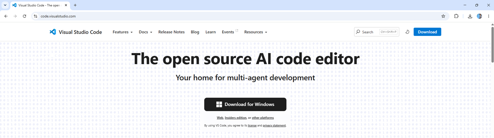
    <figcaption>Figure: VSCode Download for Windows</figcaption>
</figure>

3. ডাউনলোড হওয়া `.exe` ফাইলটি রান করুন এবং ডিফল্ট সেটিংস রেখে ইনস্টলেশন সম্পন্ন করুন।

<figure align="center">
    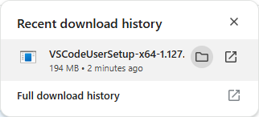
    <figcaption>Figure: Browser Download history</figcaption>
</figure>

<figure align="center">
    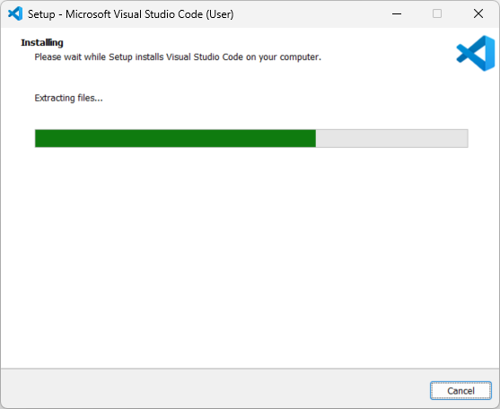
    <figcaption>Figure: Installation Running</figcaption>
</figure>

<figure align="center">
    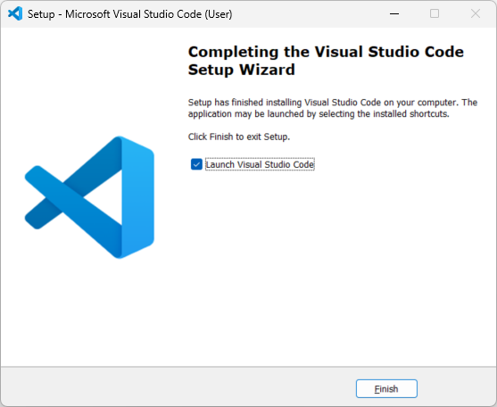
    <figcaption>Figure: Insallation Completed</figcaption>
</figure>

4. ইনস্টলেশন শেষ হলে VS Code চালু করুন।

<figure align="center">
    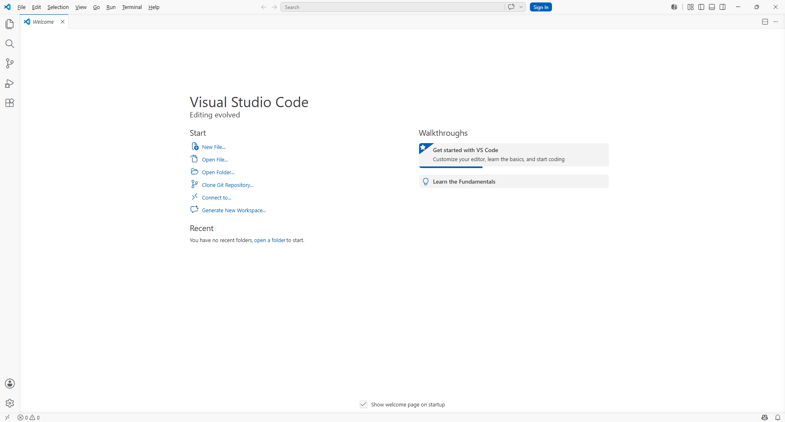
    <figcaption>Figure: Welcome Screen</figcaption>
</figure>

> **নোট**: VSCode খুললে যদি উপরের ছবির মত Light Theme এর পরিবর্তে Dark Theme দেখতে পান, তাহলে চিন্তার কিছু নেই। সুবিধামতো থিম পরিবর্তন করতে: File > Preferences > Theme > Color Theme (Ctrl+K Ctrl+T) থেকে পছন্দের থিম (যেমন Light Modern বা Dark 2026) সিলেক্ট করুন।

---

## ২.৪ ধাপ ২: ESP-IDF ইনস্টল করা 
1. অফিশিয়াল ওয়েবসাইট থেকে **ESP-IDF Windows Installer** ডাউনলোড করতে https://dl.espressif.com/dl/esp-idf/ লিংকে ভিজিট করুন। 

<figure align="center">
    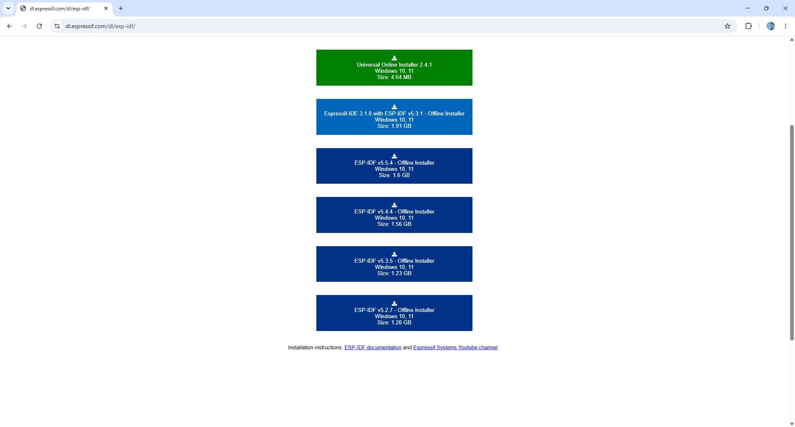
    <figcaption>Figure: ESP-IDF Windows Installer</figcaption>
</figure>

ESP-IDF vx.x.x - Offline Installer নামে সর্বশেষ যে সংস্করণ available দেখতে পাবেন, সেখানে ক্লিক করুন। (যেমন আমি যখন বইটি লিখতে বসেছি, তখন `ESP-IDF v5.5.4 - Offline Installer` হলো সর্বশেষ সংস্করণ।)

<figure align="center">
    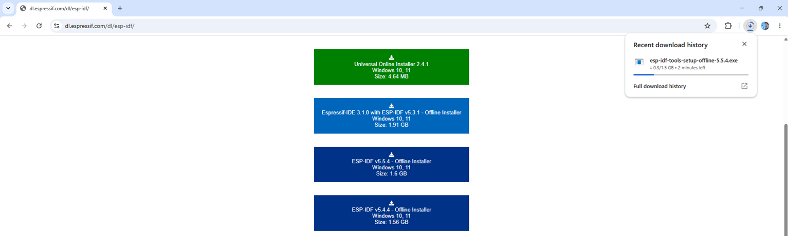
    <figcaption>Figure: Installer Downloading</figcaption>
</figure>

ডাউনলোড শেষ হলে `Show in folder` বাটনে ক্লিক করুন।

<figure align="center">
    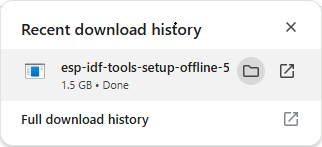
    <figcaption>Figure: Open Download Folder</figcaption>
</figure>

ফলে File টি যে লোকেশনে download হয়েছে, তা ওপেন হবে। এখন esp-if-tools-setup-offline-x.x.x.exe ফাইলটি `Open` করুন। 

<figure align="center">
    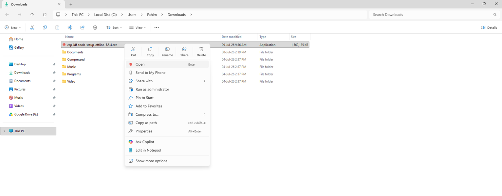
    <figcaption>Figure: Run ESP-IDF Offline Installer</figcaption>
</figure>

<figure align="center">
    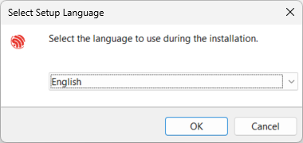
    <figcaption>Figure: Select Setup Language</figcaption>
</figure>

<figure align="center">
    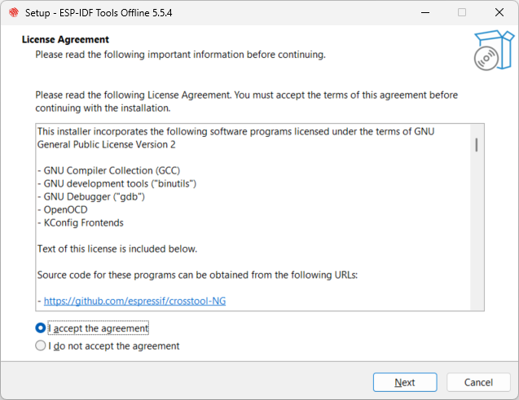
    <figcaption>Figure: License Agreement</figcaption>
</figure>

<figure align="center">
    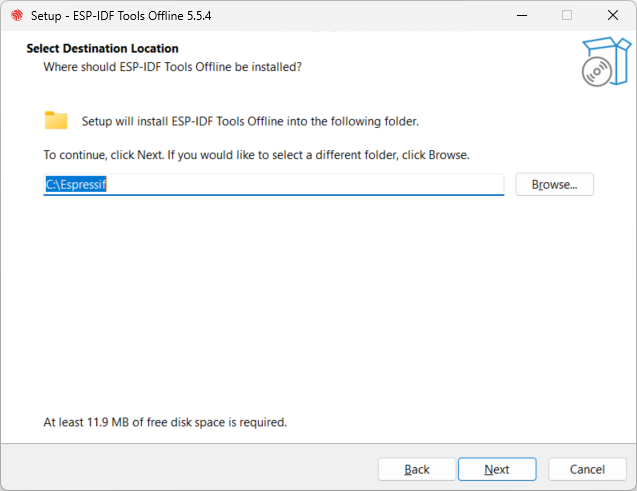
    <figcaption>Figure: Select Destination Location</figcaption>
</figure>

এ পর্যায়ে আমি `PowerShell` অপশনটি Uncheck করে রাখছি। (এটি অপশনাল বিষয়। ব্যক্তিগতভাবে আমি PowerShell এর তুলনায় `Command Prompt` ব্যবহারে বেশি স্বাচ্ছন্দ্য অনুভব করি।)

<figure align="center">
    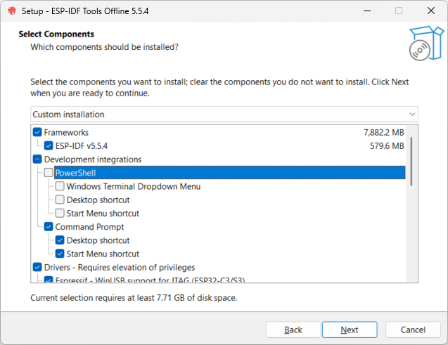
    <figcaption>Figure: Select Components</figcaption>
</figure>

<figure align="center">
    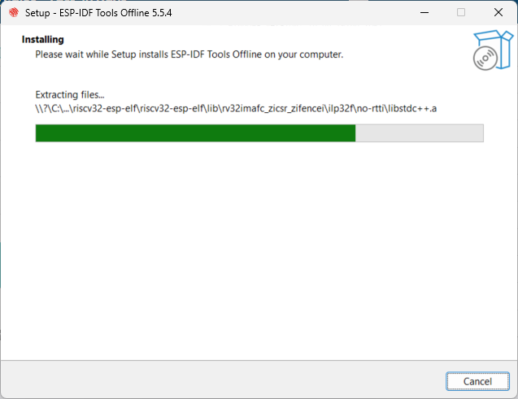
    <figcaption>Figure: Installing ESP-IDF</figcaption>
</figure>


<figure align="center">
    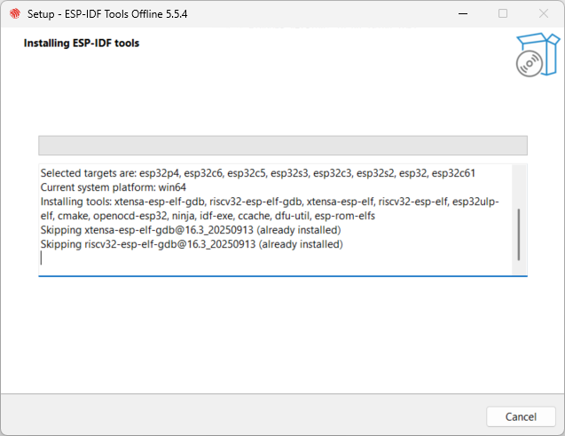
    <figcaption>Figure: Installing ESP-IDF tools</figcaption>
</figure>

এখন **Run ESP-IDF Command Prompt Environment** অপশনে checkmark রেখে, অন্য সব অপশন থেকে চেকমার্ক উঠিয়ে দিন এবং `Finish` বাটনে ক্লিক করুন।

<figure align="center">
    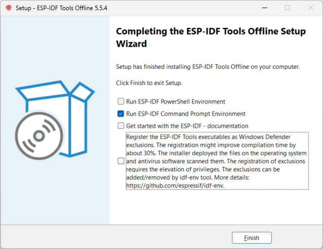
    <figcaption>Figure: Installation Completed</figcaption>
</figure>

যেহেতু আমরা *Run ESP-IDF Command Prompt Environment* অপশনে চেকমার্ক রেখেছিলাম, তাই এখন *Environment* তৈরির জন্য *Scripts* ফাইলটি `ESP-IDF CMD`-তে run হবে এবং IDF Environment সঠিক ভাবে তৈরি হলে, **Done! You can now compile ESP-IDF projects.** নামক মেসেজ দেখতে পাবেন। 

আমরা এখানে একটি CMD Command লিখে চেক করে দেখতে পারি যে, সবকিছু ঠিকঠাক কাজ করছে কি না? 

```
idf.py  --version
```

<figure align="center">
    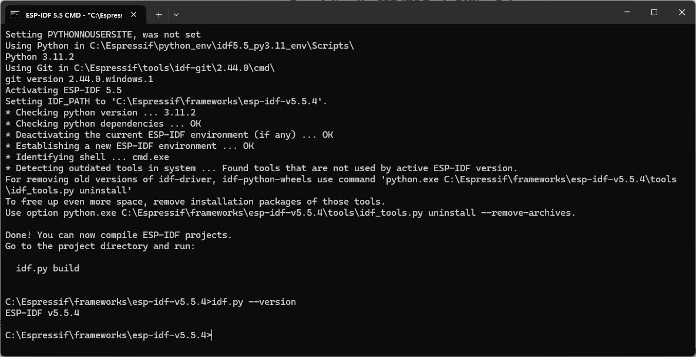
    <figcaption>Figure: Check IDF Version</figcaption>
</figure>

সবকিছু ঠিক থাকলে, ESP-IDF রিপ্লাই হিসাবে আপনাকে **Installed Version Name** রিটার্ন করবে। 

```
C:\Espressif\frameworks\esp-idf-v5.5.4>idf.py --version
ESP-IDF v5.5.4
```

---

## ২.৫ ধাপ ৩: New Project তৈরি এবং বিল্ড করা  
এতক্ষণে `VS Code` এবং `ESP-IDF` ফ্রেমওয়ার্ক — সবকিছু ইনস্টল করা হলো। এখন আমরা একটি সাধারণ কম্পিউটার প্রোগ্রাম (হ্যালো ওয়ার্ল্ড) `create` এবং `run` করে দেখবো যে সবকিছু ঠিকঠাক কাজ করছে কিনা। যেকোনো প্রোগ্রামিং ভাষা শেখার ক্ষেত্রে এটি একটি common প্রোগ্রাম। 
 
 1. সর্বপ্রথম কাজের সুবিধার্থে সকল প্রোগাম গুলোকে এক জায়গায় গুছিয়ে রাখার জন্য, Desktop-এ `ESP-Projects` (বা আপনার পছন্দমত যে কোন নাম) নামে একটি Folder তৈরি করে নিন। 
 2. এখন VSCode এর উইন্ডো থেকে `Explorer (Ctrl+Shift+E)` আইকনে ক্লিক করুন। 

<figure align="center">
    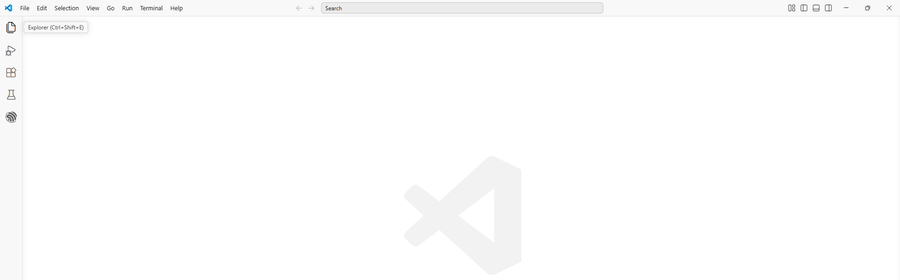
    <figcaption>Figure: Explorer</figcaption>
</figure>

3. `Open Folder` বাটনে ক্লিক করুন।

<figure align="center">
    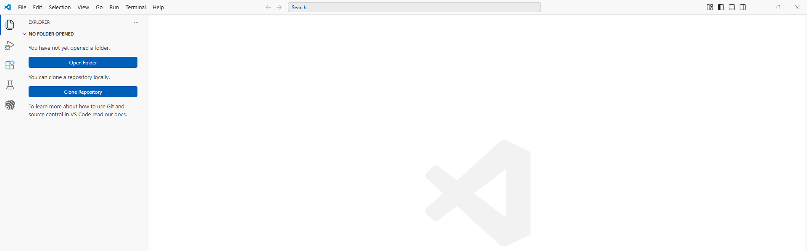
    <figcaption>Figure: Open Folder</figcaption>
</figure>

4. Destop-এ আমাদের তৈরি করা `ESP-Programs` নামক ফোল্ডারে ক্লিক করে এবং `Select Folder` বাটনে ক্লিক করুন।  

<figure align="center">
    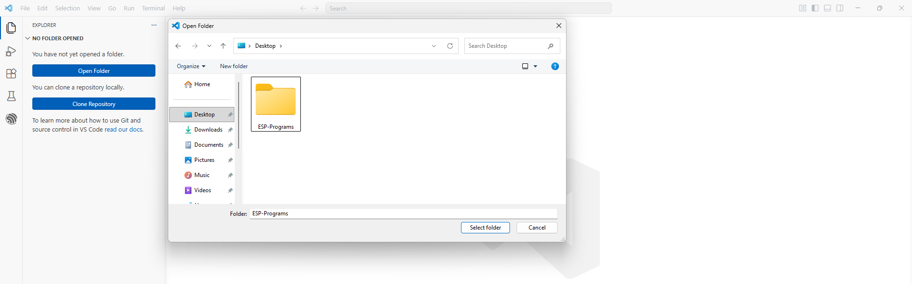
    <figcaption>Figure: Select Folder</figcaption>
</figure>

5. তাহলেই VSCode আমাদের **ESP-Projects** ফোল্ডারটি access করতে পারবে এবং আপনি VSCode Explorer-এ প্রোজেক্ট-ফোল্ডারটির নাম দেখতে পাবেন। 

<figure align="center">
    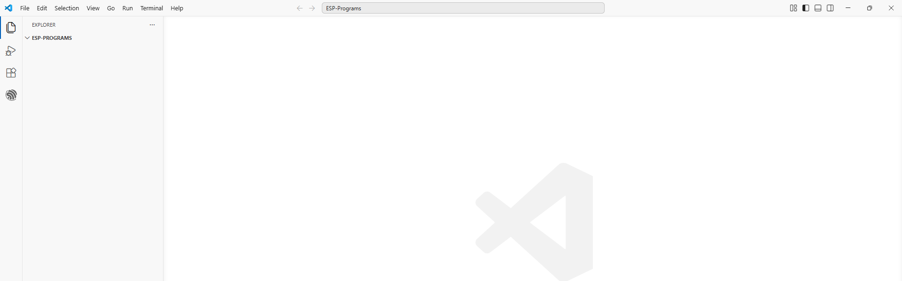
    <figcaption>Figure: Project Folder</figcaption>
</figure>

6. VSCode **EXPLORER** এর ফাঁকা জায়গায় কম্পিউটার-মাউসের Right Button ক্লিক করে Copy Path অপশনে ক্লিক করুন। 

<figure align="center">
    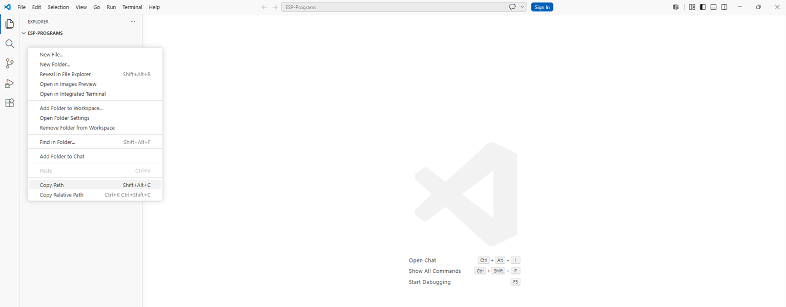
    <figcaption>Figure: Copy Project Path</figcaption>
</figure>

7. এখন কম্পিউটারের Start বাটনে (বা Keyboard থেকে Windows বাটনে) ক্লিক করুন এবং ESP লিখে সার্চ করুন। 

<figure align="center">
    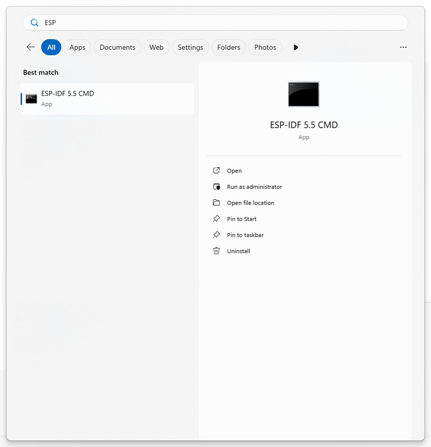
    <figcaption>Figure: ESP-IDF Command Prompt</figcaption>
</figure>

Search Results থেকে **ESP-IDF x.x CMD** নামক App-এ ক্লিক করুন। ফলে ESP-IDF এর জন্য একটি Environment তৈরির প্রক্রিয়া শুরু হবে। 

<figure align="center">
    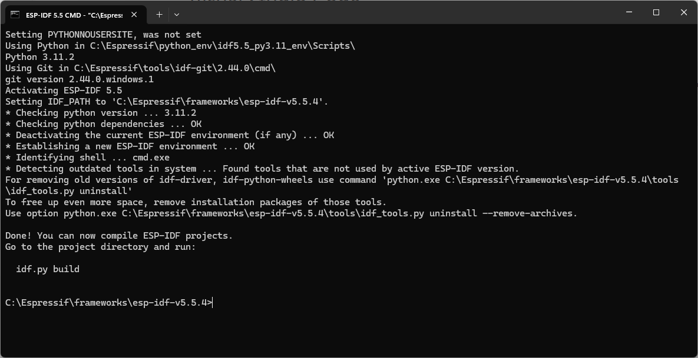
    <figcaption>Figure: Establishing ESP-IDF Environment</figcaption>
</figure>

সফলভাবে Environment তৈরি হলে **Done! You can now compile ESP-IDF projects.** মেসেজ দেখতে পাবেন। 

8. ইতিপূর্বে আমরা VSCode Explorer থেকে যে path কপি করেছিলাম (cd `<path>` কমান্ড ব্যবহার করে) সেই ডিরেক্টরিতে প্রবেশ করুন।  

```
cd C:\Users\Fahim\Desktop\ESP-Programs
```

<figure align="center">
    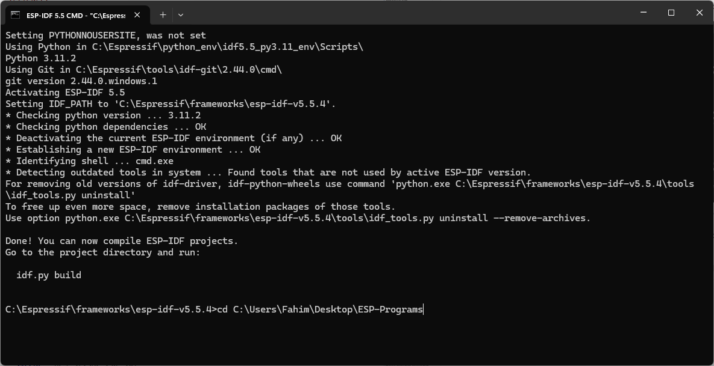
    <figcaption>Figure: Change Directory</figcaption>
</figure>

9. New Project তৈরির জন্য `idf.py create-project <project_name>` কমান্ড ব্যবহার করুন। (আমি এখানে `01-Hello-World` নামে প্রোজেক্ট তৈরি করেছি। আপনি আপনার পছন্দমত নাম ব্যবহার করতে পারেন।)

```
idf.py create-project 01-Hello-World
```
<figure align="center">
    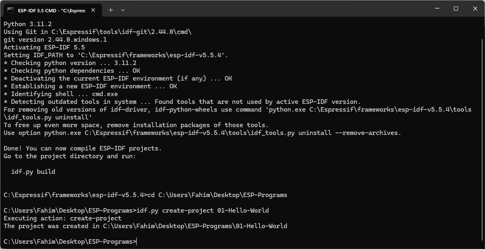
    <figcaption>Figure: Hello World Project</figcaption>
</figure>

10. এখন VSCode এর Explorer এর দিকে লক্ষ্য করলে, সেখানে **01-Hello-World** নামে একটি নতুন Folder দেখতে পাবেন। 

<figure align="center">
    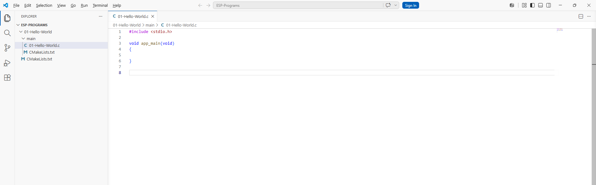
    <figcaption>Figure: Main Program File</figcaption>
</figure>

ফোল্ডারের বাম পাশে থাকা Arrow চিহ্ন এবং main এর পাশে থাকা Arrow চিহ্নে ক্লিক করুন। অতঃপর 01-Hello-World.c ফাইলে ক্লিক করার মাধ্যমে ফাইলটি ওপেন করুন। 

<figure align="center">
    
    <figcaption>Figure: Open C File</figcaption>
</figure>

নিচের প্রোগ্রামটি copy-paste করে save করুন। 

```
#include <stdio.h>

void app_main(void)
{
    printf("Hello World!\n");
}
```
<figure align="center">
    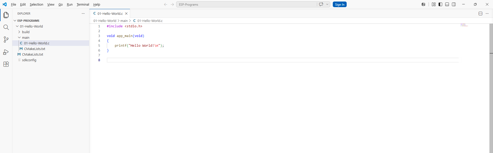
    <figcaption>Figure: Update C File</figcaption>
</figure>

11. পূণরায় ESP-IDF Command Prompt উইন্ডোতে ফিরে আসুন এবং নিচের command গুলো run করুন। 

```
cd 01-Hello-World
idf.py set-target esp32
```

<figure align="center">
    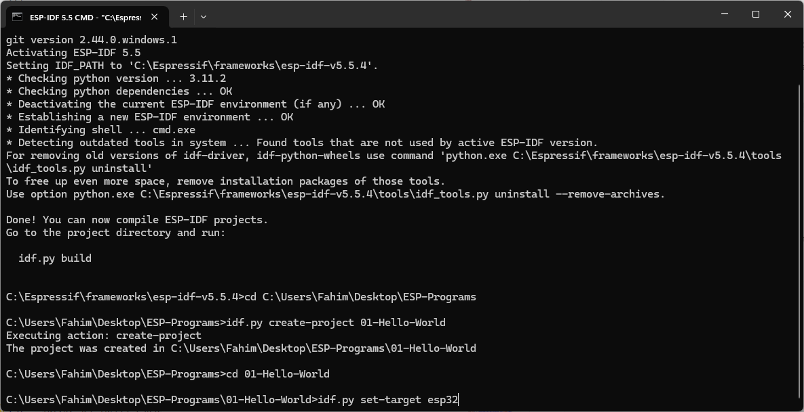
    <figcaption>Figure: Set target chip esp32</figcaption>
</figure>

<figure align="center">
    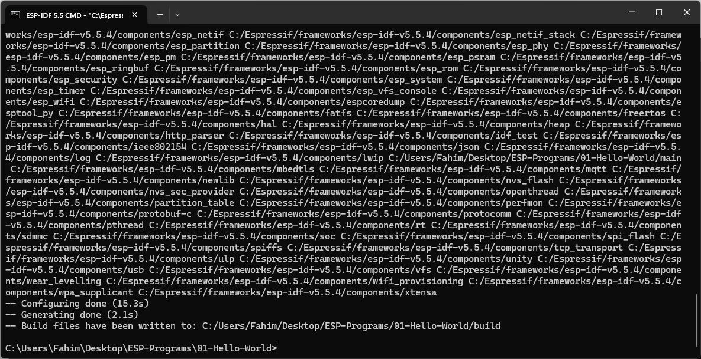
    <figcaption>Figure: Build File Created</figcaption>
</figure>

এই অবস্থায় যদি আপনি 01-Hello-World > build > bootloader ফোল্ডারের মধ্যে browse করেন, তাহলে ফোল্ডারটি empty অবস্থায় দেখতে পাবেন। 

<figure align="center">
    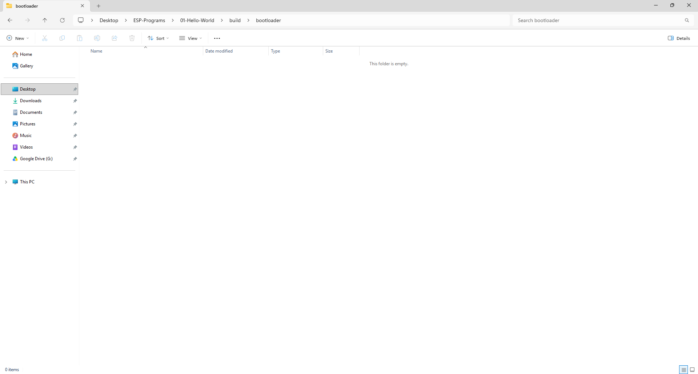
    <figcaption>Figure: Empty Bootloader Folder</figcaption>
</figure>

12. এখন আমরা Hello-World প্রোজেক্টটি build করবো। এজন্য আবার ESP-IDF Command Prompt উইন্ডোতে ফিরে গিয়ে নিচের কমান্ডটি run করুন। 

```
idf.py build
```

<figure align="center">
    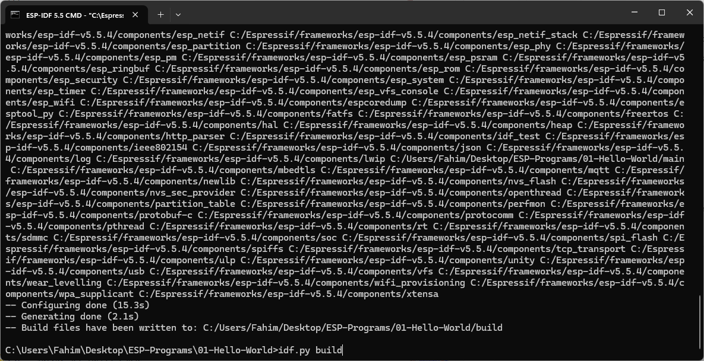
    <figcaption>Figure: Run Build Command</figcaption>
</figure>

<figure align="center">
    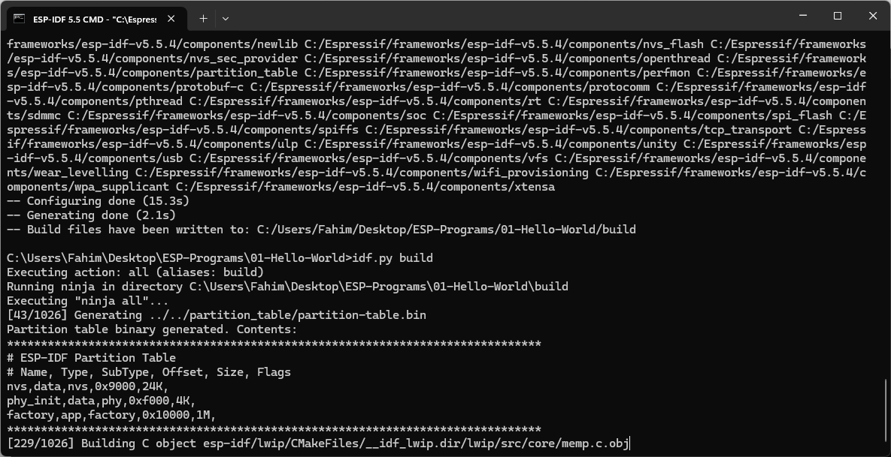
    <figcaption>Figure: Building C Object</figcaption>
</figure>

<figure align="center">
    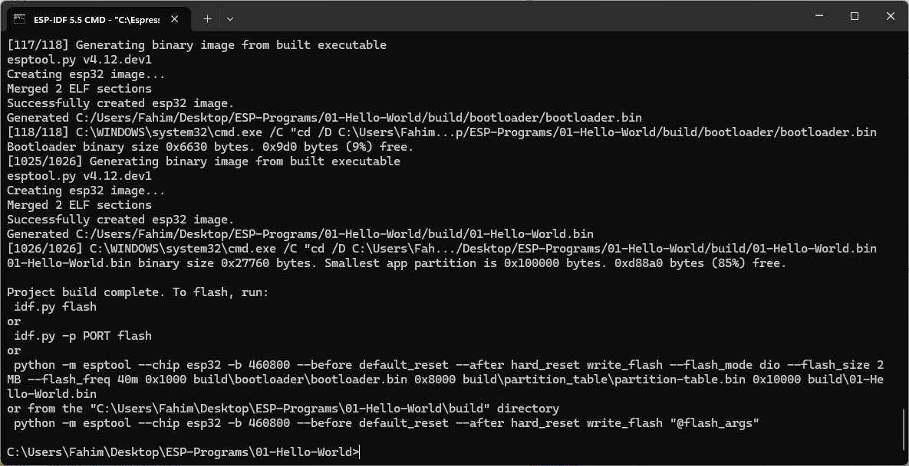
    <figcaption>Figure: Successfully Created ESP32 Image</figcaption>
</figure>

আমাদের Project File বিল্ড হয়ে binary ফাইল তৈরি হয়েছে। মূলত Program Execution এর জন্য এই bootloader.bin ফাইলটি ESP Chip এর মধ্যে Flash করা হয়। 

<figure align="center">
    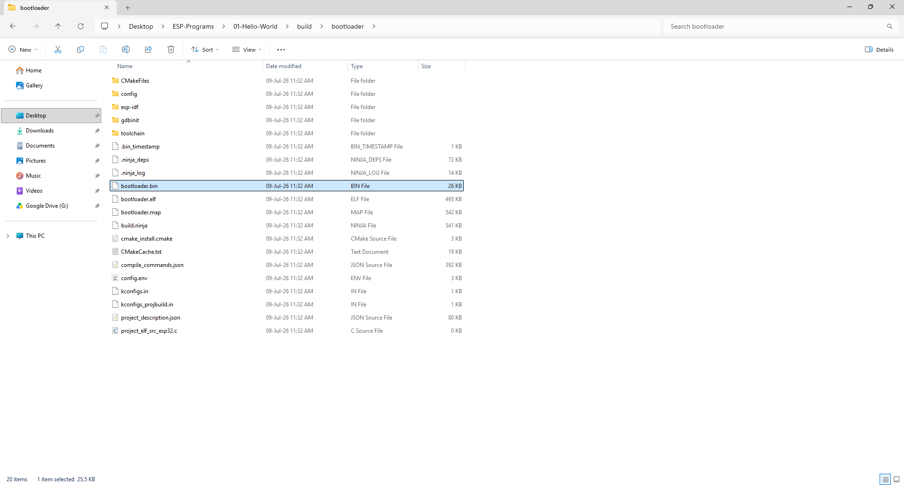
    <figcaption>Figure: Second Stage Bootloader Binary File</figcaption>
</figure>


## ২.৬ ধাপ ৩: ESP32-তে প্রোগ্রাম আপলোড করা 
আপনার কাছে থাকা ESP32 Microcontroller-এ প্রোগ্রাম আপলোড করতে, নিচের ধাপগুলো অনুসরণ করুন: 
1. প্রোগ্রাম আপলোড করতে সর্বপ্রথম ESP32 Dev Kit V1 কে USB Cable এর সাহায্যে কম্পিউটারের সাথে connect করতে হবে। 

2. ESP বোর্ডে থাকা USB-to-Serial চিপ কম্পিউটারের সাথে যোগাযোগের জন্য COMxx Port তৈরি করে। বোর্ডটি কম্পিউটারের কোন COMxx পোর্টে কানেক্ট হয়েছে, তা Device Manger থেকে খুব সহজেই চেক করা যায়। এ জন্য কম্পিউটারের Start বাটন ক্লিক করে, Device Manager লিখে সার্চ করে App টি সিলেক্ট করতে হবে। 

<figure align="center">
    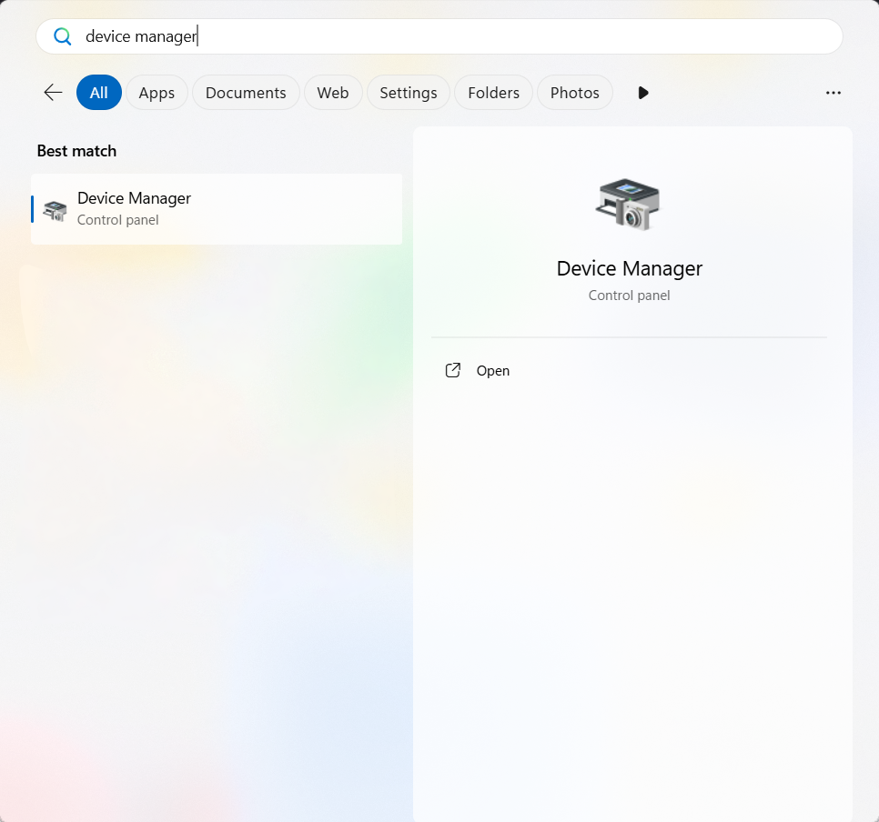
    <figcaption>Figure: Device Manager</figcaption>
</figure>

ESP বোর্ডে USB to Serial Communication এর জন্য সাধারণত **CP2102** অথবা **CH340** চিপ ব্যবহার করা হয়। 

আপনার বোর্ডে কোন চিপ ব্যবহার করা হয়েছে তা বোর্ডের ছোট IC-গুলোর গায়ে লেখা নাম পড়ে নিতে পারেন, অথবা Device Manager-এর **Ports (COM & LPT)** সেকশনে বোর্ড কানেক্ট করার পর নতুন কোন COM পোর্ট (যেমন `COM5`) তৈরি হচ্ছে সেটা দেখেও নিশ্চিত হতে পারেন। 

<figure align="center">
    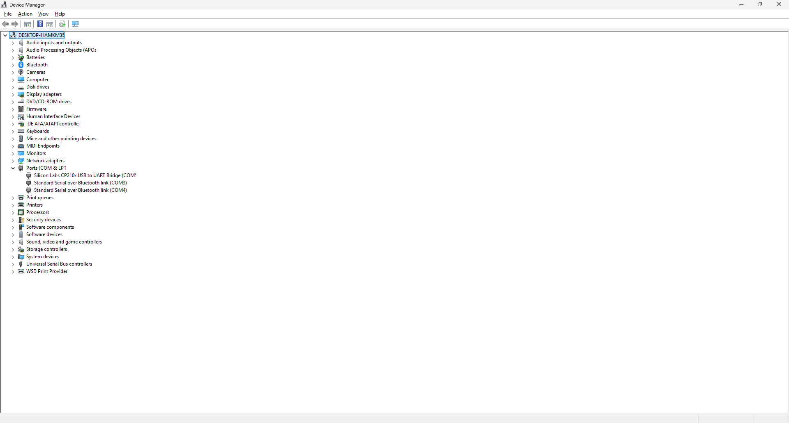
    <figcaption>Figure: USB to UART Bridge (COM5)</figcaption>
</figure>

যেমন আমরা কম্পিউটারে **CP210x USB to Serial** ড্রাইভার চিপ `COM5` পোর্ট তৈরি করেছে। এই পোর্ট-নম্বরটি খুবই গুরুত্বপূর্ণ, এটি ব্যবহার করেই আমরা পরবর্তীতে ESP-তে প্রোগ্রাম আপলোড বা সিরিয়াল-ডেটা প্রিন্ট করার মত কাজ গুলো করতে পারবো। 

3. ESP32 Dev Kit V1-এ Hello-World প্রোজেক্টটি binary file flash করার জন্য নিচের কমান্ডটি run করুন। 

```
idf.py -p com5 flash 
```

<figure align="center">
    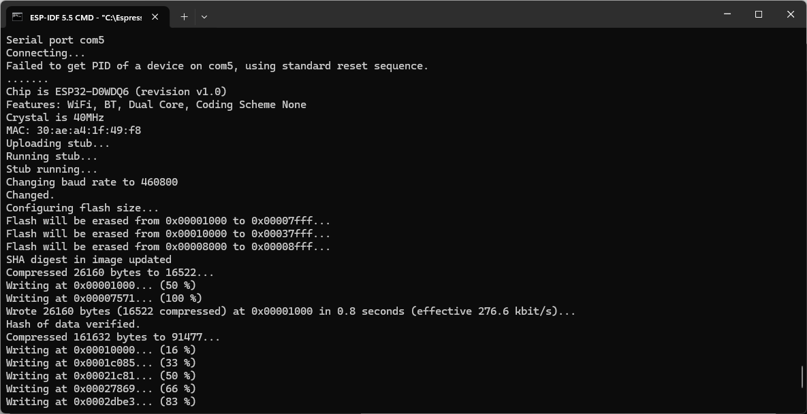
    <figcaption>Figure: Flashing ESP32</figcaption>
</figure>

<figure align="center">
    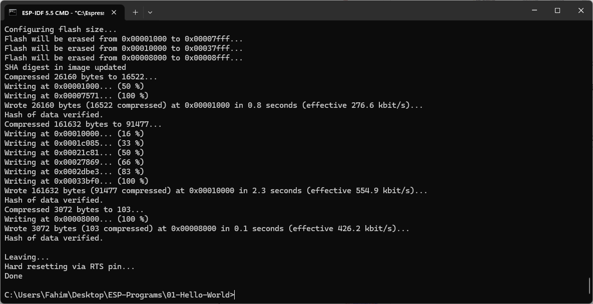
    <figcaption>Figure: Program Uploading Done</figcaption>
</figure>

Screen-এ `Connecting...` মেসেজ দৃশ্যমান হওয়ার সাথে সাথেই `Boot` বাটনটি প্রেস করে ধরে রাখুন এবং `Writing at 0x00010000...` মেসেজ দৃশ্যমান হলে `Button Release` করুন। 


4. মনে আছে? প্রোগ্রামে আমরা printf(Hello World!\n); লিখেছিলাম। সুতরাং আমরা যদি এখন ESP32-এর সিরিয়াল পোর্টের কানেক্ট হতে পারি, তাহলে Hello World! লেখা দেখতে পাবো। 

ESP32 Dev Kit V1 এর সিরিয়াল-ডেটা read করতে, নিচের কমান্ডটি run করুন। 

```
idf.py -p com5 monitor 
```

<figure align="center">
    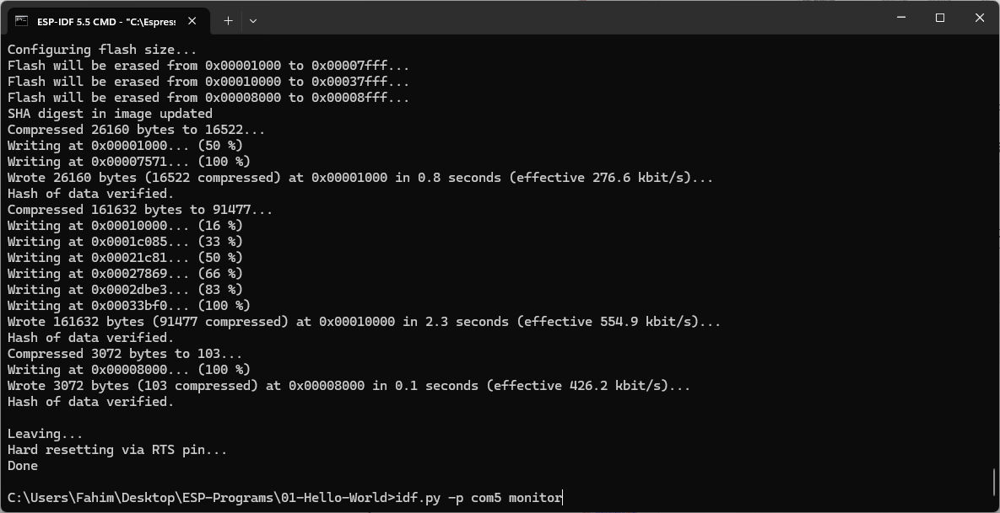
    <figcaption>Figure: Monitoring ESP32</figcaption>
</figure>

<figure align="center">
    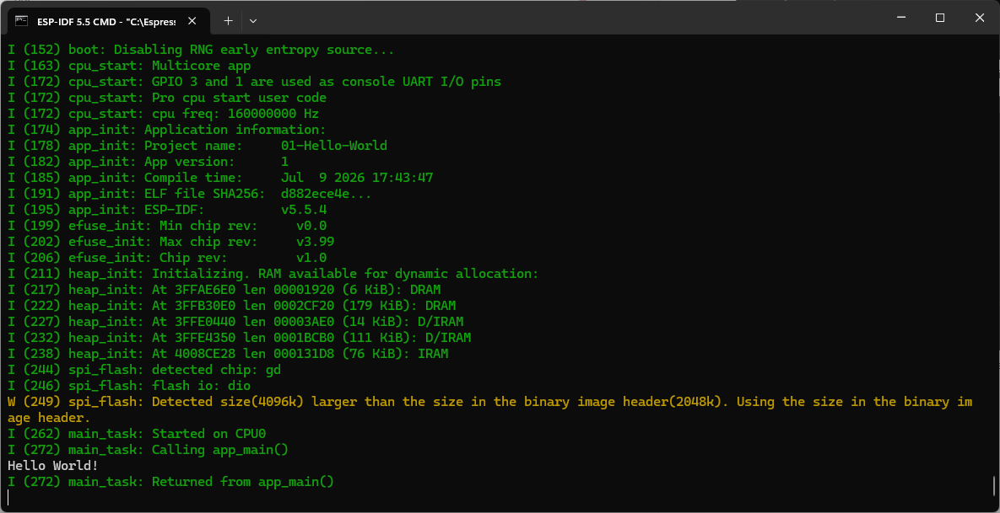
    <figcaption>Figure: Read Serial Data</figcaption>
</figure>


ফাইনালি আমরা কিন্তু successfully আমাদের ESP32 Dev Kit V1 ব্যবহার করে Hello World প্রিন্ট করতে পেরেছি। 

যদিও আমি বোঝার সুবিধার্থে ভেঙ্গে ভেঙ্গে কমান্ড দিয়েছি, তবে আপনি ইচ্ছা করলে সরাসরি নিচের মত করে single line command লিখতে পারেন, এতে করে Program Upload হয়ে সরাসরি Terminal-এ  Serial Data প্রিন্ট হওয়া শুরু হবে।  

```
idf.py -p com5 build monitor 
```

সুতরাং আমরা এখন পর্যন্ত ESP-IDF ব্যবহার করে Project `Create`, `Build`, `Flash`, এবং `Monitor` করা শিখেছি। যদিও এই অধ্যায়ে আমি কিছু কিছু বিষয় একটু জটিল ভাবে উপস্থাপন করেছি, এর কারণ ছিলো আপনাকে `ESP-IDF Command Prompt` সম্পর্কে একটি বেসিক ধারণা দেওয়া। পরবর্তী অধ্যায়ে আমরা VSCode এর আরও কিছু settings udpate করবো যাতে, next time প্রোগ্রাম লেখার সময় বারবার VSCode এবং ESP-IDF Command Prompt এর মধ্যে switch করতে না হয়। 

> **নোট:** অধ্যায়-১ এবং অধ্যায়-২ তুলনামূলক ভাবে একটু কঠিন মনে হতে পারে। তবে এটি যেহেতু শুধমাত্র একবারই করতে হয়, তাই আমার পরামর্শ থাকবে হতাশ না হয়ে বরং একটু মনোযোগ দিয়ে বারবার এই অংশ practice করার। এটি হলো ESP শেখার ভিত্তি, আর ভিত্তি যত শক্ত হবে - পরবর্তী শেখা গুলো ততই সহজ হবে। 

