# অধ্যায় ২: এনভায়রনমেন্ট সেটআপ (Windows)

ESP মাইক্রোকন্ট্রোলার প্রোগ্রামিং-এর জন্য বেশ কিছু প্রচলিত পদ্ধতি রয়েছে। যেমন:

1. ESP-IDF Command Prompt ব্যবহার করে
2. Espressif-IDE ব্যবহার করে
3. Arduino Framework ব্যবহার করে
4. ESP-IDF VSCode Extension ব্যবহার করে

তবে উপরের প্রতিটি পদ্ধতিরই কিছু না কিছু drawback (সীমাবদ্ধতা) রয়েছে। আমি চেষ্টা করব **ESP-IDF Framework + VS Code**-এর সংমিশ্রণে একটি **Clean Interface** ব্যবহার করে ESP32 প্রোগ্রামিং শেখানোর, যাতে একই সাথে **Easy Interface** এবং **Latest Espressif Release** ব্যবহারের এক দুর্দান্ত অভিজ্ঞতা পাওয়া যায়।

---

## ২.১ এই অধ্যায়ে আমরা কী শিখব?

প্রথম অধ্যায়ে আমরা জেনেছি *Embedded System*, *ESP32*, এবং *ESP-IDF* কী। এখন হাতে-কলমে কাজ শুরু করার পালা। এই অধ্যায়ে আমরা `Windows Operating System (OS)` চালিত কম্পিউটারে এমন একটি এনভায়রনমেন্ট তৈরি করব, যেখানে প্রোজেক্ট তৈরি করা, বিল্ড করা, এবং বোর্ডে আপলোড (Flash) করার মতো জটিল কাজগুলো খুব সহজেই করা যায়।

> **নোট**: Windows এবং macOS-এ ইনস্টলেশনের ধাপ কিছুটা ভিন্ন। এই অংশে আমরা **Windows**-এর জন্য পুরো প্রক্রিয়াটি দেখব, এবং পরের অংশে **macOS**-এর জন্য আলাদাভাবে এনভায়রনমেন্ট তৈরি করা শিখব। আপনি যদি macOS ব্যবহার করেন, তাহলে সরাসরি পরের অধ্যায়ে চলে যেতে পারেন।

**আমরা ধাপে ধাপে যা করব:**

1. Visual Studio Code (VS Code) ইনস্টল করা (কোড এডিটর হিসেবে)
2. ESP-IDF Installation Manager (EIM) ডাউনলোড করা
3. EIM দিয়ে ESP-IDF ফ্রেমওয়ার্ক ইনস্টল করা
4. ESP-IDF দিয়ে প্রয়োজনীয় টুলস ইনস্টল করা
5. New Project তৈরি এবং বিল্ড করা
6. ESP32-তে প্রোগ্রাম আপলোড করা

> **নোট**: ESP-IDF Framework-এর ভার্সন নম্বর মাঝেমধ্যে আপডেট হয়। এই অধ্যায়টি লেখার সময় (২০২৬) ESP-IDF Installation Manager (EIM)-এর মাধ্যমে সর্বশেষ সংস্করণ **ESP-IDF v6.0.2** ইনস্টল করা হয়েছে এবং তারই screenshot ব্যবহার করা হয়েছে। ভবিষ্যতে ভার্সন নম্বরে সামান্য পরিবর্তন দেখলে ঘাবড়াবেন না — মূল ধারণাটি সবসময় একই থাকবে।

---

## ২.২ প্রয়োজনীয় জিনিসপত্র

**পরবর্তী ধাপ শুরু করার আগে নিশ্চিত হয়ে নিন যে আপনার কাছে রয়েছে:**

- একটি Windows কম্পিউটার (Windows 10 বা তার পরের ভার্সন)
- স্ট্যাবল ইন্টারনেট কানেকশন (ডাউনলোড করতে 1-2 GB পর্যন্ত ডেটা লাগতে পারে)
- একটি ESP32 Dev Kit V1 বোর্ড
- একটি ভালো মানের USB ক্যাবল (শুধু চার্জিং না, ডেটা ট্রান্সফার সাপোর্ট করে এমন ক্যাবল হতে হবে)

---

## ২.৩ Visual Studio Code ইনস্টল করা

যদি আপনার কম্পিউটারে আগে থেকেই `VS Code` ইনস্টল করা না থাকে:

1. ব্রাউজারে গিয়ে সরাসরি **[code.visualstudio.com](https://code.visualstudio.com/)**-এ ভিজিট করুন।
2. **Download for Windows** বাটনে ক্লিক করে ইনস্টলার ডাউনলোড করুন।

<figure align="center">
    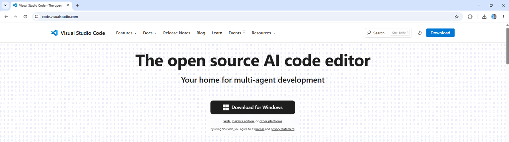
    <figcaption>Figure: VSCode Download for Windows</figcaption>
</figure>

3. ডাউনলোড হওয়া `.exe` ফাইলটি রান করুন এবং ডিফল্ট সেটিংস রেখে ইনস্টলেশন সম্পন্ন করুন।

<figure align="center">
    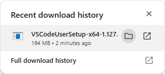
    <figcaption>Figure: Browser Download History</figcaption>
</figure>

<figure align="center">
    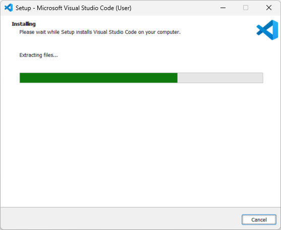
    <figcaption>Figure: Installation Running</figcaption>
</figure>

<figure align="center">
    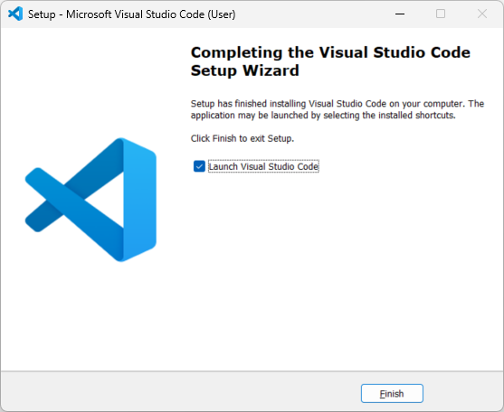
    <figcaption>Figure: Installation Completed</figcaption>
</figure>

4. ইনস্টলেশন শেষ হলে VS Code চালু করুন।

<figure align="center">
    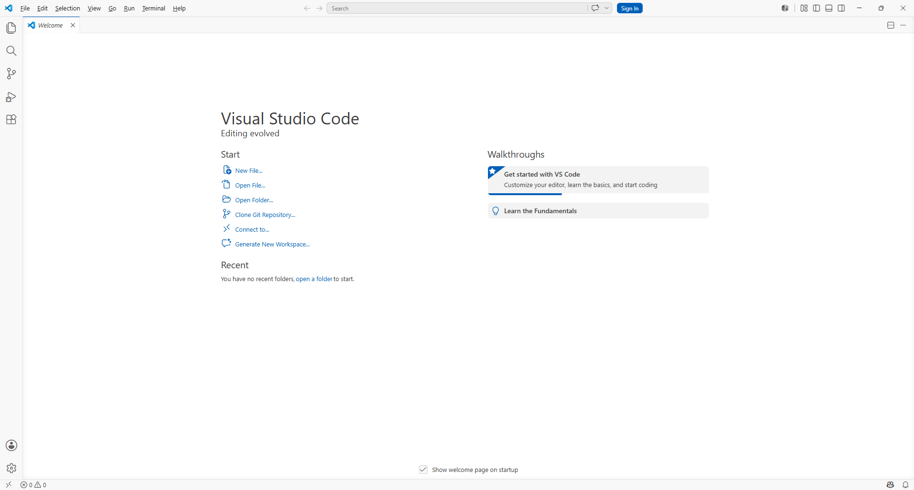
    <figcaption>Figure: Welcome Screen</figcaption>
</figure>

> **নোট**: VSCode খুললে যদি উপরের ছবির মত Light Theme এর পরিবর্তে Dark Theme দেখতে পান, তাহলে চিন্তার কিছু নেই। সুবিধামতো থিম পরিবর্তন করতে: File > Preferences > Theme > Color Theme (Ctrl+K Ctrl+T) থেকে পছন্দের থিম (যেমন Light Modern বা Dark 2026) সিলেক্ট করুন।

---

## ২.৪ ESP-IDF Installation Manager (EIM) ডাউনলোড করা 
1. অফিশিয়াল ওয়েবসাইট থেকে **EIM** ডাউনলোড করতে https://dl.espressif.com/dl/eim/ লিংকে ভিজিট করুন। 

<figure align="center">
    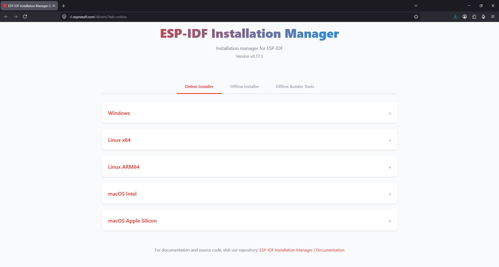
    <figcaption>Figure: ESP-IDF Installation Manager</figcaption>
</figure>

Online Installer ট্যাব থেকে উইন্ডোজ অপারেটিং সিস্টেমের জন্য Windows GUI Installer হিসাবে **eim-gui-windows-x64.exe** এর নিচে থাকা `Download` বাটনে ক্লিক করুন। 

<figure align="center">
    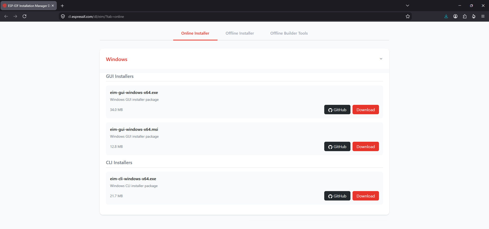
    <figcaption>Figure: ESP-IDF Windows GUI Installer</figcaption>
</figure>

ফলে **eim-gui-windows-x64.exe** ইনস্টলার ফাইলটির downloading process শুরু হবে।  

<figure align="center">
    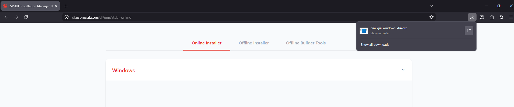
    <figcaption>Figure: EIM Downloaded Complete</figcaption>
</figure>

Installer ডাউনলোড শেষ হলে, Show in Folder অপশনে ক্লিক করুন। এতে ফাইলটি যেখানে save হয়েছে, সেই directory ওপেন হবে। 

<figure align="center">
    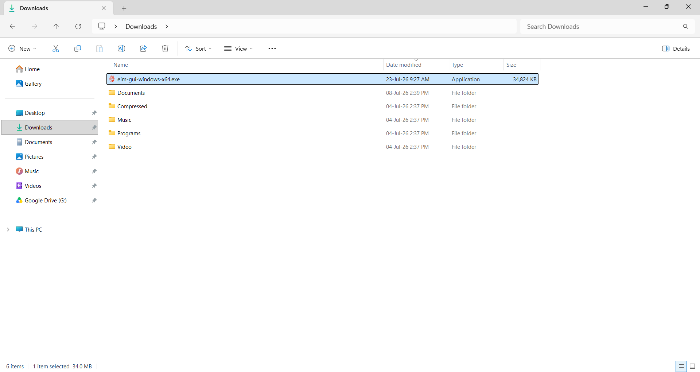
    <figcaption>Figure: Open Download Folder</figcaption>
</figure>

--- 

## ২.৫ EIM দিয়ে ESP-IDF ফ্রেমওয়ার্ক ইনস্টল করা
এখন **eim-gui-windows-x64.exe** ফাইলটিকে `Run as administrator` দিয়ে `run` করুন। 

<figure align="center">
    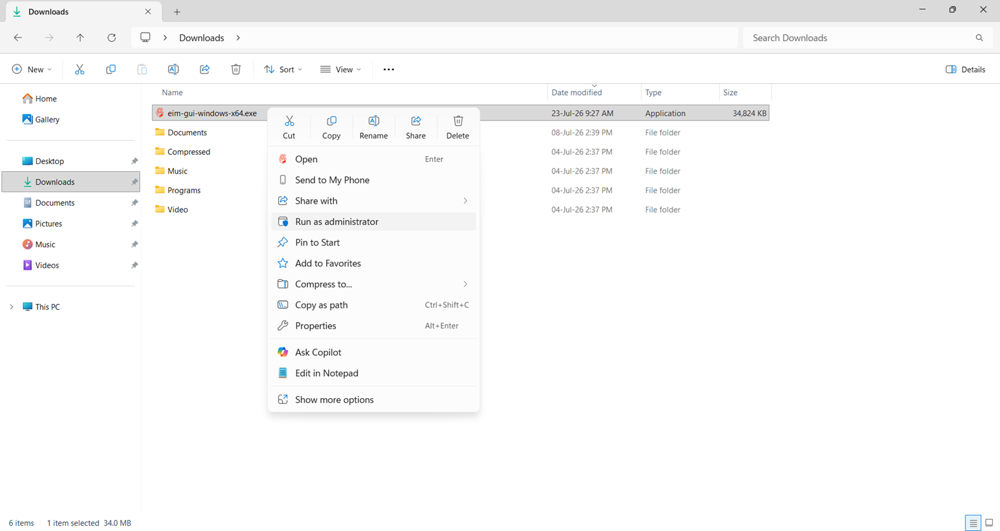
    <figcaption>Figure: ESP-IDF Windows Installer</figcaption>
</figure>

এখন ধাপে ধাপে নিচের ছবি গুলো অনুসরণ করে ESP-IDF Installation Manager (EIM) এর ইনস্টলেশন শেষ করুন। 

<figure align="center">
    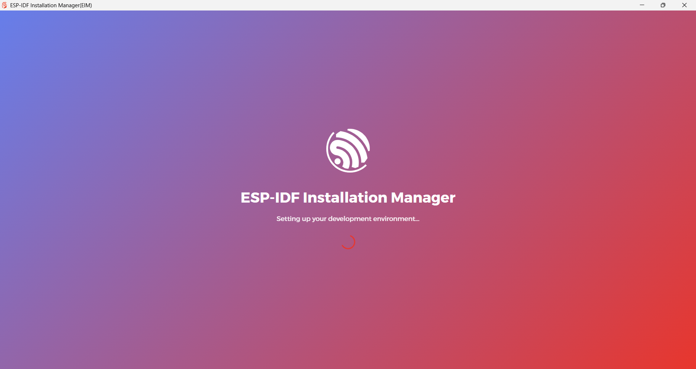
    <figcaption>Figure: Setting Up Development Environment</figcaption>
</figure>

<figure align="center">
    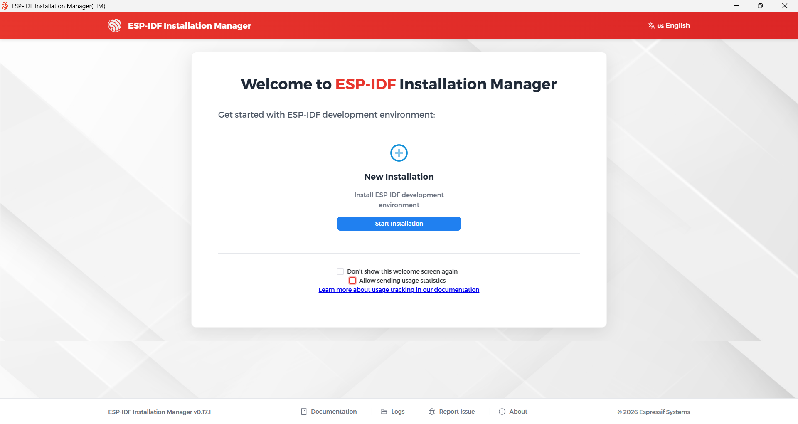
    <figcaption>Figure: Welcome to EIM</figcaption>
</figure>

<figure align="center">
    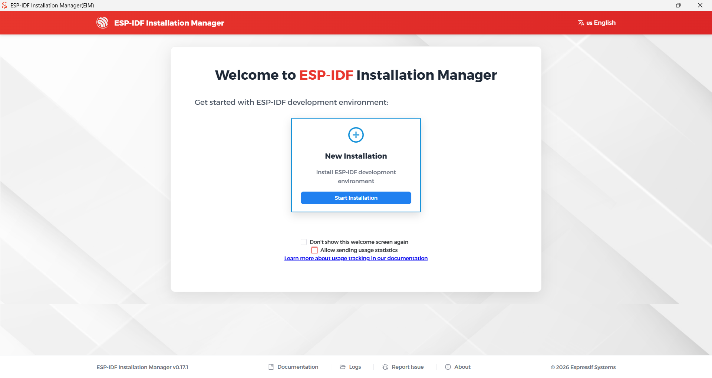
    <figcaption>Figure: New Installation</figcaption>
</figure>

<figure align="center">
    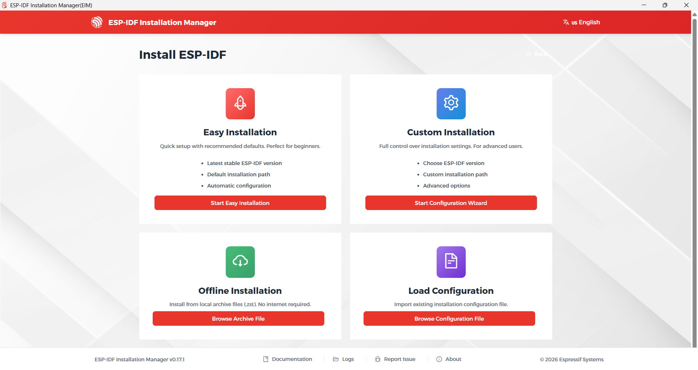
    <figcaption>Figure: Easy Installation</figcaption>
</figure>

<figure align="center">
    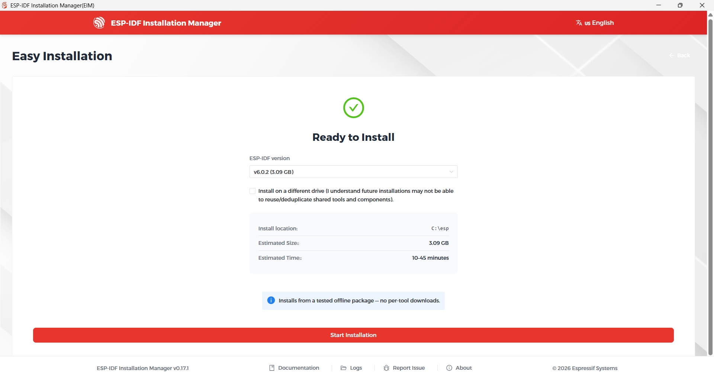
    <figcaption>Figure: Ready to Install</figcaption>
</figure>

<figure align="center">
    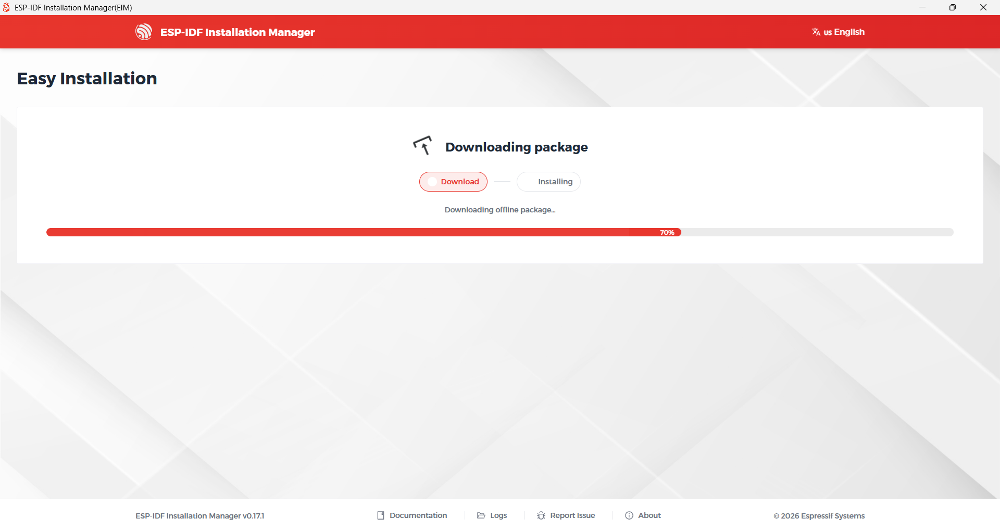
    <figcaption>Figure: Downloading Package</figcaption>
</figure>

<figure align="center">
    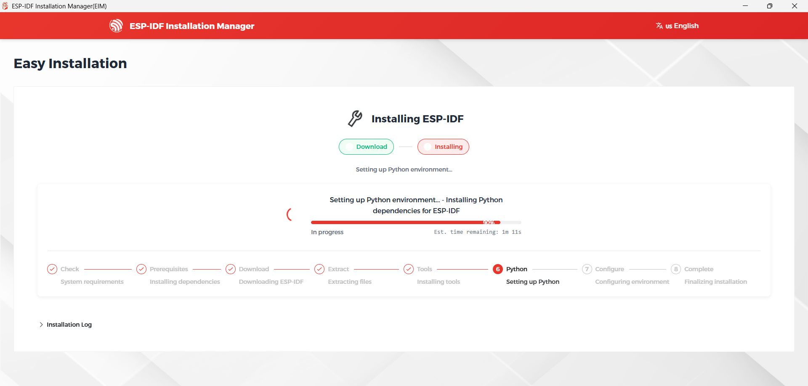
    <figcaption>Figure: Installing ESP-IDF</figcaption>
</figure>

<figure align="center">
    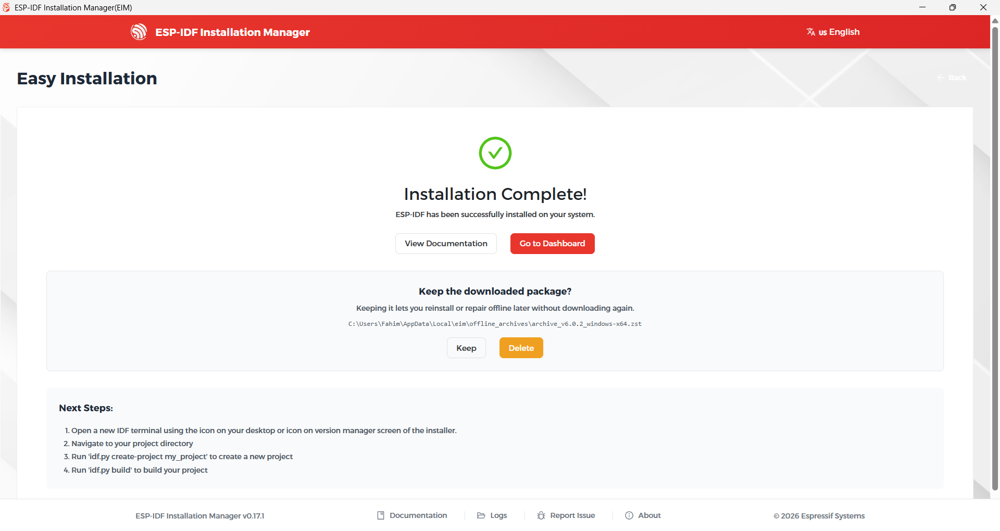
    <figcaption>Figure: Installation Complete</figcaption>
</figure>

<figure align="center">
    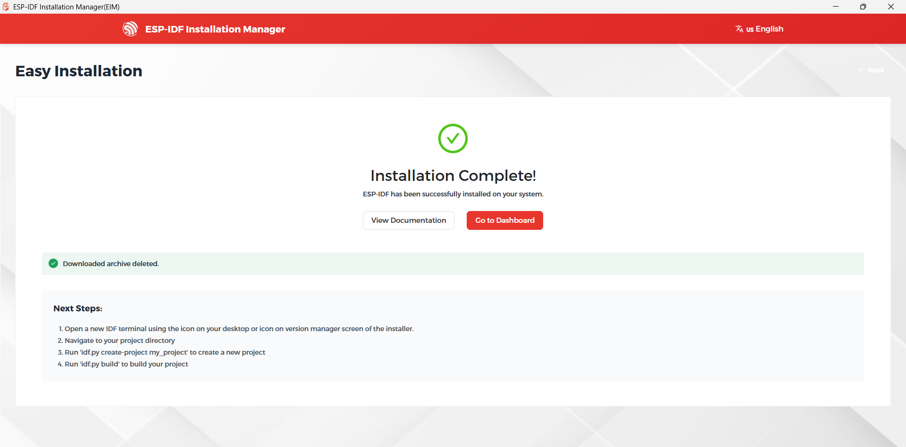
    <figcaption>Figure: Downloaded archive deleted</figcaption>
</figure>

এখন Go to Dashboard বাটনে ক্লিক করুন। এখানে Installed Versions এবং তার installation directory সম্পর্কে তথ্য দেখতে পাবেন। 

ESP32 Development Board গুলো সাধারণত `CP2102` অথবা `CH340` **USB-to-Serial** চিপ ব্যবহার করে কম্পিউটারের সাথে যোগাযোগ করে থাকে। Windows 10/11-এ সাধারণত এই ড্রাইভার স্বয়ংক্রিয়ভাবে ইনস্টল হয়ে যায়, কিন্তু যদি বোর্ড কানেক্ট করার পর Device Manager-এ "Unknown Device" বা হলুদ চিহ্নসহ কোনো ডিভাইস দেখেন, তাহলে ম্যানুয়ালি ড্রাইভার ইনস্টল করার প্রয়োজন হয়।

ড্রাইভার ইনস্টলেশনের জন্য EIM-এর GUI-তে `Install Drivers` নামক বাটন থাকে, যেটা দিয়ে সরাসরি এই ড্রাইভারগুলো ইনস্টল করা যায়।

<figure align="center">
    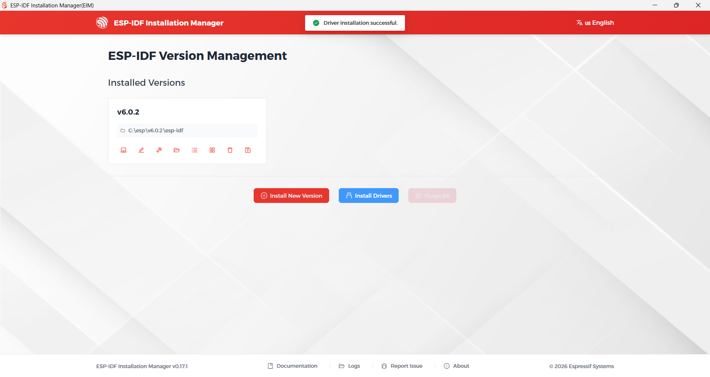
    <figcaption>Figure: Driver Installation Successful</figcaption>
</figure>

সফলভাবে ড্রাইভার-ইনস্টলেশন শেষ হলে, `Driver installation successful.` মেসেজ দেখতে পাবেন।

--- 

## ২.৬ ESP-IDF দিয়ে প্রয়োজনীয় টুলস ইনস্টল করা
আগের ধাপে আমরা EIM দিয়ে C: ড্রাইভের নির্দিষ্ট লোকেশনে (C:\esp\v6.0.2\esp-idf) এর মধ্যে ESP-IDF ইনস্টল করেছি। ফোল্ডারটি ওপেন করলে install.bat, export.bat-এর মতো বেশ কিছু স্ক্রিপ্ট ফাইল দেখতে পাবেন। ESP-IDF এগুলো ব্যবহার করে Windows-এর জন্য প্রয়োজনীয় সফটওয়্যার এর সমন্বয়ে একটি Environment তৈরি করে, যেখানে ESP-কে প্রোগ্রাম করার জন্য প্রয়োজনীয় কমান্ড `run` করা যায়। 

<figure align="center">
    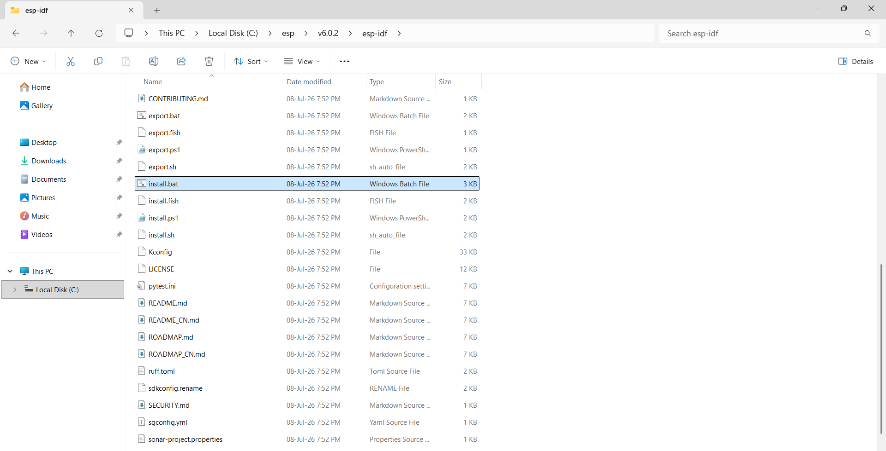
    <figcaption>Figure: ESP-IDF Folder Contents</figcaption>
</figure>

### ২.৬.১ install.bat রান করা
এই `install.bat` ফাইলটি রান করলে ESP-IDF কম্পাইল করার জন্য প্রয়োজনীয় সব টুল (`কম্পাইলার`, `Python প্যাকেজ`, ইত্যাদি) স্বয়ংক্রিয়ভাবে ডাউনলোড ও ইনস্টল হতে শুরু করে। এ সময় লক্ষ্য করলে টার্মিনালে দেখতে পাবেন কোন কোন টুল ইনস্টল হচ্ছে (যেমন `xtensa-esp-elf-gdb`, `riscv32-esp-elf-gdb`, `cmake`, `ninja`, `ccache`, `dfu-util` ইত্যাদি):

<figure align="center">
    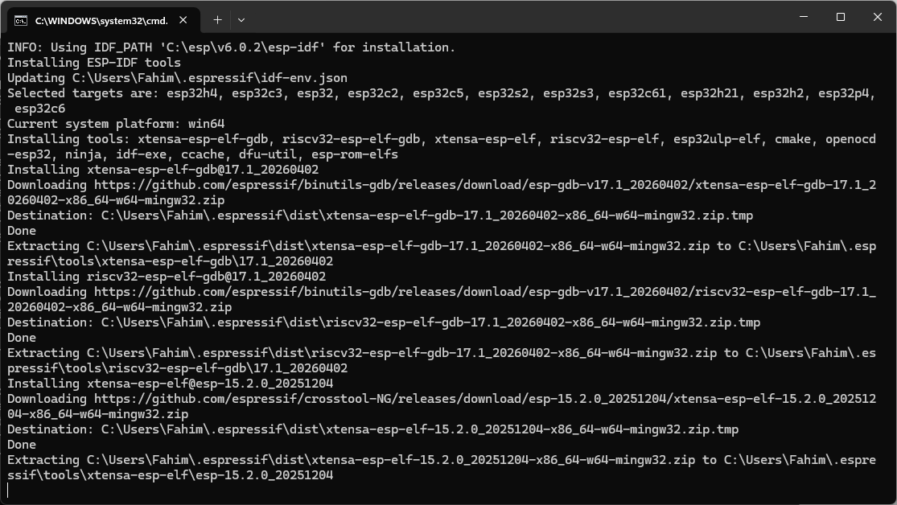
    <figcaption>Figure: Installing ESP Tools</figcaption>
</figure>

এরপর প্রয়োজনীয় `Python` প্যাকেজগুলোও (যেমন `esptool`, `pyserial`, `freertos-gdb` ইত্যাদি) ডাউনলোড ও ইনস্টল হবে:

<figure align="center">
    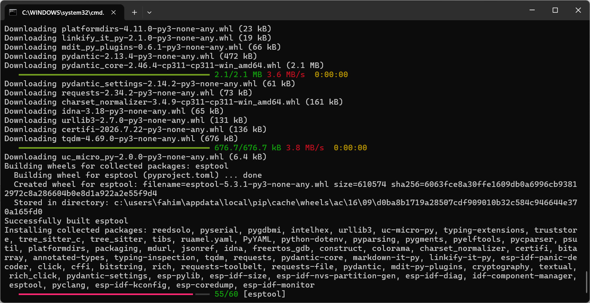
    <figcaption>Figure: Installing Python Packages</figcaption>
</figure>

> নোট: এই পুরো প্রক্রিয়ায় বেশ কিছুটা সময় লাগতে পারে (ইন্টারনেট স্পিডের উপর নির্ভর করে), কারণ বেশ বড় সাইজের কিছু ফাইল (যেমন টুলচেইন) ডাউনলোড হবে। ধৈর্য ধরে অপেক্ষা করুন।

সবকিছু সফলভাবে ইনস্টল হয়ে গেলে, আমরা এখন `VS Code`-এ ফিরে গিয়ে এই ইনস্টল করা `ESP-IDF` এনভায়রনমেন্টটা অ্যাক্টিভেট করব।

### ২.৬.২ VS Code-এ প্রজেক্ট ফোল্ডার ওপেন করা
কম্পিউটারের `Start Icon` অথবা কীবোর্ড থেকে `Windows` বাটনে ক্লিক করুন এবং `Visual Studio Code` লিখে সার্চ করে `App` টি চালু করুন। প্রথমবার Window টি এভাবে খালি অবস্থায় দেখতে পাবেন:

<figure align="center">
    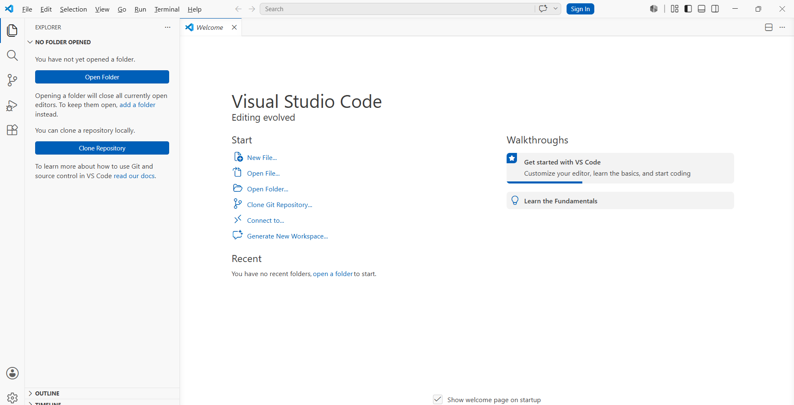
    <figcaption>Figure: VSCode Welcome Screen</figcaption>
</figure>

আমাদের সকল প্রোগ্রাম গুলো একজায়গায় গুছিয়ে রাখতে রাখতে, Desktop-এ ESP-Programs নামে একটি Project Folder তৈরি করে রাখুন। এখন File > Open Folder (অথবা Welcome স্ক্রিনের Open Folder লিংকে) ক্লিক করে ESP-Programs ফোল্ডারটি সিলেক্ট করুন:

<figure align="center">
    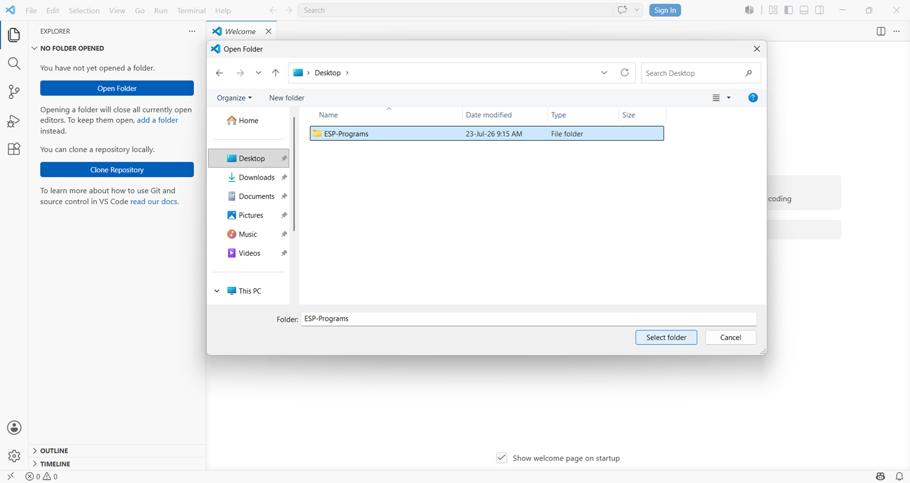
    <figcaption>Figure: VSCode Open Folder</figcaption>
</figure>

ফোল্ডারটি ওপেন হলে VS Code-এর Explorer-এ ESP-PROGRAMS নামে দেখতে পাবেন:

<figure align="center">
    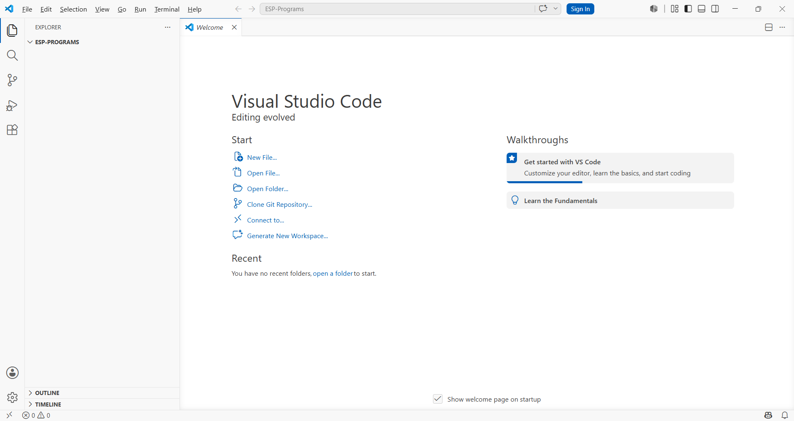
    <figcaption>Figure: ESP Project Folder</figcaption>
</figure>

### ২.৬.৩ VS Code Integrated Terminal ওপেন করা
আমরা এখন থেকে আলাদা কোনো CMD/PowerShell window না খুলে, সরাসরি VS Code-এর নিজস্ব Integrated Terminal ব্যবহার করব। এ জন্য VSCode এর উপরের মেনু থেকে Terminal > New Terminal সিলেক্ট করুন (অথবা শর্টকাট Ctrl+Shift+`):

<figure align="center">
    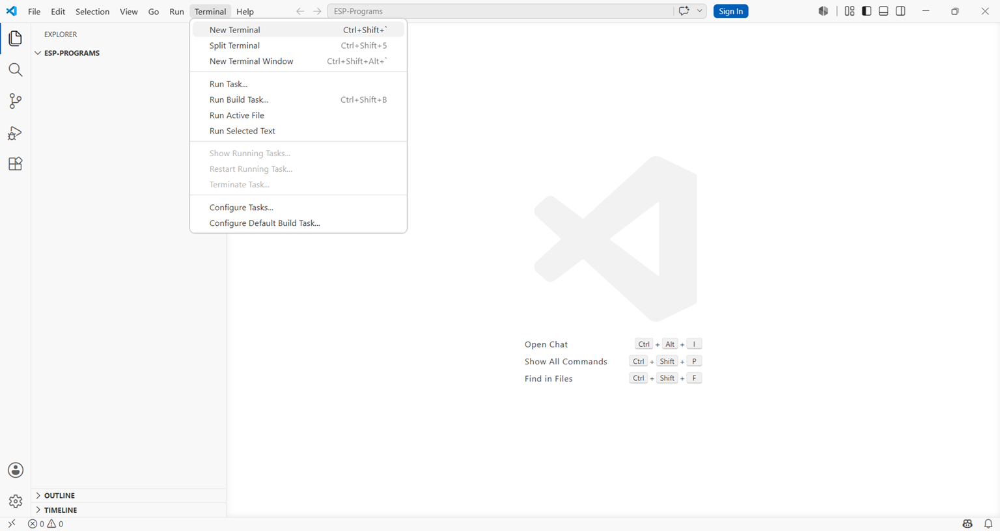
    <figcaption>Figure: Integrated Terminal</figcaption>
</figure>

একটা টার্মিনাল প্যানেল খুলে যাবে। খেয়াল করুন, ডিফল্টভাবে এটা PowerShell দিয়ে ওপেন হয়:

<figure align="center">
    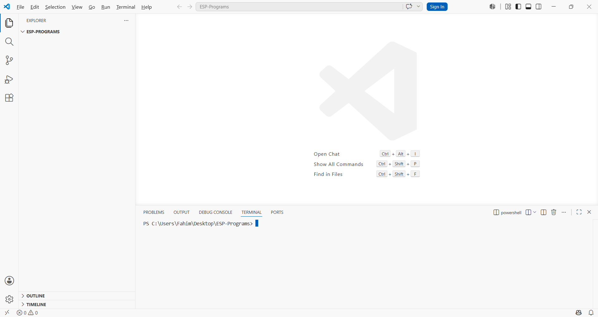
    <figcaption>Figure: Power Shell Terminal</figcaption>
</figure>

> নোট: ESP-IDF-এর স্ক্রিপ্টগুলো (install.bat, export.bat) মূলত Command Prompt (CMD)-এর জন্য লেখা ব্যাচ ফাইল। যদিও export.ps1 নামে PowerShell ভার্সনও পাওয়া যায়, তবু সবচেয়ে ঝামেলামুক্ত অভিজ্ঞতার জন্য আমরা VS Code-এর ডিফল্ট টার্মিনাল প্রোফাইল হিসাবে PowerShell থেকে Command Prompt-এ পরিবর্তন করে নেব।

### ২.৬.৪ ডিফল্ট টার্মিনাল Command Prompt-এ পরিবর্তন করা
VS Code এর বাম পাশের নিচের দিক থেকে Gear Icon এ ক্লিক করার মাধ্যমে Settings ওপেন করুন (Ctrl+,) এবং সার্চ বক্সে লিখুন default terminal। এখন Terminal > Integrated > Default Profile: Windows সেটিংসটি খুঁজে বের করুন। ডিফল্টভাবে এটি null (মানে সিস্টেমের ডিফল্ট, সাধারণত PowerShell) দেখাবে:

<figure align="center">
    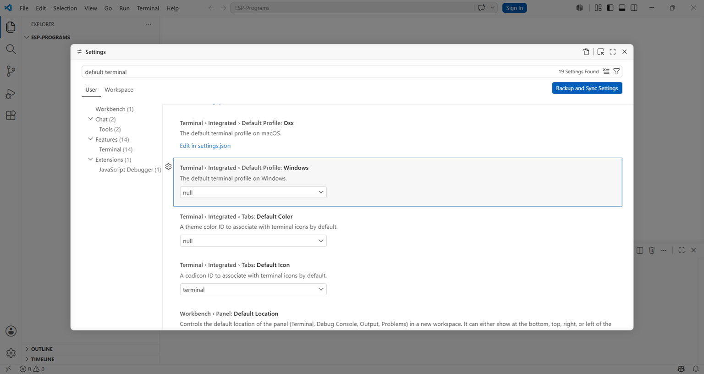
    <figcaption>Figure: Windows Default Profile</figcaption>
</figure>

এখন ড্রপডাউন থেকে Command Prompt সিলেক্ট করুন:

<figure align="center">
    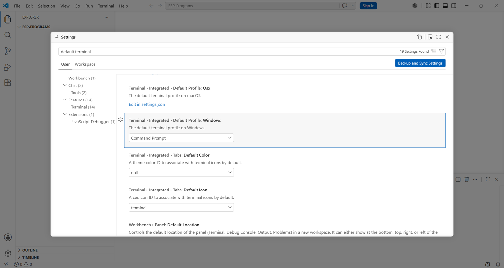
    <figcaption>Figure: Select command Prompt</figcaption>
</figure>

Settings ট্যাব বন্ধ করে একটা নতুন টার্মিনাল খুলুন (পুরনোটা বন্ধ করে আবার Ctrl+Shift+`), এখন লক্ষ্য করলে দেখবেন এটি CMD দিয়ে ওপেন হবে:

<figure align="center">
    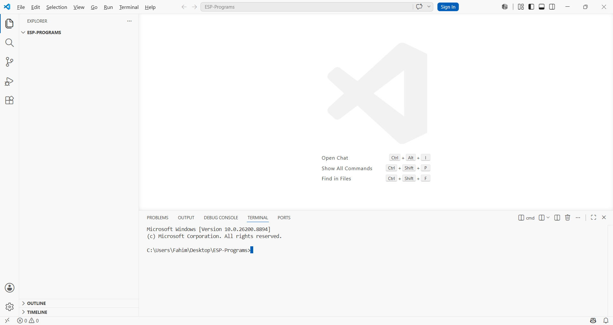
    <figcaption>Figure: CMD Default Terminal</figcaption>
</figure>

### ২.৬.৫ ESP-IDF এনভায়রনমেন্ট অ্যাক্টিভেট করা
এখানে মনে একটি প্রশ্ন আসতে পারে — টুলস ইনস্টল করা হয়েছে, তাহলে আবার "অ্যাক্টিভেট" করার দরকার কী?

আসলে EIM যে টুলগুলো (Python, কম্পাইলার, idf.py স্ক্রিপ্ট ইত্যাদি) ইনস্টল করেছে, সেগুলো সাধারণ কোনো প্রোগ্রামের মতো সরাসরি Windows-এর PATH-এ যোগ হয়নি — বরং একটা নির্দিষ্ট, আলাদা লোকেশনে (.espressif ফোল্ডারের ভেতরে) রাখা হয়েছে, যাতে অন্য কোনো সফটওয়্যারের সাথে conflict না হয়। ফলে যদি আপনি এখনই একটা নতুন টার্মিনাল খুলে idf.py লেখেন, Windows সেই কমান্ডটা চিনবে না — কারণ টার্মিনালটা জানেই না এই টুলগুলো কোথায় আছে।

"অ্যাক্টিভেট করা" মানে হলো — এই নির্দিষ্ট টার্মিনাল সেশনের জন্য সাময়িকভাবে PATH এবং অন্যান্য প্রয়োজনীয় Environment Variable সেট করে দেওয়া, যাতে টার্মিনালটা জানতে পারে ঠিক কোথায় গিয়ে idf.py, Python, কম্পাইলার ইত্যাদি খুঁজে পেতে হবে। এই কাজটিই করে export.bat স্ক্রিপ্ট। এই সেটিংস শুধু ওই একটা টার্মিনাল সেশনের জন্যই প্রযোজ্য — টার্মিনাল বন্ধ করে আবার নতুন করে খুললে আবার export.bat চালাতে হবে।

ESP-IDF এনভায়রনমেন্ট অ্যাক্টিভেট করতে, EIM যেখানে ESP-IDF ইনস্টল করেছে, সেই ডিরেক্টরিতে প্রবেশ করুন:

```
cd C:\esp\v6.0.2\esp-idf
```

<figure align="center">
    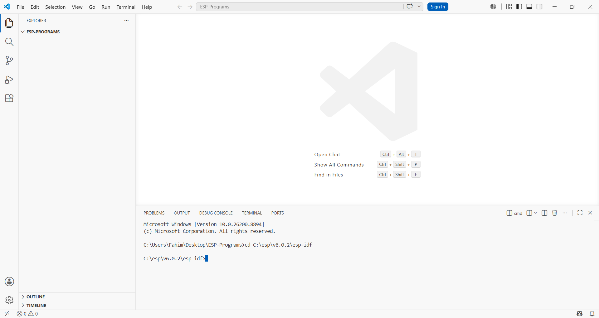
    <figcaption>Figure: ESP-IDF Directory</figcaption>
</figure>

এখন `export.bat` স্ক্রিপ্টটি রান করুন: 

```
export.bat
```

<figure align="center">
    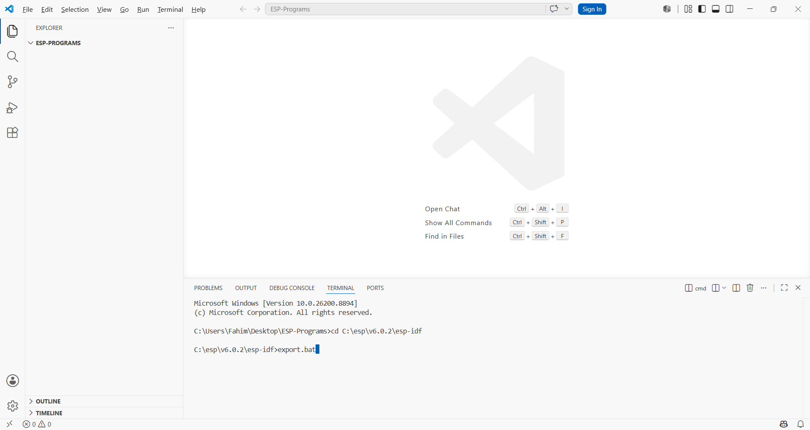
    <figcaption>Figure: Script File</figcaption>
</figure>

এই কমান্ড রান হওয়ার পর একে একে বেশ কিছু চেক সম্পন্ন হবে (Python dependencies, ESP-IDF environment, shell identification, outdated tools) এবং সবশেষে "Done! You can now compile ESP-IDF projects." মেসেজ দেখতে পাবেন:

<figure align="center">
    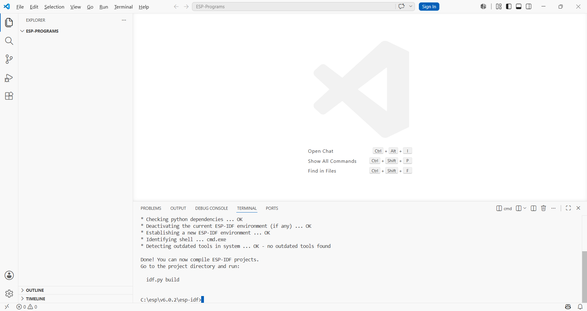
    <figcaption>Figure: Activating ESP-IDF Environment</figcaption>
</figure>

> নোট: এই export.bat কমান্ডটি প্রতিবার নতুন টার্মিনাল খোলার সময় আবার রান করতে হবে (এনভায়রনমেন্ট ভ্যারিয়েবলগুলো শুধু ওই নির্দিষ্ট টার্মিনাল সেশনের জন্যই সেট হয়)। বারবার এই দুটো কমান্ড টাইপ করা এড়াতে চাইলে, আমরা পরবর্তী একটা অধ্যায়ে একটা সহজ শর্টকাট তৈরি করার উপায় দেখব।

### ২.৬.৬ ইনস্টলেশন চেক করা
আমরা এখানে একটি CMD Command লিখে চেক করে দেখতে পারি যে, সবকিছু ঠিকঠাক কাজ করছে কি না? 

```
idf.py --version
```

<figure align="center">
    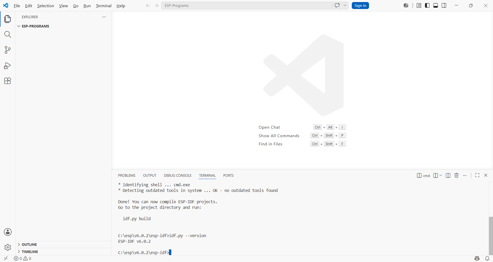
    <figcaption>Figure: Check IDF Verson</figcaption>
</figure>

সবকিছু ঠিক থাকলে, ESP-IDF রিপ্লাই হিসাবে আপনাকে **Installed Version Name** রিটার্ন করবে: 

```
ESP-IDF v6.0.2
```

অভিনন্দন! আপনার ESP-IDF এনভায়রনমেন্ট এখন VS Code-এর ভেতরেই সম্পূর্ণভাবে কাজ করছে — কোনো আলাদা CMD window ছাড়াই।

---

## ২.৭ New Project তৈরি এবং বিল্ড করা
এতক্ষণে `VS Code` এবং `ESP-IDF` ফ্রেমওয়ার্ক — সবকিছু ইনস্টল করা হলো। এখন আমরা একটি সাধারণ কম্পিউটার প্রোগ্রাম (হ্যালো ওয়ার্ল্ড) `create` এবং `run` করে দেখবো যে সবকিছু ঠিকঠাক কাজ করছে কিনা। যেকোনো প্রোগ্রামিং ভাষা শেখার ক্ষেত্রে এটি একটি common প্রোগ্রাম। 

1. সর্বপ্রথম নিশ্চিত হয়ে নিয়ে যে, VSCode EXPLORER এ আমাদের Project Folder ওপেন রয়েছে। এবার **EXPLORER** এর ফাঁকা জায়গায় কম্পিউটার-মাউসের Right Button ক্লিক করে Copy Path অপশনে ক্লিক করুন।

<figure align="center">
    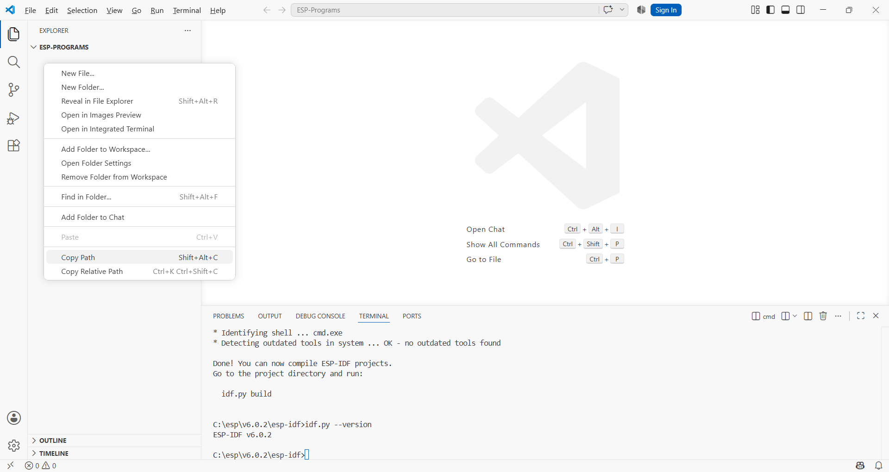
    <figcaption>Figure: Copy Project Path</figcaption>
</figure>

2. এখন VSCode Terminal এর Current Working Directory পরিবর্তন করে Project Folder করতে নিচের কমান্ডটি লিখুন: 

```
cd C:\Users\Fahim\Desktop\ESP-Programs
```

<figure align="center">
    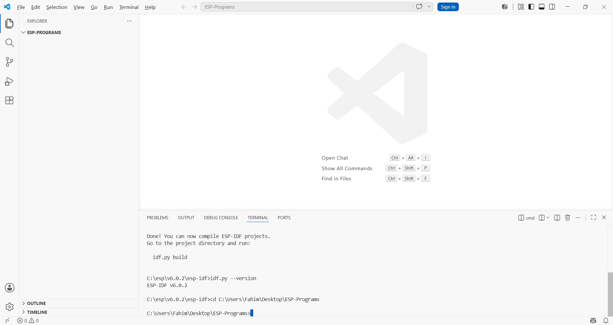
    <figcaption>Figure: Project Directory</figcaption>
</figure>


3. নতুন একটি ESP IDF Project তৈরি করতে, `idf.py create-project <project-name>` কমান্ডটি run করুন: 

```
idf.py create-project 01-Hello-World 
```

<figure align="center">
    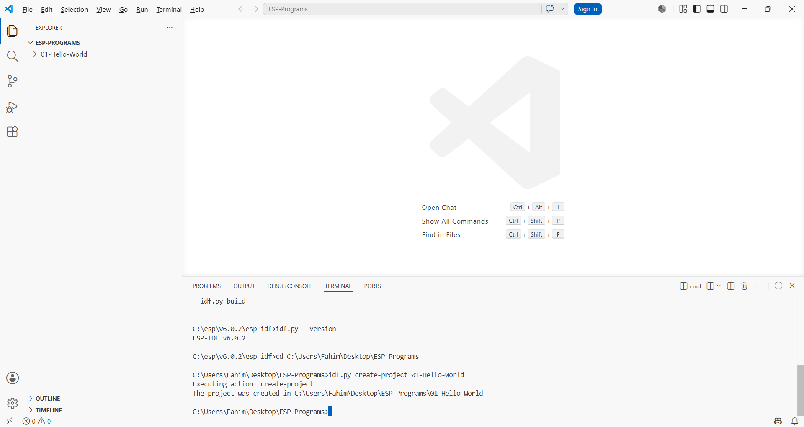
    <figcaption>Figure: Create New Project</figcaption>
</figure>

4. VSCode Explorer এ ওপেন থাকা Project Folder এর পাশে থাকা Arrow বাটনগুলোতে ক্লিক করার মাধ্যমে `01-Hello-World.c` ফাইলটি ওপেন করুন। 

<figure align="center">
    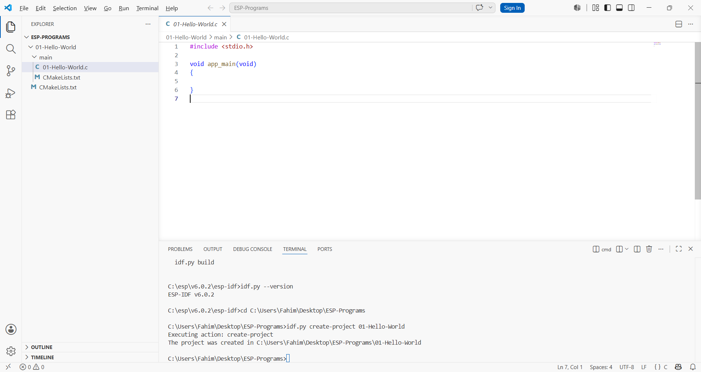
    <figcaption>Figure: Boilerplate Code</figcaption>
</figure>

Main C File এ pre-written (boilerplate) কিছু কোড দেখতে পাবেন। 

5. `app_main` ফাংশনের মধ্যে `printf("Hello World!\n");` লিখুন এবং কীবোর্ড থেকে Ctrl+S চেপে ফাইলটি Save করুন।

```
#include <stdio.h>

void app_main(void)
{
    printf("Hello World!\n");
}
```

<figure align="center">
    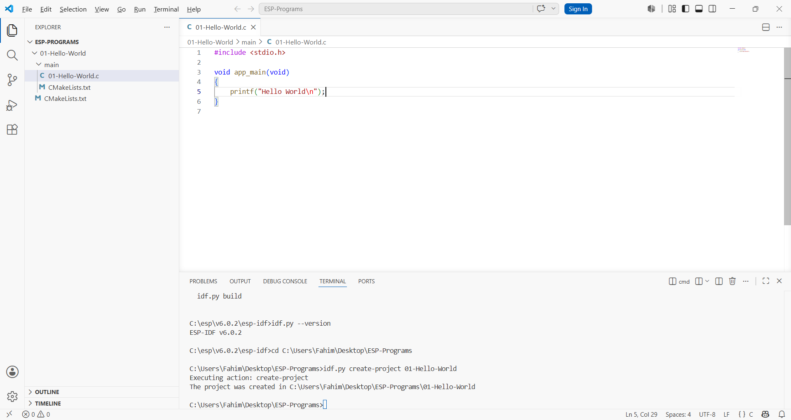
    <figcaption>Figure: Updated C File</figcaption>
</figure>

6. Project Folder এ browse করুন। 

```
cd 01-Hello-World
```

<figure align="center">
    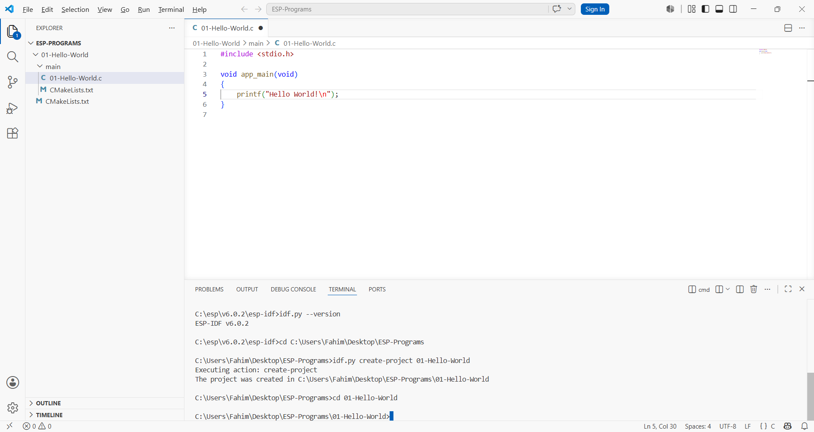
    <figcaption>Figure: Change Working Directory</figcaption>
</figure>

7. নিচের কমান্ডটি run করার মাধ্যমে target-chip সিলেক্ট করুন। 

```
idf.py set-target esp32
```

<figure align="center">
    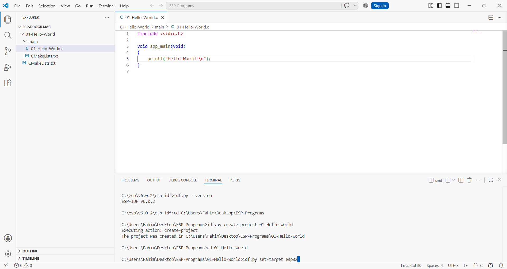
    <figcaption>Figure: Set Target Chip</figcaption>
</figure>

<figure align="center">
    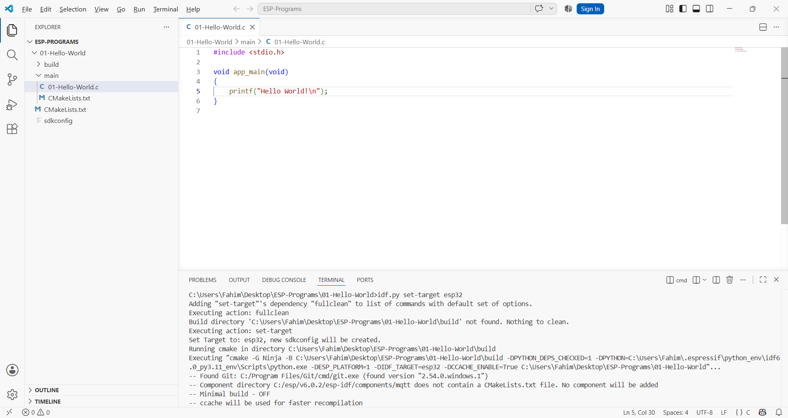
    <figcaption>Figure: Executing Action Set-Target</figcaption>
</figure>

<figure align="center">
    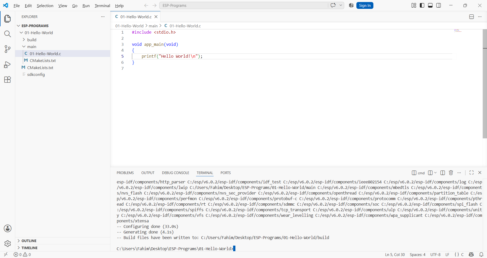
    <figcaption>Figure: Build File Created</figcaption>
</figure>

> নোট: লক্ষ্য করলে দেখবেন ‌‌`idf.py set-target esp32` কমান্ড execute করার সাথে সাথেই Project Folder এর মধ্যে build নামে একটি নতুন folder তৈরি হয়েছে।

8. এখন পর্যন্ত কোন বুটলোডার ফাইল তৈরি হয়নি, মানে bootloader ফোল্ডারটি empty অবস্থায় পাবেন। 

<figure align="center">
    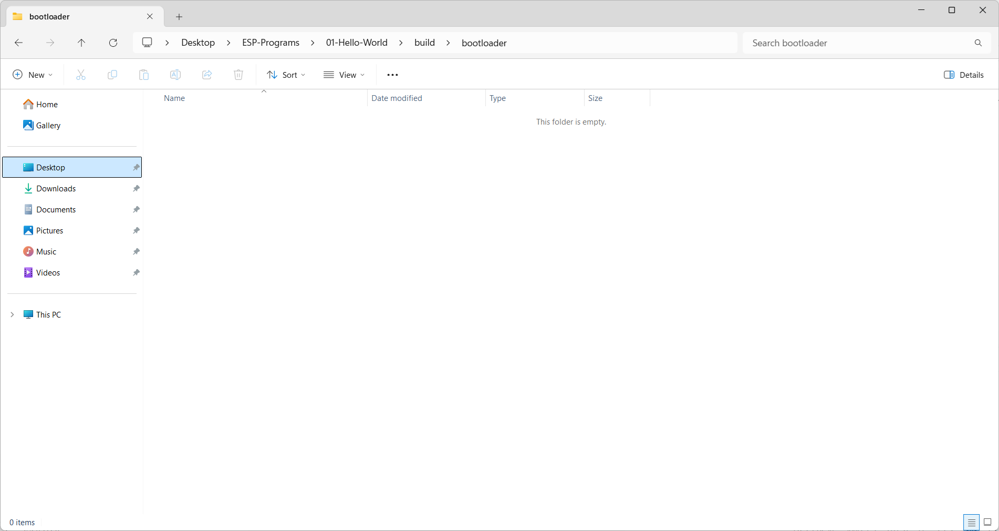
    <figcaption>Figure: Empty Build Folder</figcaption>
</figure>

প্রোজেক্ট build করতে নিচের কমান্ডটি লিখুন: 

```
idf.py build
```

<figure align="center">
    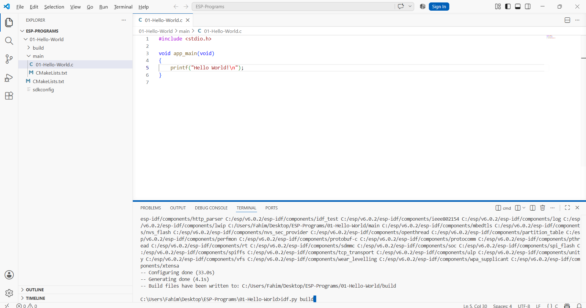
    <figcaption>Figure: Build Project</figcaption>
</figure>

<figure align="center">
    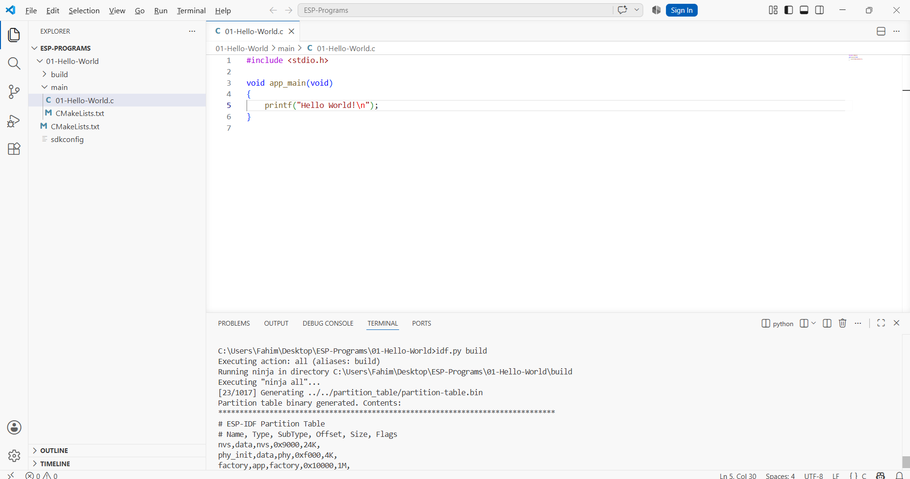
    <figcaption>Figure: Partition Table Generated</figcaption>
</figure>

<figure align="center">
    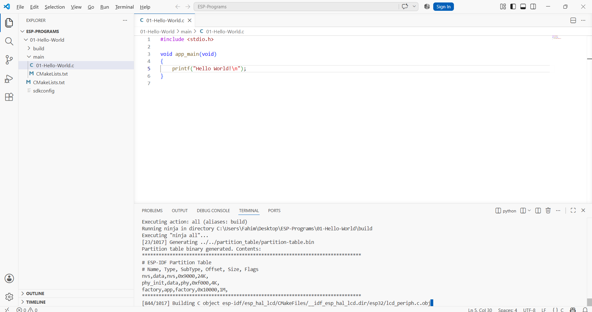
    <figcaption>Figure: Partition Table</figcaption>
</figure>

<figure align="center">
    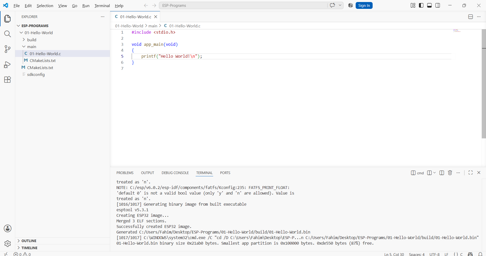
    <figcaption>Figure: ESP32 Image Created</figcaption>
</figure>

<figure align="center">
    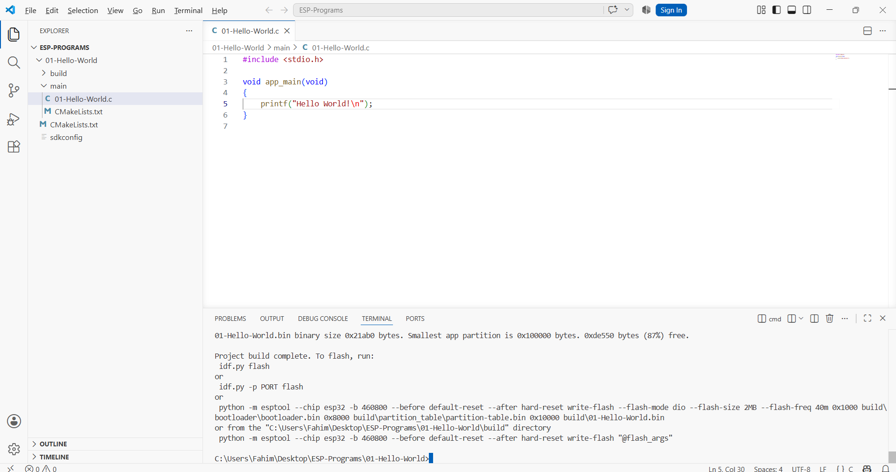
    <figcaption>Figure: Project Build Completed</figcaption>
</figure>

আমাদের ESP Image তৈরি হয়েছে। এখন যদি আপনি পুনরায় bootloader ফোল্ডারটিতে browse করেন, তাহলে সেখানে bootloader.bin নামে একটি ফাইল দেখতে পাবেন। 

অর্থাৎ আমাদের Project File বিল্ড হয়ে binary ফাইল তৈরি হয়েছে। মূলত Program Execution এর জন্য এই bootloader.bin ফাইলটি ESP Chip এর মধ্যে Flash করা হয়। 

---

## ২.৮ ESP32-তে প্রোগ্রাম আপলোড করা 
আপনার কাছে থাকা ESP32 Microcontroller-এ প্রোগ্রাম আপলোড করতে, নিচের ধাপগুলো অনুসরণ করুন: 
1. প্রোগ্রাম আপলোড করতে সর্বপ্রথম ESP32 Dev Kit V1 কে USB Cable এর সাহায্যে কম্পিউটারের সাথে connect করতে হবে। 

2. ESP বোর্ডে থাকা USB-to-Serial চিপ কম্পিউটারের সাথে যোগাযোগের জন্য COMxx Port তৈরি করে। বোর্ডটি কম্পিউটারের কোন COMxx পোর্টে কানেক্ট হয়েছে, তা Device Manger থেকে খুব সহজেই চেক করা যায়। এ জন্য কম্পিউটারের Start বাটন ক্লিক করে, Device Manager লিখে সার্চ করে App টি সিলেক্ট করতে হবে। 

<figure align="center">
    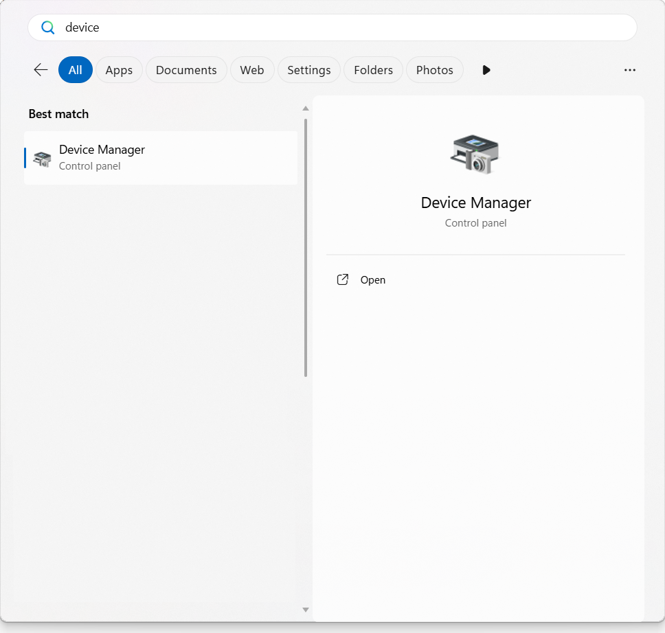
    <figcaption>Figure: Device Manager</figcaption>
</figure>

ESP বোর্ডে USB to Serial Communication এর জন্য সাধারণত **CP2102** অথবা **CH340** চিপ ব্যবহার করা হয়। 

আপনার বোর্ডে কোন চিপ ব্যবহার করা হয়েছে তা বোর্ডের ছোট IC-গুলোর গায়ে লেখা নাম পড়ে নিতে পারেন, অথবা Device Manager-এর **Ports (COM & LPT)** সেকশনে বোর্ড কানেক্ট করার পর নতুন কোন COM পোর্ট (যেমন `COM5`) তৈরি হচ্ছে সেটা দেখেও নিশ্চিত হতে পারেন। 

<figure align="center">
    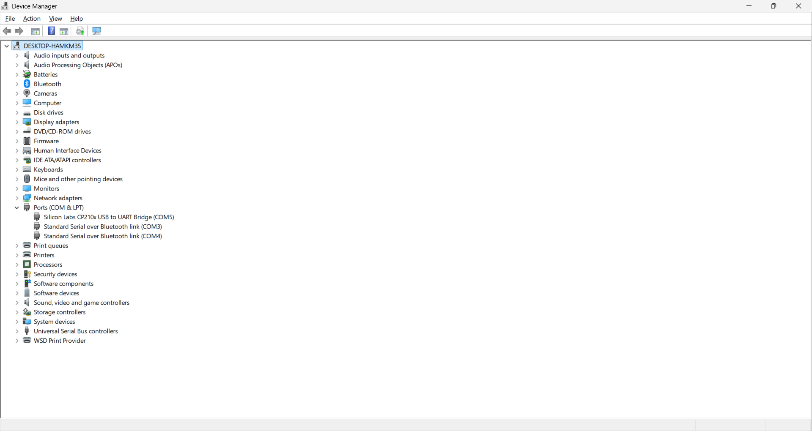
    <figcaption>Figure: USB to UART Bridge (COM5)</figcaption>
</figure>

যেমন আমার কম্পিউটারে **CP210x USB to Serial** ড্রাইভার চিপ `COM5` পোর্ট তৈরি করেছে। এই পোর্ট-নম্বরটি খুবই গুরুত্বপূর্ণ, এটি ব্যবহার করেই আমরা পরবর্তীতে ESP-তে প্রোগ্রাম আপলোড বা সিরিয়াল-ডেটা প্রিন্ট করার মত কাজ গুলো করতে পারবো। 

3. ESP32 Dev Kit V1-এ Hello-World প্রোজেক্টটি binary file flash করার জন্য নিচের কমান্ডটি run করুন। 

```
idf.py -p com5 flash 
```

<figure align="center">
    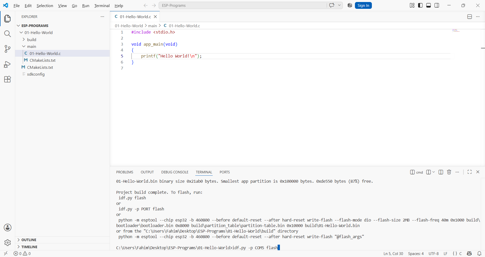
    <figcaption>Figure: Flashing ESP32</figcaption>
</figure>

<figure align="center">
    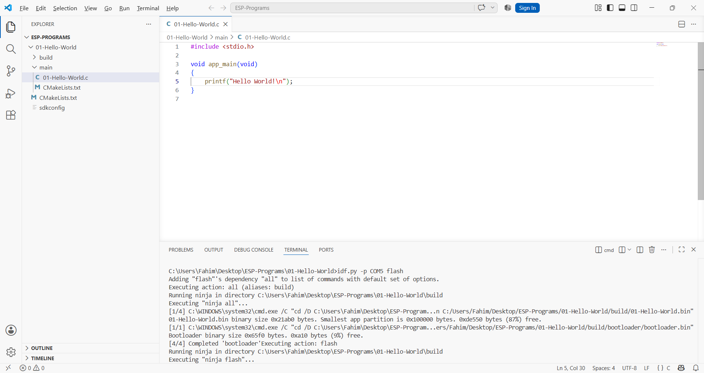
    <figcaption>Figure: Executing Ninja Flash</figcaption>
</figure>

<figure align="center">
    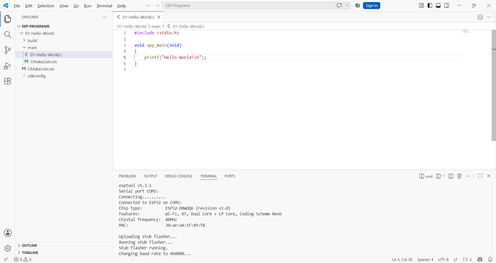
    <figcaption>Figure: Connected to ESP32</figcaption>
</figure>

Screen-এ `Connecting...` মেসেজ দৃশ্যমান হওয়ার সাথে সাথেই `Boot` বাটনটি প্রেস করে ধরে রাখুন এবং `Writing at 0x00010000...` মেসেজ দৃশ্যমান হলে `Button Release` করুন। 

<figure align="center">
    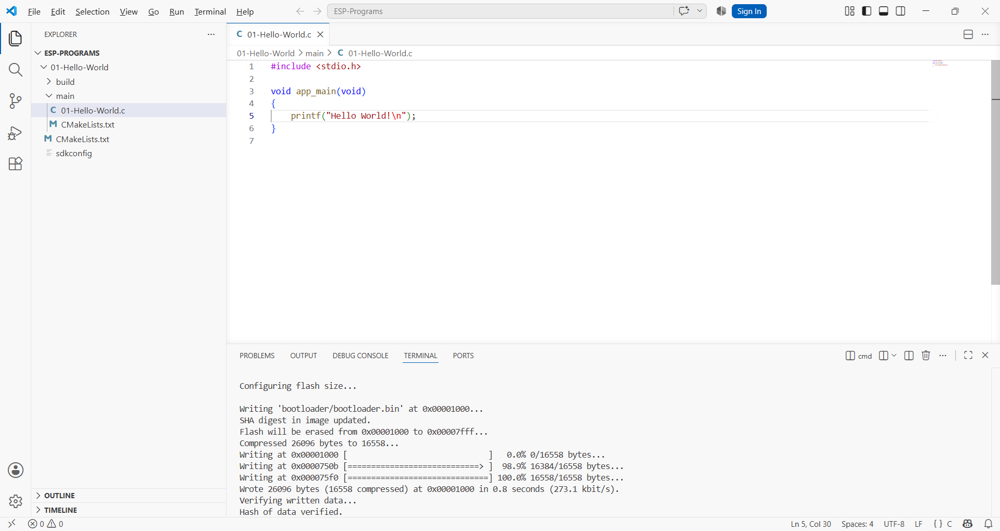
    <figcaption>Figure: Writing Bootloader Bin File</figcaption>
</figure>

<figure align="center">
    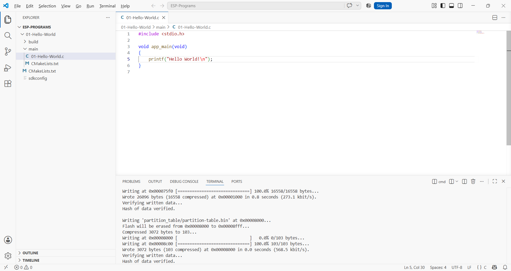
    <figcaption>Figure: Writing Partition-Table Bin File</figcaption>
</figure>

<figure align="center">
    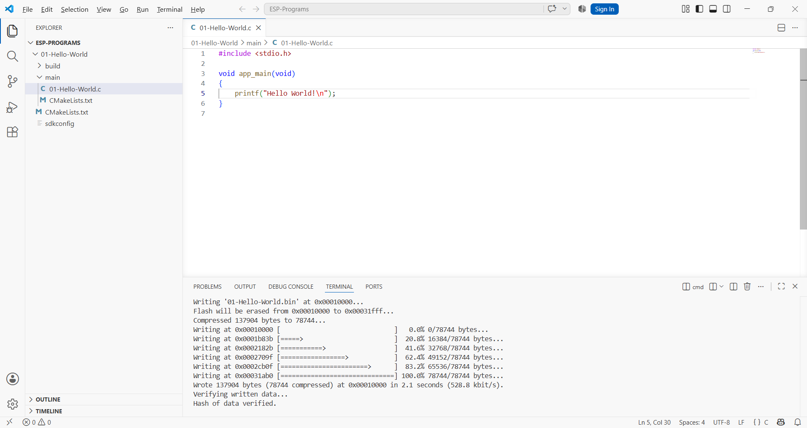
    <figcaption>Figure: Writing 01-Hello-World Bin File</figcaption>
</figure>

<figure align="center">
    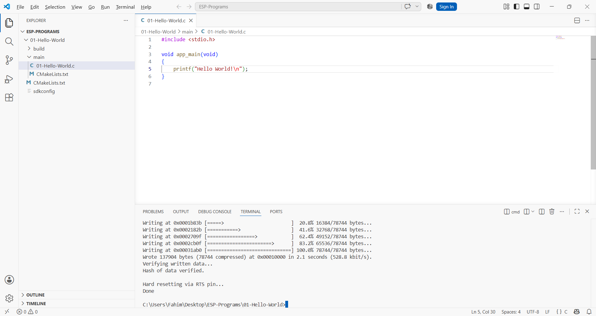
    <figcaption>Figure: Hard Reset via RST Pin</figcaption>
</figure>


4. মনে আছে? প্রোগ্রামে আমরা printf("Hello World!\n"); লিখেছিলাম। সুতরাং আমরা যদি এখন ESP32-এর সিরিয়াল পোর্টের কানেক্ট হতে পারি, তাহলে Hello World! লেখা দেখতে পাবো। 

ESP32 Dev Kit V1 এর সিরিয়াল-ডেটা read করতে, নিচের কমান্ডটি run করুন। 

```
idf.py -p com5 monitor 
```

<figure align="center">
    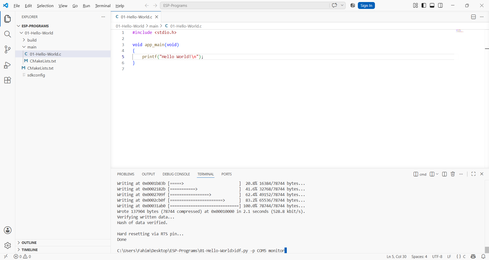
    <figcaption>Figure: Monitoring ESP32</figcaption>
</figure>

<figure align="center">
    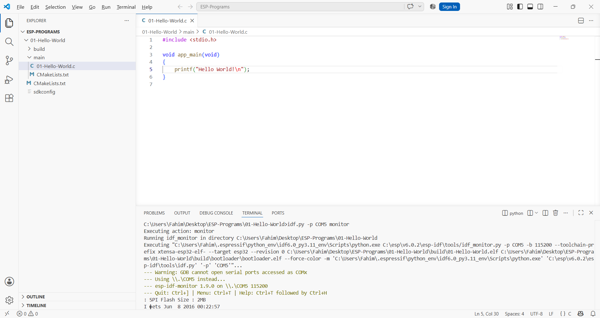
    <figcaption>Figure: Executing Action Monitor</figcaption>
</figure>

<figure align="center">
    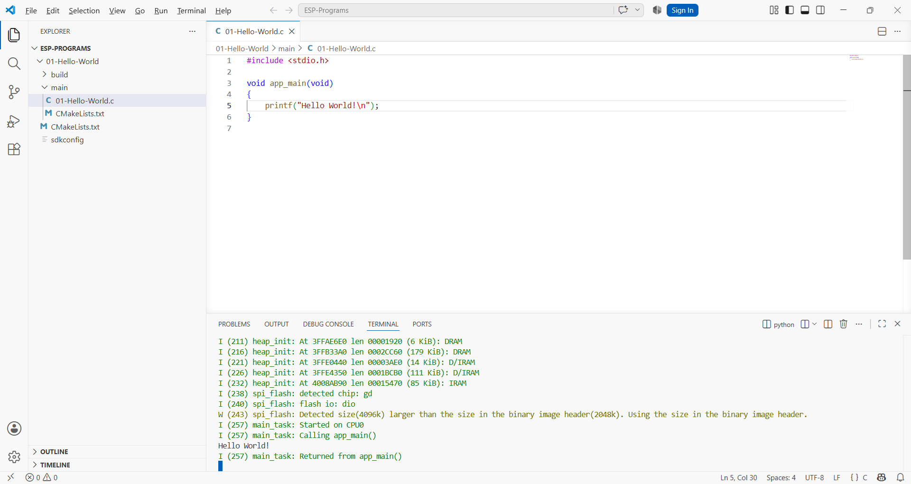
    <figcaption>Figure: Serial Data Printing</figcaption>
</figure>


ফাইনালি আমরা successfully আমাদের ESP32 Dev Kit V1 ব্যবহার করে Hello World প্রিন্ট করতে পেরেছি। 

যদিও আমি বোঝার সুবিধার্থে ভেঙ্গে ভেঙ্গে কমান্ড দিয়েছি, তবে আপনি ইচ্ছা করলে সরাসরি নিচের মত করে single line command লিখতে পারেন, এতে করে Program Upload হয়ে সরাসরি Terminal-এ Serial Data প্রিন্ট হওয়া শুরু হবে।  

```
idf.py -p com5 flash monitor 
```

5. Serial Data প্রিন্ট করার কমান্ড execute করার সাথে সাথেই Terminal-এ নতুন কমান্ড নেওয়া বন্ধ হয়ে যাবে। VSCode Terminal টি stop করতে কীবোর্ড থেকে Ctrl+] প্রেস করুন। 

<figure align="center">
    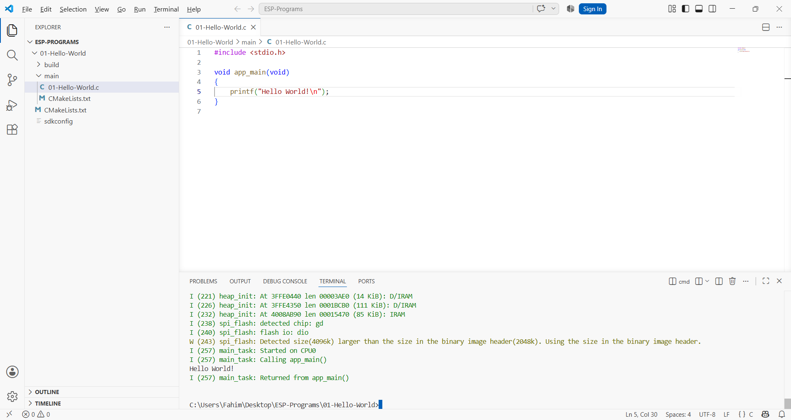
    <figcaption>Figure: Terminate VSCode Terminal</figcaption>
</figure>

সুতরাং আমরা এখন পর্যন্ত ESP-IDF ব্যবহার করে Project `Create`, `Build`, `Flash`, এবং `Monitor` করা শিখেছি। 

> **নোট:** অধ্যায়-১ এবং অধ্যায়-২ তুলনামূলকভাবে একটু কঠিন মনে হতে পারে। তবে এটি যেহেতু শুধমাত্র একবারই করতে হয়, তাই আমার পরামর্শ থাকবে হতাশ না হয়ে বরং একটু মনোযোগ দিয়ে বারবার এই অংশ practice করার। এটি হলো ESP শেখার ভিত্তি, আর ভিত্তি যত শক্ত হবে - পরবর্তী শেখাগুলো ততই সহজ হবে। 

---

## ২.৯ সাধারণ সমস্যা ও সমাধান
| সমস্যা | সম্ভাব্য কারণ ও সমাধান |
|---|---|
| **"Insufficient permissions to install drivers"** — EIM-এ Install Drivers বাটনে ক্লিক করলে এই এরর আসছে | ড্রাইভার ইনস্টল করতে Windows-এ সবসময় Administrator পারমিশন লাগে। EIM বন্ধ করুন, `eim-gui-windows-x64.exe` ফাইলে রাইট-ক্লিক করে **Run as administrator** সিলেক্ট করুন, তারপর আবার Install Drivers-এ ক্লিক করুন। |
|`export.bat` ফাইল `run` করলে **ERROR** আসছে |সম্ভবত `C:\esp\v6.0.2\esp-idf` এই লোকেশন থেকে `install.bat` ফাইলটি `run` করা হয়নি! (প্রথমবার EIM ইনস্টলেশনের পর একবার `install.bat` ফাইলটি `run` করা বাধ্যতামূলক) |
| `idf.py --version` চালালে **"idf.py is not recognized"** জাতীয় এরর দেখাচ্ছে | এর মানে ESP-IDF এনভায়রনমেন্ট অ্যাক্টিভেট হয়নি। ঠিক esp-idf ফোল্ডারে (`cd C:\esp\v6.0.2\esp-idf`) আছেন কিনা এবং তারপর `export.bat` চালিয়েছেন কিনা যাচাই করুন। মনে রাখবেন, প্রতিটা নতুন টার্মিনালে আবার এই দুই ধাপ করতে হয়। |
| `install.bat` / `export.bat` চলাকালীন ডাউনলোড খুব ধীর বা আটকে গেছে মনে হচ্ছে | ইন্টারনেট কানেকশন চেক করুন। টুলচেইনের কিছু ফাইল বেশ বড় সাইজের, তাই ধীরগতির কানেকশনে স্বাভাবিকের চেয়ে বেশি সময় লাগতে পারে — ধৈর্য ধরে অপেক্ষা করুন। |
| বোর্ড USB দিয়ে কানেক্ট করার পর Device Manager-এ কোনো নতুন COM পোর্ট দেখাচ্ছে না | USB ক্যাবল বদলে দেখুন (অনেক ক্যাবল শুধু চার্জিং সাপোর্ট করে, ডেটা ট্রান্সফার না)। এরপরও না দেখালে CP2102/CH340 ড্রাইভার ম্যানুয়ালি ইনস্টল করুন — EIM-এর **Install Drivers** বাটন দিয়ে, অথবা সরাসরি Silicon Labs (CP2102) বা WCH (CH340)-এর ওয়েবসাইট থেকে। |
| `idf.py flash` চালালে **"Could not open port"** বা **"Failed to connect"** এরর | সঠিক COM নম্বর ব্যবহার করছেন কিনা Device Manager-এ আবার চেক করুন। এছাড়া অন্য কোনো প্রোগ্রাম (যেমন Arduino IDE-এর Serial Monitor) যদি একই সময়ে সেই পোর্ট ব্যবহার করে থাকে, সেটা বন্ধ করুন — একই সিরিয়াল পোর্ট একসাথে দুটো প্রোগ্রাম ব্যবহার করতে পারে না। |
| Flash করার সময় বোর্ড সাড়া দিচ্ছে না, বারবার "Connecting..." দেখাচ্ছে | কিছু ESP32 Dev Kit V1 বোর্ডে ম্যানুয়ালি bootloader mode-এ যেতে হয় — **Boot** বাটন চেপে ধরে রাখুন, "Writing at 0x00010000..." মেসেজ দেখা গেলে ছেড়ে দিন (২.৮ সেকশনে বিস্তারিত আছে)। |

---

*[পরবর্তী অধ্যায়: এনভায়রনমেন্ট সেটআপ (macOS)]*
