# অধ্যায় ৩: এনভায়রনমেন্ট সেটআপ (macOS)

## ৩.১ এই অধ্যায়ে আমরা কী শিখব?

দ্বিতীয় অধ্যায়ে আমরা Windows-এ ESP-IDF এনভায়রনমেন্ট সেটআপ করেছি। যারা macOS ব্যবহার করেন, তাদের জন্য এই অধ্যায়। মূল ধারণা একদম একই — VS Code + ESP-IDF Installation Manager (EIM), শুধু কমান্ড ও টুলগুলো macOS-এর উপযোগী।

> **নোট**: macOS এবং Windows-এ ইনস্টলেশনের ধাপ কিছুটা ভিন্ন। দ্বিতীয় অধ্যায়ে আমরা **Windows** এর জন্য এনভায়রনমেন্ট তৈরি করা শিখেছি, এই অংশে আমরা **macOS**-এর জন্য পুরো প্রক্রিয়াটি দেখব। আপনি যদি Windows ব্যবহারকারী হয়ে থাকেন, তাহলে সরাসরি পরের অধ্যায়ে চলে যেতে পারেন।

**আমরা ধাপে ধাপে যা করব:**

1. Visual Studio Code (VS Code) ইনস্টল করা (কোড এডিটর হিসেবে)
2. Prerequisites (Homebrew দিয়ে) ইনস্টল করা
3. ESP-IDF Installation Manager (EIM) ইনস্টল করা
4. EIM দিয়ে ESP-IDF ফ্রেমওয়ার্ক ইনস্টল করা
5. ESP-IDF দিয়ে প্রয়োজনীয় টুলস ইনস্টল করা 
6. ESP-IDF এনভায়রনমেন্ট অ্যাক্টিভেট করা
7. New Project তৈরি এবং বিল্ড করা
8. ESP32-তে প্রোগ্রাম আপলোড করা

> **নোট**: ESP-IDF Framework-এর ভার্সন নম্বর মাঝেমধ্যে আপডেট হয়। এই অধ্যায়টি লেখার সময় (২০২৬) ESP-IDF Installation Manager (EIM)-এর মাধ্যমে সর্বশেষ সংস্করণ **ESP-IDF v6.0.2** ইনস্টল করা হয়েছে এবং তারই screenshot ব্যবহার করা হয়েছে। ভবিষ্যতে ভার্সন নম্বরে সামান্য পরিবর্তন দেখলে ঘাবড়াবেন না — মূল ধারণাটি সবসময় একই থাকবে।

---

## ৩.২ প্রয়োজনীয় জিনিসপত্র

পরবর্তী ধাপ শুরু করার আগে নিশ্চিত হয়ে নিন যে আপনার কাছে রয়েছে:

- একটি Mac কম্পিউটার (macOS Monterey বা তার পরের ভার্সন)
- স্ট্যাবল ইন্টারনেট কানেকশন (ডাউনলোড করতে 1-2 GB পর্যন্ত ডেটা লাগতে পারে)
- একটি ESP32 Dev Kit V1 বোর্ড
- একটি ভালো মানের USB ক্যাবল (শুধু চার্জিং না, ডেটা ট্রান্সফার সাপোর্ট করে এমন ক্যাবল হতে হবে)

---

## ৩.৩ Visual Studio Code ইনস্টল করা

যদি আপনার Mac-এ আগে থেকেই VS Code ইনস্টল করা না থাকে:

1. ব্রাউজারে গিয়ে সরাসরি **[code.visualstudio.com](https://code.visualstudio.com/)**-এ ভিজিট করুন।

<figure align="center">
    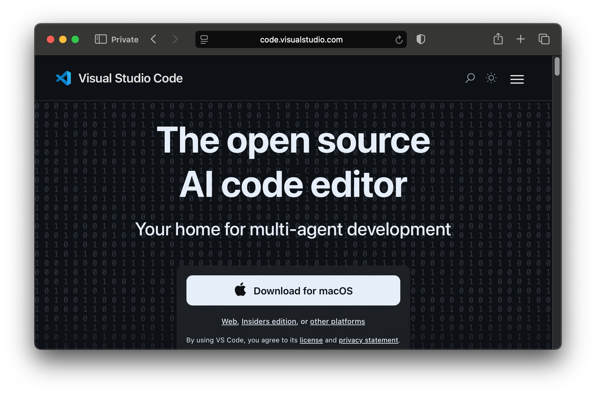
    <figcaption>Figure: VSCode Download for macOS</figcaption>
</figure>

2. **Download for macOS** বাটনে ক্লিক করে `.dmg` ফাইলটি ডাউনলোড করুন।

<figure align="center">
    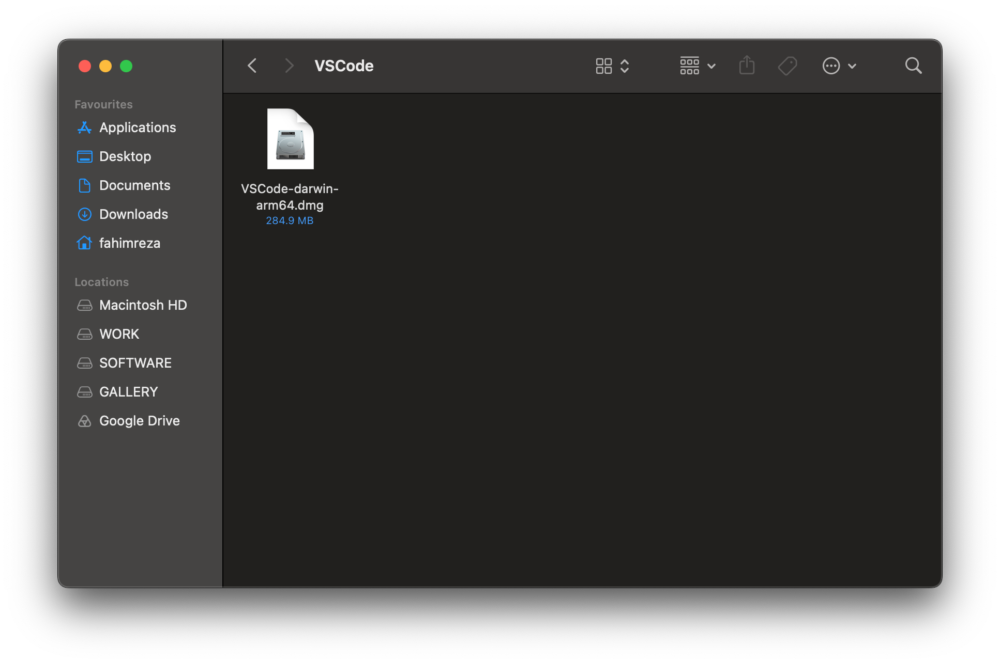
    <figcaption>Figure: VSCode Downloaded</figcaption>
</figure>

3. ডাউনলোড হওয়া ফাইলটি (আমার ক্ষেত্রে `VSCode-darwin-arm64.dmg`) ওপেন করুন এবং **Visual Studio Code.app** ফাইলটি **Applications** ফোল্ডারে ড্র্যাগ করে নিন।

<figure align="center">
    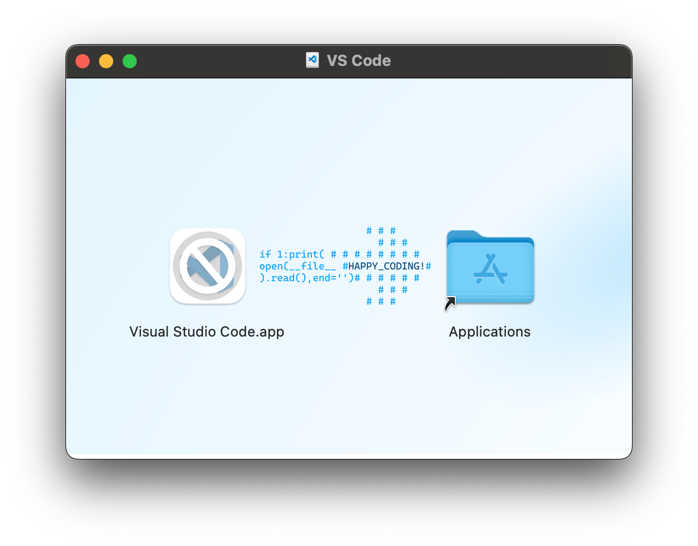
    <figcaption>Figure: Drag VS Code to Applications Folder</figcaption>
</figure>

4. Launchpad বা Spotlight (`Cmd + Space` চেপে "Visual Studio Code.app" লিখে) থেকে VS Code চালু করুন।

<figure align="center">
    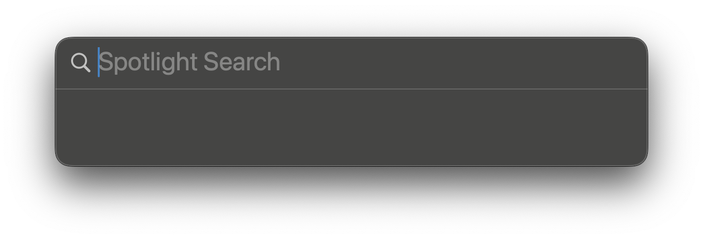
    <figcaption>Figure: Searching VS Code via Spotlight</figcaption>
</figure>

> **নোট**: প্রথমবার খুললে macOS একটা সিকিউরিটি ওয়ার্নিং দেখাতে পারে ("VS Code is an app downloaded from the Internet")। এটা স্বাভাবিক — **Open** বাটনে ক্লিক করলেই চলবে।

<figure align="center">
    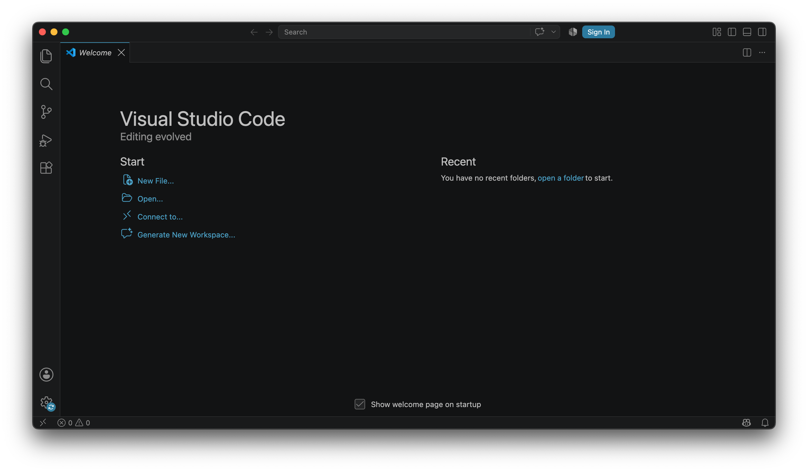
    <figcaption>Figure: VSCode Welcome Screen</figcaption>
</figure>

> **নোট**: VS Code খুললে যদি পরিচিত হালকা রঙের থিমের বদলে গাঢ় থিম দেখতে পান, তাহলে **Code > Preferences > Theme > Color Theme** (`Cmd+K Cmd+T`) থেকে **Light (Visual Studio)** বা পছন্দের অন্য যেকোন থিম বেছে নিতে পারেন।

<figure align="center">
    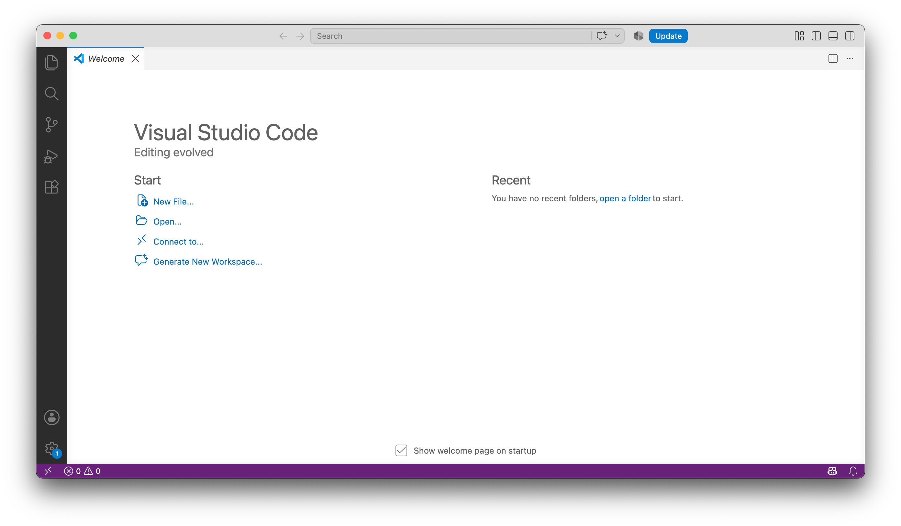
    <figcaption>Figure: Light (Visual Studio) Theme Selected</figcaption>
</figure>

---

## ৩.৪ Prerequisites (Homebrew দিয়ে) ইনস্টল করা

ESP-IDF কম্পাইল করার জন্য কিছু বেসিক টুল দরকার। Terminal খুলুন (Spotlight থেকে `Cmd + Space` চেপে "Terminal.app" লিখে সার্চ করুন)।

<figure align="center">
    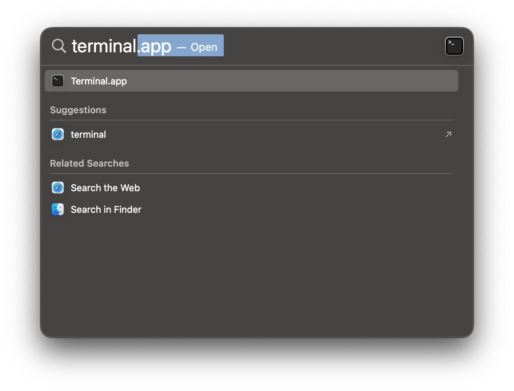
    <figcaption>Figure: Spotlight Terminal Search</figcaption>
</figure>

<figure align="center">
    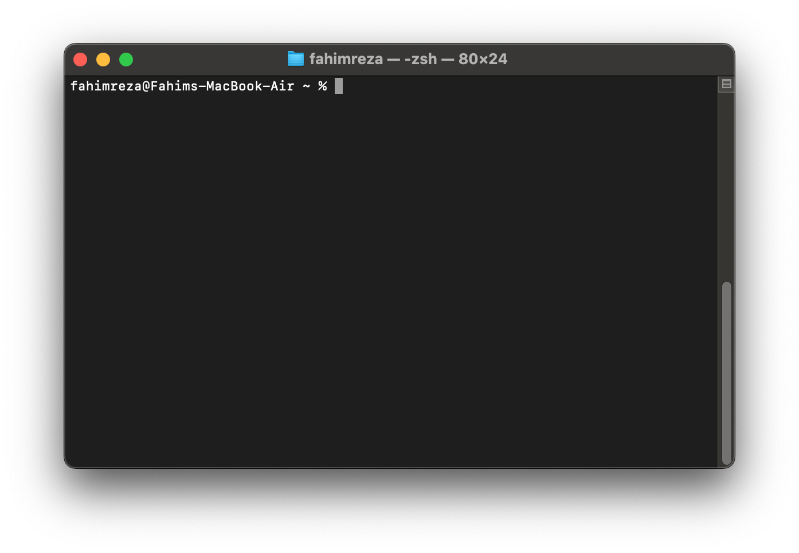
    <figcaption>Figure: Terminal Opened with zsh Shell</figcaption>
</figure>

### ৩.৪.১ Homebrew ইনস্টল করা
Homebrew হলো macOS-এর জন্য ব্যবহৃত একটি package manager। সহজভাবে বললে, এটি ব্যবহার করে Terminal দিয়ে বিভিন্ন সফটওয়্যার/টুল ইনস্টল, আপডেট ও ম্যানেজ করা যায়।

যেমন Homebrew ইনস্টল থাকলে Terminal-এ: 

```
brew install python
brew install git
brew install node
```

দিয়ে Python, Git বা Node.js ইনস্টল করা যায়। 

> **নোট**: `brew update` দিয়ে Homebrew-এর package information আপডেট করা এবং `brew upgrade` দিয়ে পুরোনো প্যাকেজ আপগ্রেড করা যায়। 

নিচের কমান্ডটি `run` করে নিশ্চিত হয়ে নিন যে, আপনার কম্পিউটারে আগে থেকেই Homebrew ইনস্টল করা আছে কিনা। যদি থাকে, তাহলে এই সেকশনটি এড়িয়ে গিয়ে সরাসরি **৩.৪.২ প্রয়োজনীয় প্যাকেজ ইনস্টল করা** থেকে অনুসরণ করুন। 

```
brew --version
```

<figure align="center">
    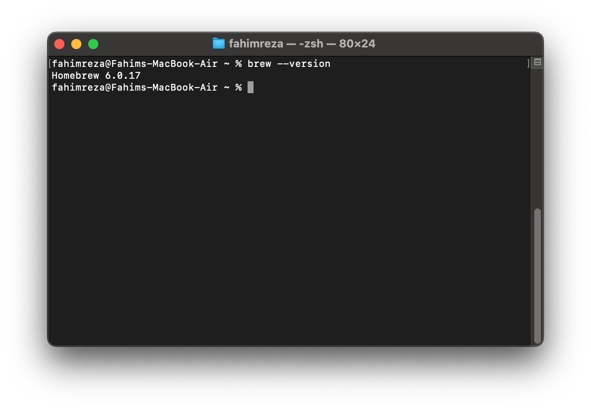
    <figcaption>Figure: Homebrew Version 6.0.17</figcaption>
</figure>

যদি আপনার কম্পিউটারে আগে থেকেই Homebrew ইনস্টল করা না থাকে, তাহলে নিচের মত মেসেজ দেখতে পাবেন।

```
command not found: brew
```

<figure align="center">
    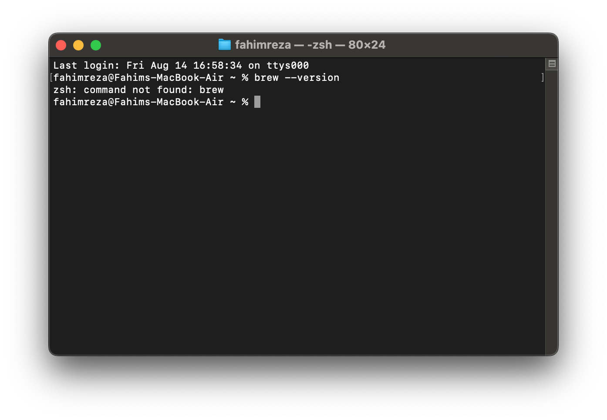
    <figcaption>Figure: Brew Not Found</figcaption>
</figure>

Homebrew ইনস্টল করতে terminal-এ নিচের কমান্ডটি লিখুন।

```
/bin/bash -c "$(curl -fsSL https://raw.githubusercontent.com/Homebrew/install/HEAD/install.sh)"
```

<figure align="center">
    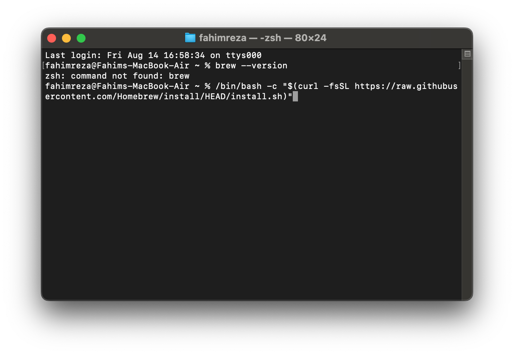
    <figcaption>Figure: Install Homebrew</figcaption>
</figure>

System-level settings এর জন্য sudo (superuser do) access প্রয়োজন হবে, আপনার Mac-এর user password টাইপ করুন।

<figure align="center">
    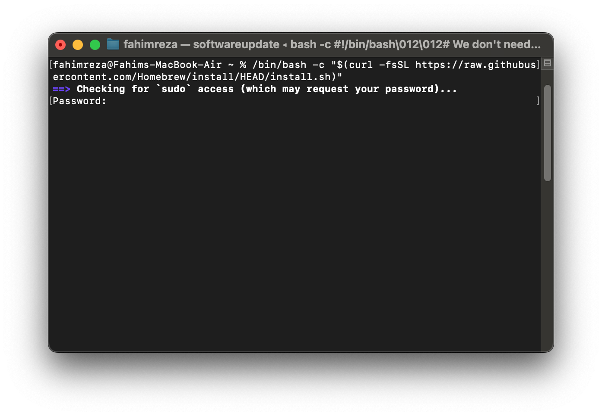
    <figcaption>Figure: Sudo Access Password</figcaption>
</figure>

Xcode Command Line Tools (CLT) হলো Apple-এর একটি ছোট developer toolkit, যা macOS-এ Terminal থেকে programming/development-related কাজ করার জন্য প্রয়োজনীয় tools দেয়। তাই Homebrew ইনস্টলের জন্য prerequisites হিসাবে Xcode Command Line Tools প্রয়োজন। Xcode Command Line Tools ডাউনলোড এবং ইনস্টল করতে Enter বাটন চাপুন।

<figure align="center">
    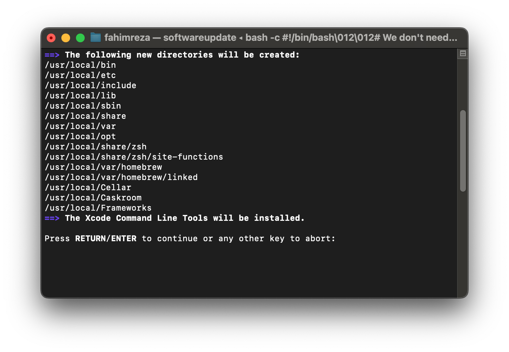
    <figcaption>Figure: Press Enter to Continue</figcaption>
</figure>

ধৈর্য নিয়ে অপেক্ষা করুন, এ পর্যায়ে Xcode Command Line Tools ডাউনলোড এবং ইনস্টল হবে।

<figure align="center">
    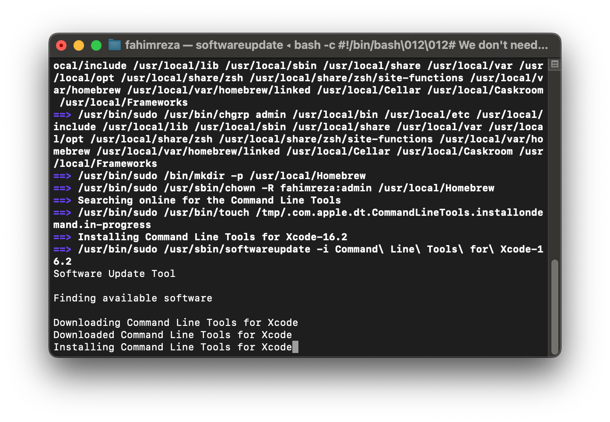
    <figcaption>Figure: Downloading Installing Command Line Tool</figcaption>
</figure>

এখন আবার আপনার Mac-এর user password টাইপ করুন।

<figure align="center">
    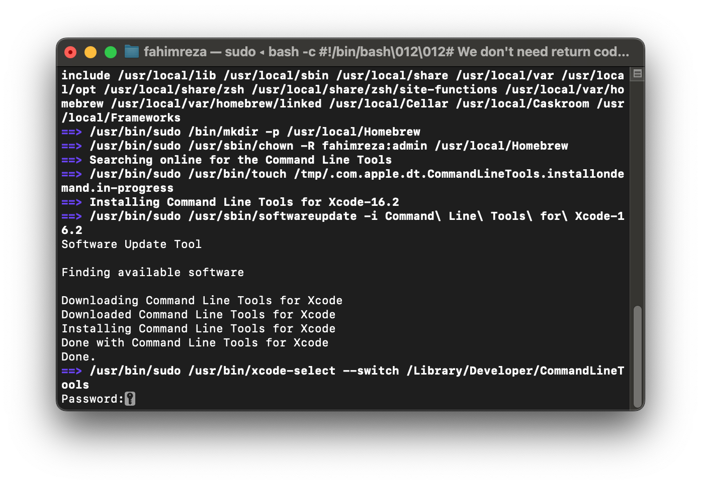
    <figcaption>Figure: Type Password</figcaption>
</figure>

কিছুক্ষণের মধ্যেই Installation Successful মেসেজ দেখতে পাবেন।

<figure align="center">
    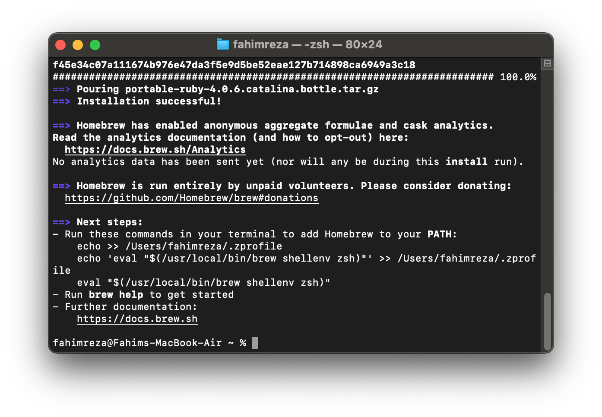
    <figcaption>Figure: Installation Successful</figcaption>
</figure>

Homebrew সঠিকভাবে কাজ করছে কি না - যাচাই করতে এবং কোন ভার্সনটি ইনস্টল হয়েছে জানতে `brew --version` কমান্ডটি run করুন। 

<figure align="center">
    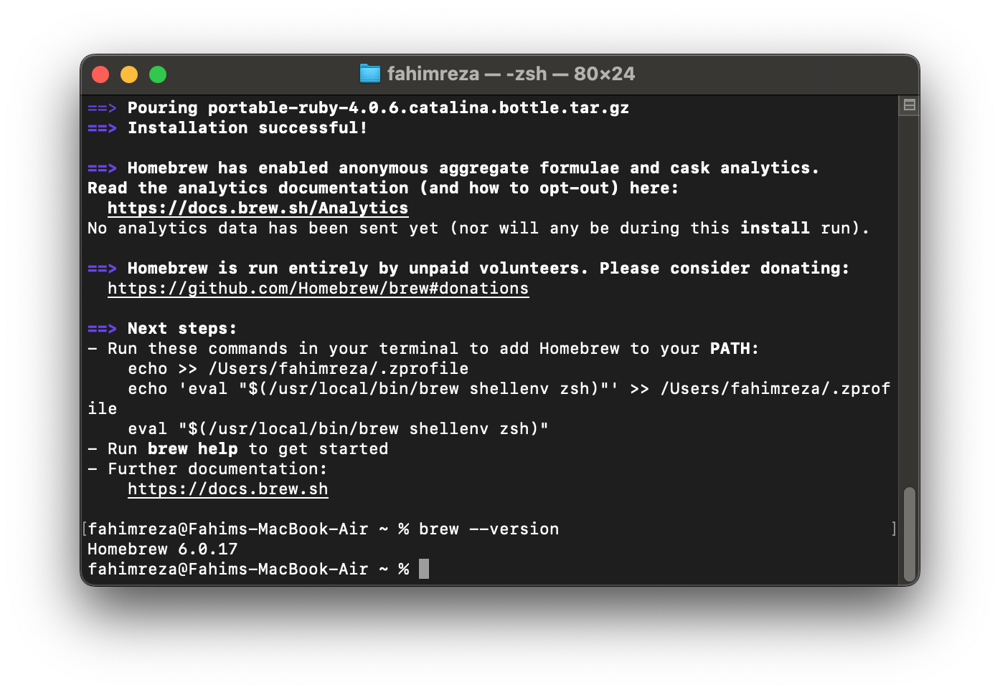
    <figcaption>Figure: Brew Version</figcaption>
</figure>

আমার কম্পিউটারে Homebrew 6.0.17 ইনস্টল হয়েছে। 

---

### ৩.৪.২ প্রয়োজনীয় প্যাকেজ ইনস্টল করা 

```
brew install libgcrypt glib pixman sdl2 libslirp dfu-util cmake python
```

<figure align="center">
    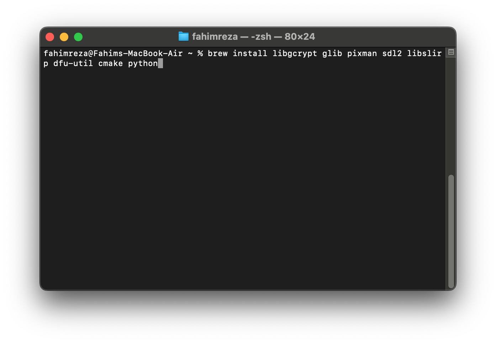
    <figcaption>Figure: Installing Necessary Packages</figcaption>
</figure>

<figure align="center">
    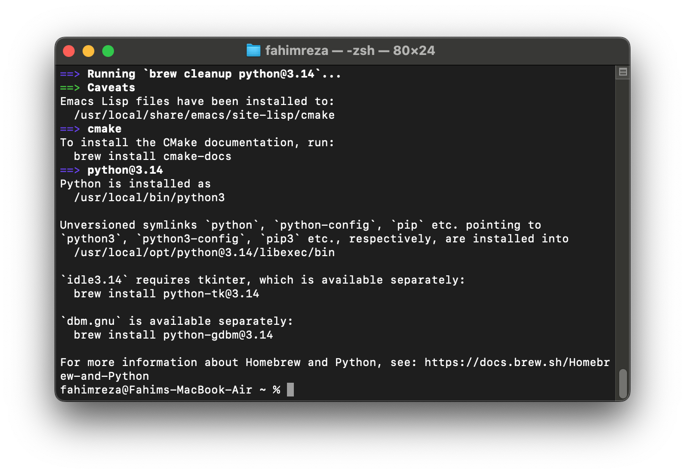
    <figcaption>Figure: Proceeding with Installation</figcaption>
</figure>


> **নোট**: ESP-IDF-এর জন্য Python 3.10 বা তার পরের ভার্সন লাগবে। `python3 --version` দিয়ে যাচাই করে নিতে পারেন।

<figure align="center">
    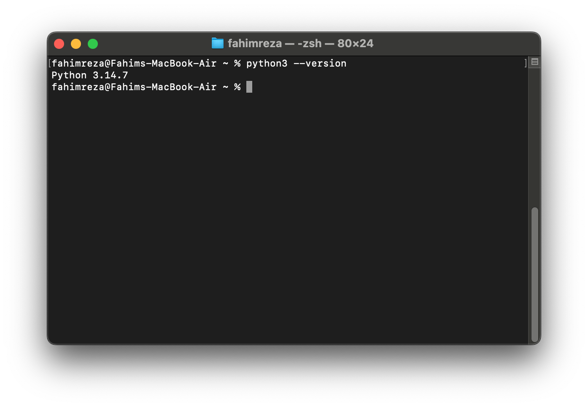
    <figcaption>Figure: Check Python3 Version</figcaption>
</figure>

> **নোট (Apple Silicon — M1/M2/M3/M4 ইউজারদের জন্য)**: যদি পরবর্তীতে `bad CPU type in executable` জাতীয় এরর দেখেন, Rosetta 2 ইনস্টল করুন:
> ```
> /usr/sbin/softwareupdate --install-rosetta --agree-to-license
> ```

---

## ৩.৫ ESP-IDF Installation Manager (EIM) ইনস্টল করা 

EIM ইনস্টল করার দুটো উপায় আছে — Homebrew দিয়ে, অথবা সরাসরি ডাউনলোড করে। তবে Homebrew দিয়ে (সহজ, ভবিষ্যতে আপডেট করাও সহজ)।

### ৩.৫.১ Homebrew-এ EIM-এর Tap যোগ করা
**Third-party repository যুক্ত করা:** যেহেতু espressif/eim Homebrew-এর নিজস্ব repository নয়, বরং Espressif-এর একটি Homebrew tap, তাই Homebrew-এর পরিভাষায় এটি একটি third-party tap। এই ধরনের tap-এর মাধ্যমে সরবরাহ করা package ইনস্টল করার আগে brew tap কমান্ড ব্যবহার করে Homebrew-এ সেই tap-টি যুক্ত করতে হয়। এর মাধ্যমে Homebrew জানতে পারে যে সংশ্লিষ্ট package-এর formula কোথায় পাওয়া যাবে।

```
brew tap espressif/eim
```
- brew → macOS-এর package manager Homebrew
- tap → Homebrew-এ কোনো third-party repository যোগ করে
- espressif/eim → Espressif-এর EIM-এর Homebrew tap

<figure align="center">
    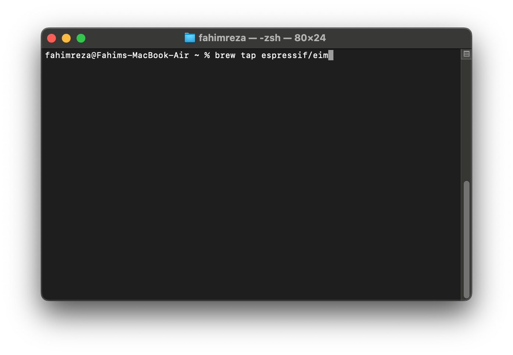
    <figcaption>Figure: Add EIM to Homebrew</figcaption>
</figure>

<figure align="center">
    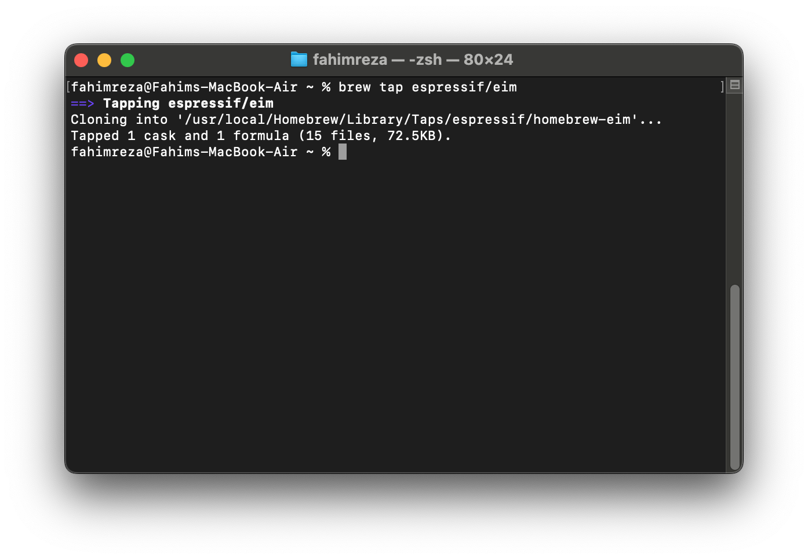
    <figcaption>Figure: Tapped Cask and Formula</figcaption>
</figure>

### ৩.৫.২ EIM Graphical User Interface (GUI) ইনস্টল করা 

এখন Homebrew Cask ব্যবহার করে EIM-এর GUI (Graphical User Interface) অ্যাপ ইনস্টল করতে হবে। 

```
brew install --cask eim-gui
```

- brew → Homebrew
- install → কোনো package/app ইনস্টল করার নির্দেশ
 - --cask → command-line package নয়, GUI application হিসেবে app ইনস্টল করতে Homebrew Cask ব্যবহার করবে
- eim-gui → Espressif Installation Manager-এর graphical interface

<figure align="center">
    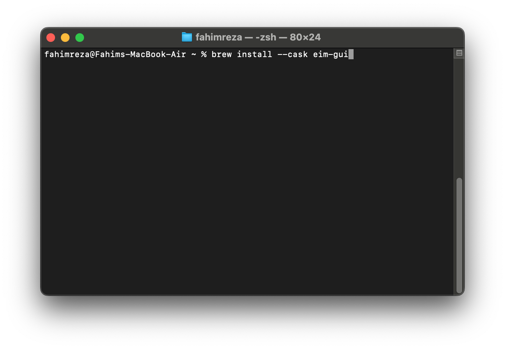
    <figcaption>Figure: Brew Install EIM GUI</figcaption>
</figure>

<figure align="center">
    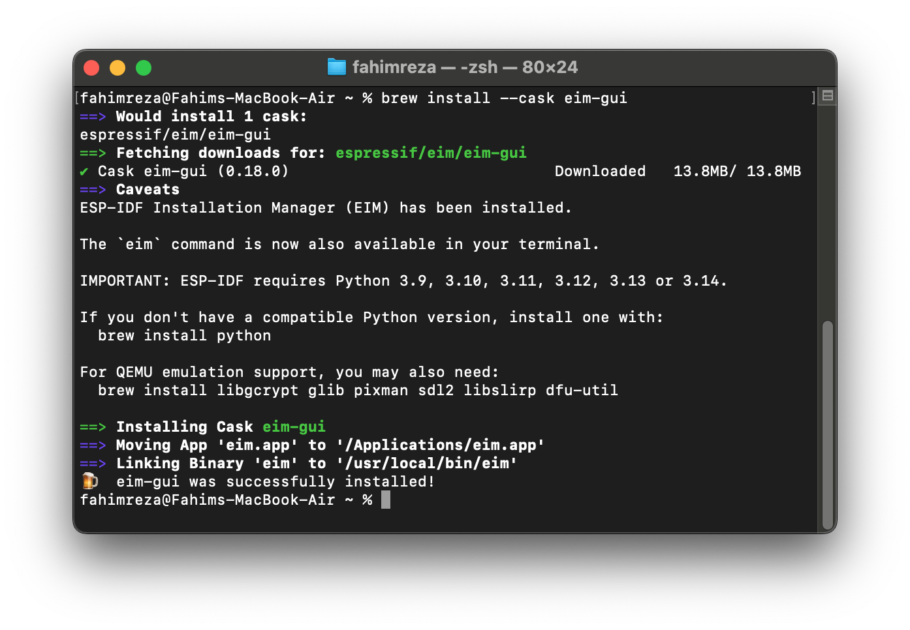
    <figcaption>Figure: EIM GUI Successfully Installed</figcaption>
</figure>

এখন আপনি যদি Applications ফোল্ডারে browse করেন, তাহলে `eim.app` নামে একটি অ্যাপ্লিকেশন দেখতে পাবেন। এটিই হলো EIM-এর Graphical User Interface (GUI)।

<figure align="center">
    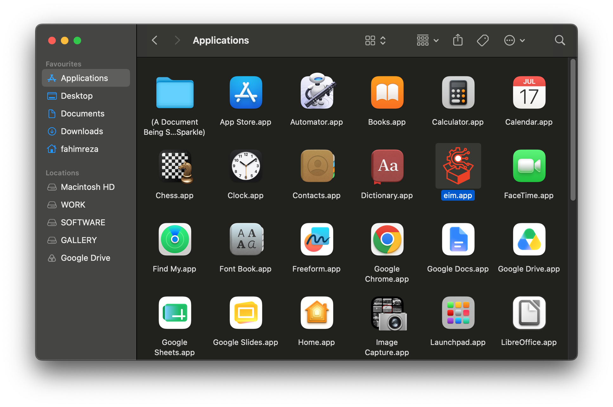
    <figcaption>Figure: EIM GUI</figcaption>
</figure>

---

## ৩.৬ EIM দিয়ে ESP-IDF ফ্রেমওয়ার্ক ইনস্টল করা

আপনার Mac Computer এর Applications ফোল্ডার থেকে `eim.app` নামক অ্যাপ্লিকেশনটি চালু করুন। 

<figure align="center">
    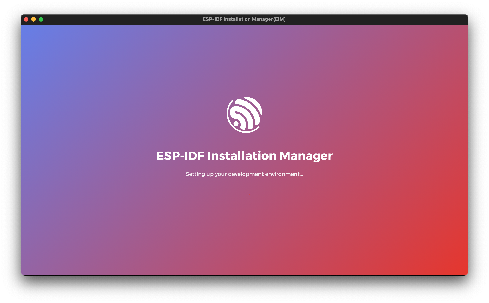
    <figcaption>Figure: ESP-IDF Installation Manager</figcaption>
</figure>

Start Installation > Custom Installation > Start Configuration Wizard বাটনে ক্লিক করুন। 

<figure align="center">
    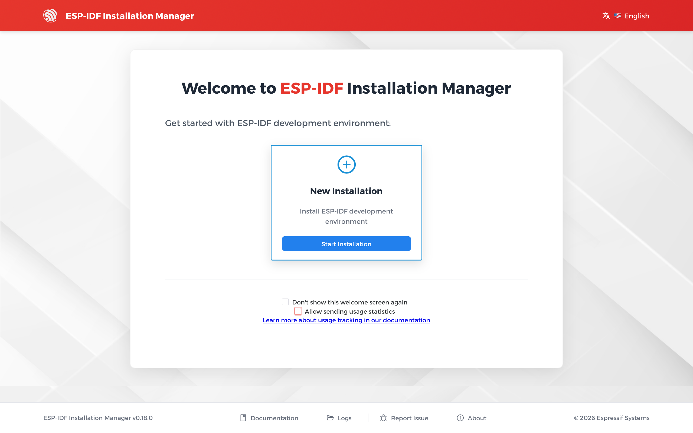
    <figcaption>Figure: New Installation</figcaption>
</figure>

<figure align="center">
    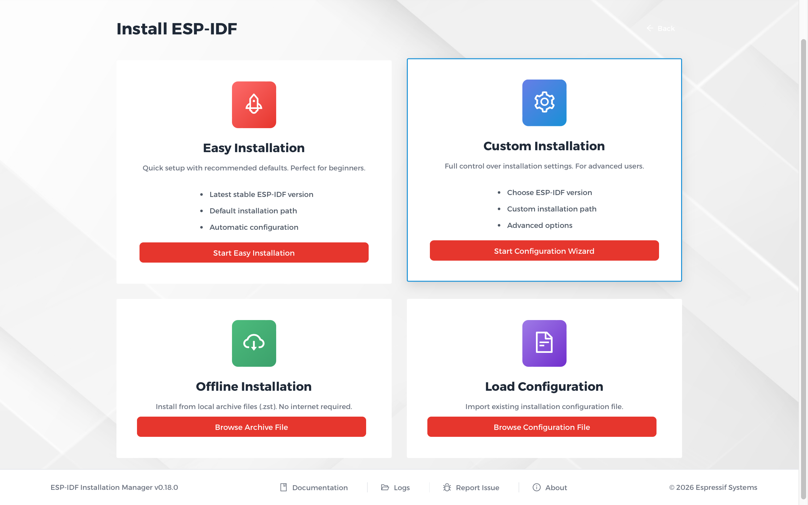
    <figcaption>Figure: Custom Installation</figcaption>
</figure>

**Expert Installation** Step এর `Step 1: Prerequisites Check` এবং `Step 2: Python Sanity Check` শেষ হলে, `Step 3: Select Target` থেকে সেই সকল `Target Chips` সিলেক্ট করুন, যেগুলো নিয়ে আপনি কাজ করতে চান। (যত বেশি Chips সিলেক্ট করবেন, ইনস্টল হতে ততবেশি সময় লাগতে পারে, তাই অপ্রয়োজনীয় Chip সিলেক্ট করা এড়িয়ে যেতে পারেন।)

আমি এখান থেকে `esp32`,  `esp32c6`, `esp32s2`, `esp32s3` সিলেক্ট করে **Continue with Selected Targets** বাটনে ক্লিক করুন। 

<figure align="center">
    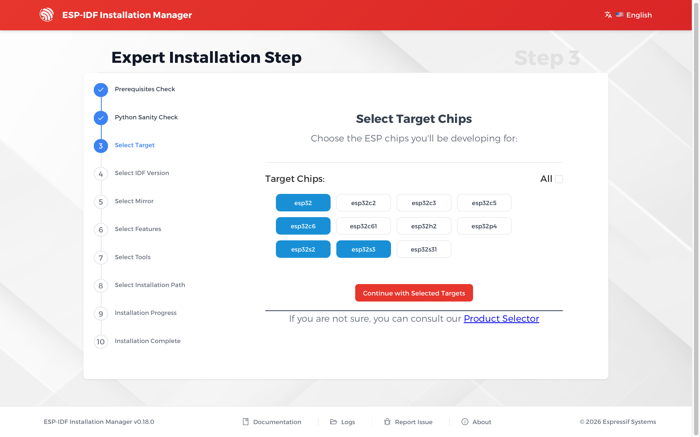
    <figcaption>Figure: Expert Installation — Step 3: Select Target</figcaption>
</figure>

**Step 4: Select IDF Version** উইনডোতে Stable Releases গুলোর version name দেখতে পাবেন। আমি এখান থেকে `v6.0.2 (Latest)` সিলেক্ট করছি এবং নিচে scroll করে Continue Installation বাটনে ক্লিক করুন। 

<figure align="center">
    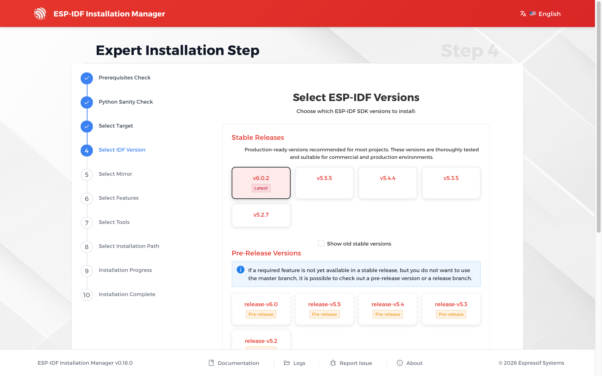
    <figcaption>Figure: Expert Installation — Step 4: Select IDF Version</figcaption>
</figure>

<figure align="center">
    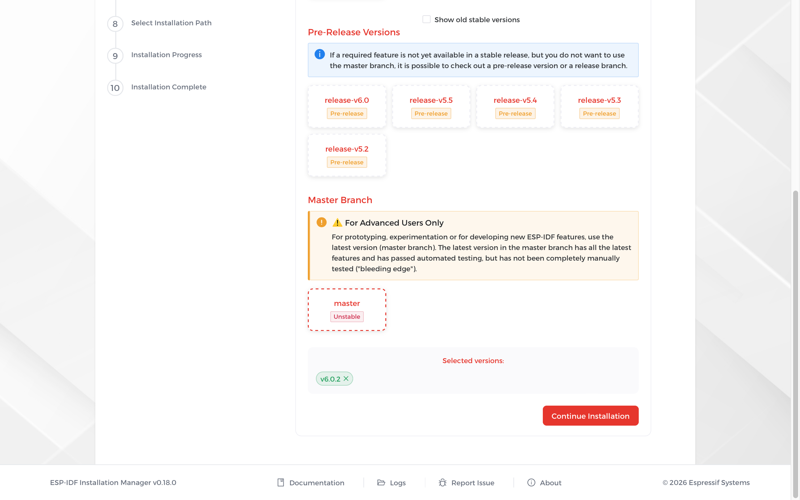
    <figcaption>Figure: Expert Installation — Step 4: Continue Installation</figcaption>
</figure>

**Step 5: Select Mirror** উইনডো থেকে `ESP-IDF Repository Mirror`, `ESP-IDF Tools Mirror`, এবং `PyPI Mirror` এর জন্য যে default selection আছে, সেগুলো ঠিক রেখে **Continue with Selected Mirrors** বাটনে ক্লিক করুন। 

<figure align="center">
    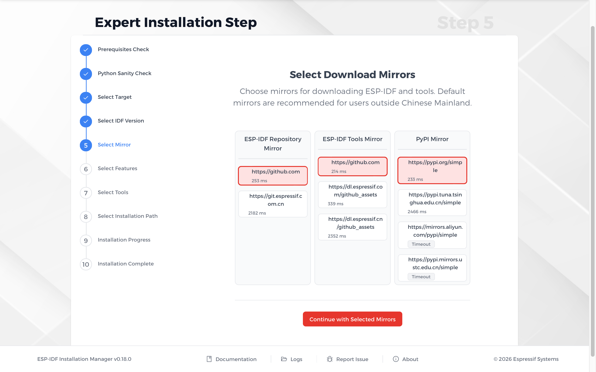
    <figcaption>Figure: Select Download Mirrors</figcaption>
</figure>

**Step 6: Select Features** অপশন গুলো থেকে শুধুমাত্র Required Features গুলোতে `check-mark` এবং Optional Features গুলো `uncheck-mark` রেখে নিচে scroll করুন এবং **Continue to Tools selection** বাটনে ক্লিক করুন। 

<figure align="center">
    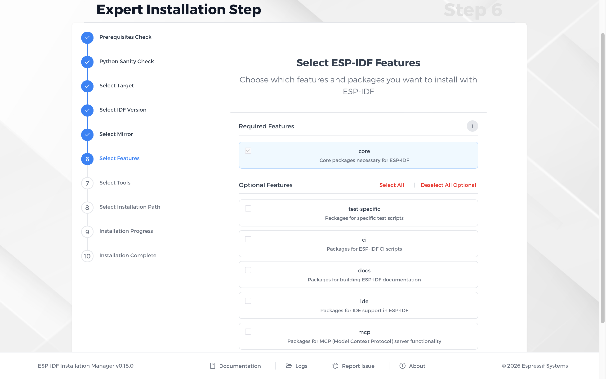
    <figcaption>Figure: Select ESP-IDF Features</figcaption>
</figure>

<figure align="center">
    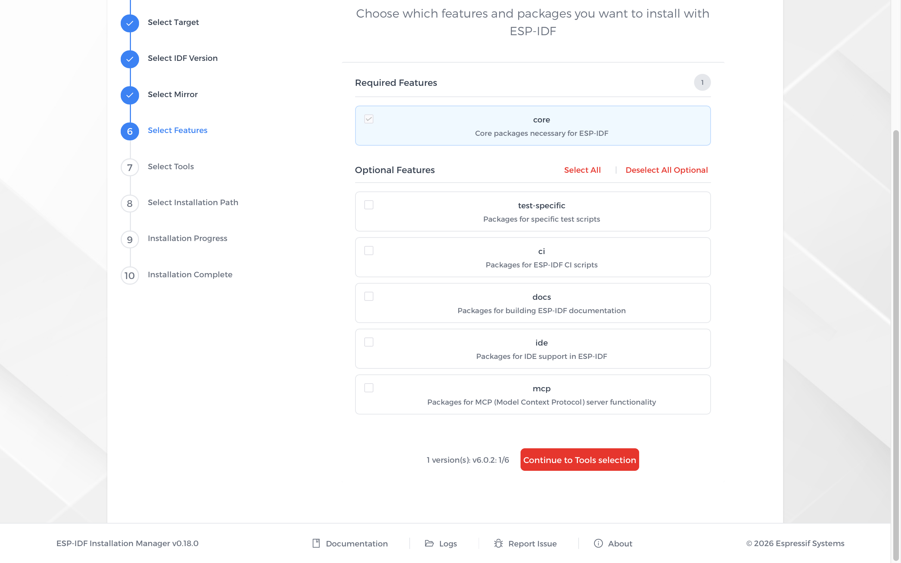
    <figcaption>Figure: Continue to Tools Selection</figcaption>
</figure>

**Step 7: Select Tools** অপশন গুলো থেকে `Required Tools` এবং `Optional Tools` সবগুলোতে `check-mark`রেখে **Continue** বাটনে ক্লিক করুন। 

<figure align="center">
    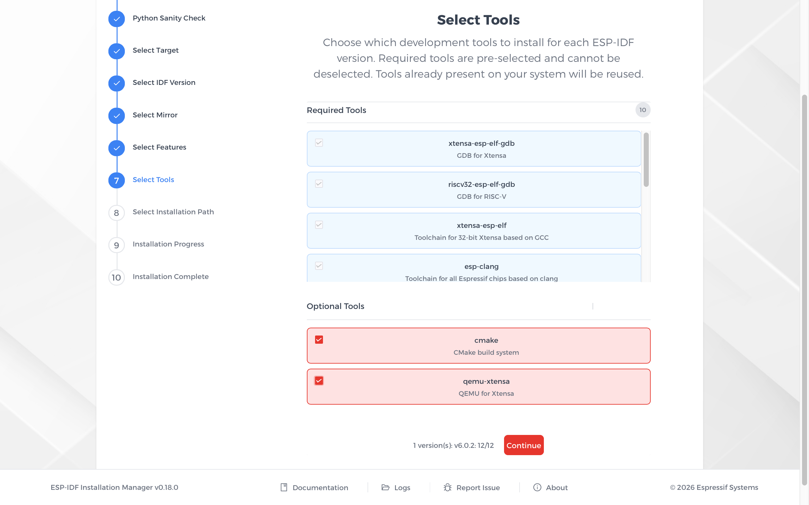
    <figcaption>Figure: Select Tools</figcaption>
</figure>

**Step 8: Select Installation Path** উইনোউ থেকে Path /Users/<user name>/.espressif is valid মেসেজটি নিশ্চিত হয়ে নিতে হবে। (যদি Path Invalid দেখায়, তার অর্থ হলো আগে থেকেই ঐ Path এ .espressif নামে একটি ফোল্ডার রয়েছে! এটি remove করতে হবে।)

<figure align="center">
    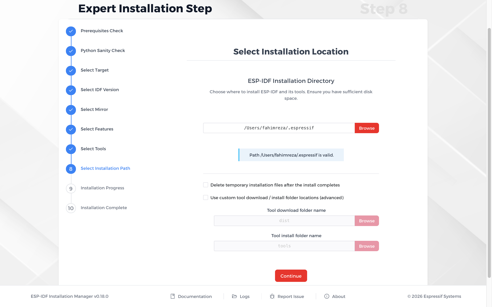
    <figcaption>Figure: Select Installation Location</figcaption>
</figure>

সবকিছু ঠিক থাকলে **Continue** বাটনে ক্লিক করুন। 

**Step 9: Installation Progress** উইনোউতে আপনার selected version name দেখতে পারবেন। সবকিছু ঠিক থাকলে **Start Installation** বাটনে ক্লিক করুন।

<figure align="center">
    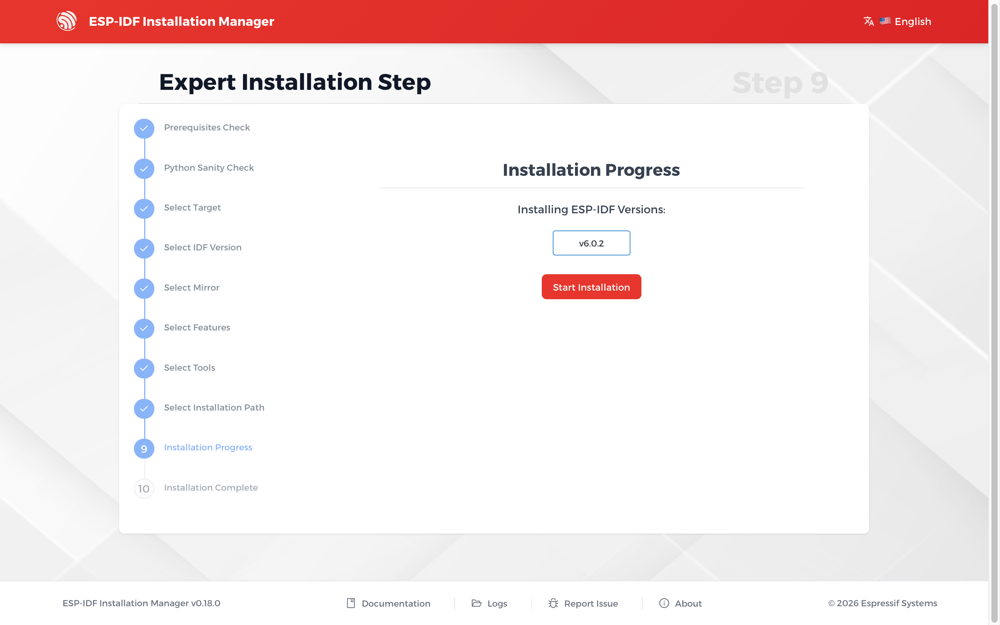
    <figcaption>Figure: Installation Progress</figcaption>
</figure>

Installation Progress এর বেশ কয়েকটি ধাপ রয়েছে। যেমন: `Check`, `Prerequisites`, `Download`, `Submodules`, `Tools`, `Python`, `Configure`, এবং `Complete` । (Download হতে বেশ কিছুটা সময় লাগতে পারে। ধৈর্য নিয়ে অপেক্ষা করুন।)

<figure align="center">
    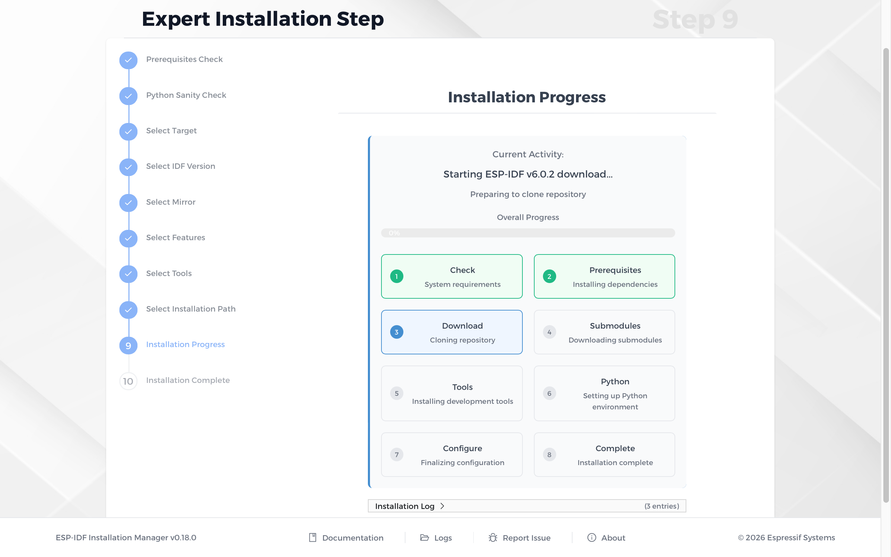
    <figcaption>Figure: Installation Progress Download</figcaption>
</figure>

Development Tools Installed হতে বেশ কিছুটা সময় লাগতে পারে। ধৈর্য নিয়ে অপেক্ষা করুন।

<figure align="center">
    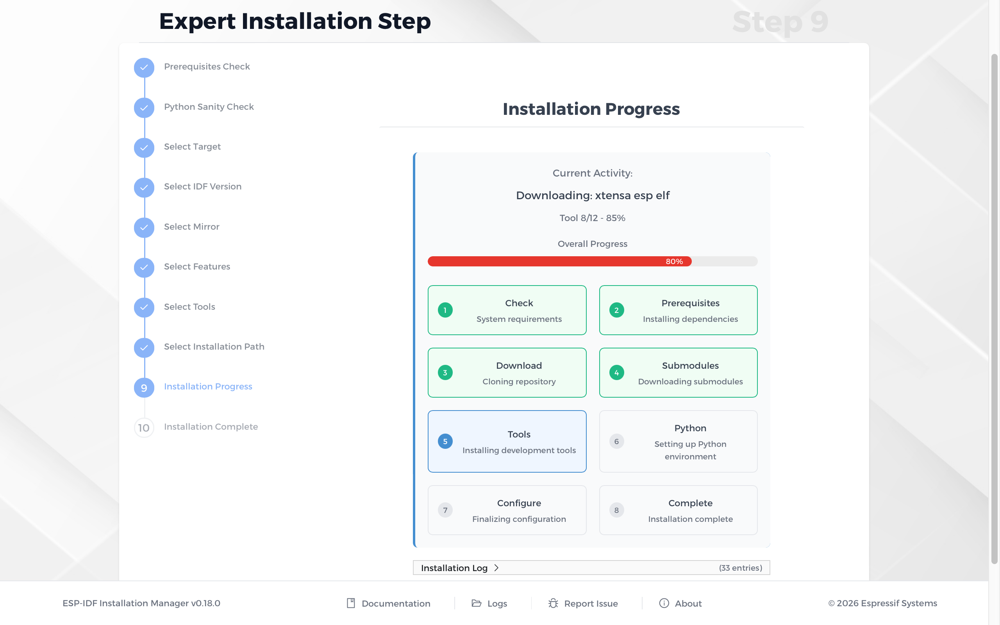
    <figcaption>Figure: Installation Progress Tools</figcaption>
</figure>

এ পর্যায়ে Python Environemnt Setting এবং Finalizing Configuration এর কাজ হবে।  

<figure align="center">
    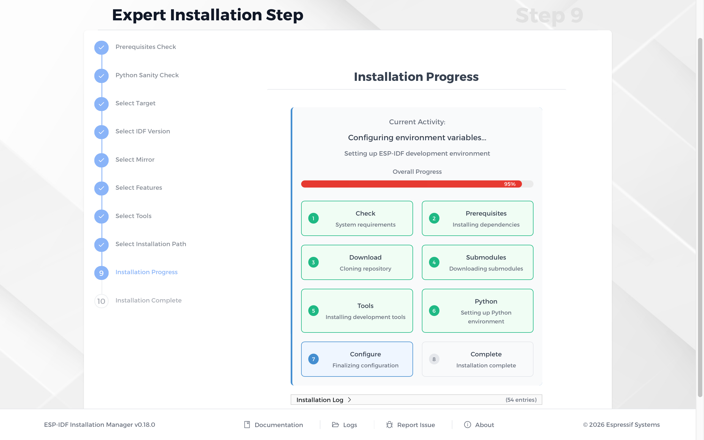
    <figcaption>Figure: Installation Progress Python</figcaption>
</figure>

অতঃপর Installation Progress শেষে হলে **Complete Installation** বাটনে ক্লিক করুন। 

<figure align="center">
    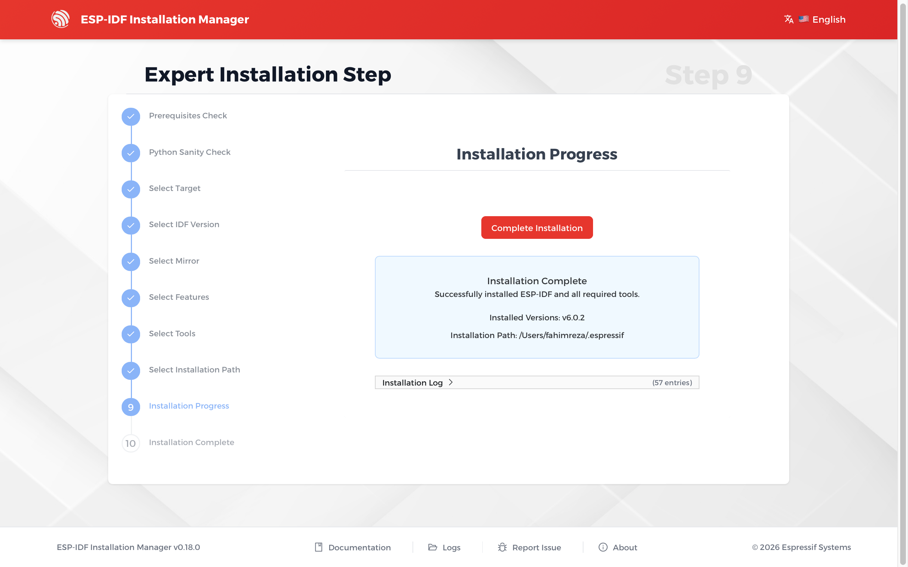
    <figcaption>Figure: Successfully Installed ESP-IDF and Tools</figcaption>
</figure>

এখন **Home** বাটন ক্লিক করুন। 

<figure align="center">
    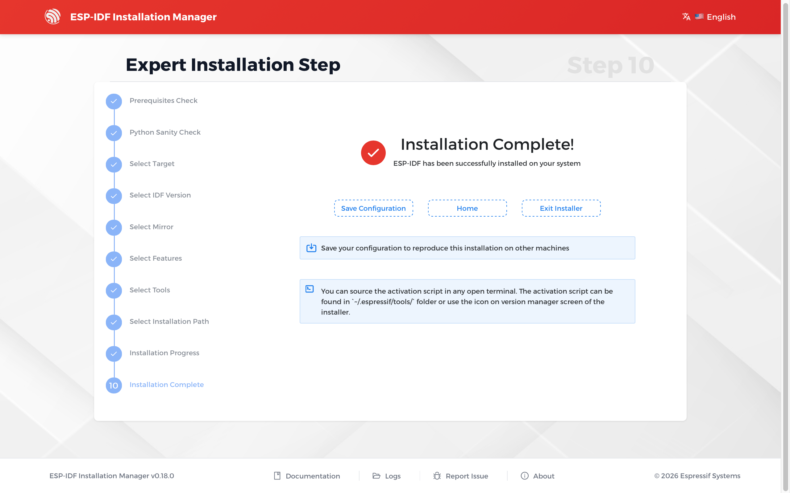
    <figcaption>Figure: Installation Complete</figcaption>
</figure>

Manage Installations থেকে **Open Dashboard** বাটনে ক্লিক করুন। 

<figure align="center">
    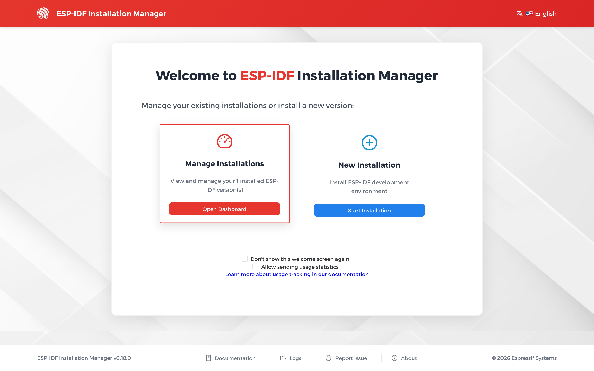
    <figcaption>Figure: Open Dashboard</figcaption>
</figure>

ফলে Installed Versions এর নাম এবং লোকেশন দেখতে পাবেন। 

<figure align="center">
    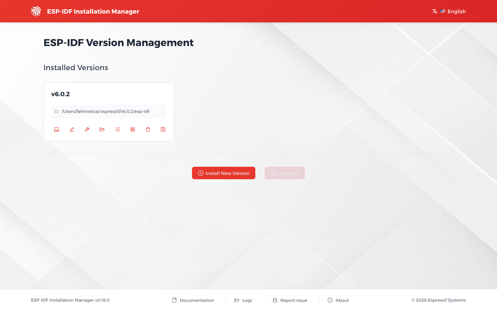
    <figcaption>Figure: ESP-IDF Version Management Dashboard</figcaption>
</figure>

--- 

## ৩.৭ ESP-IDF দিয়ে প্রয়োজনীয় টুলস ইনস্টল করা 
আগের ধাপে আমরা EIM দিয়ে Home directory-এর (`~/.espressif/v6.0.2/esp-idf`) ভিতরে ESP-IDF ইনস্টল করেছি। ফোল্ডারটি ওপেন করলে `install.sh`, `export.sh`-এর মতো বেশ কিছু স্ক্রিপ্ট ফাইল দেখতে পাবেন। 

<figure align="center">
    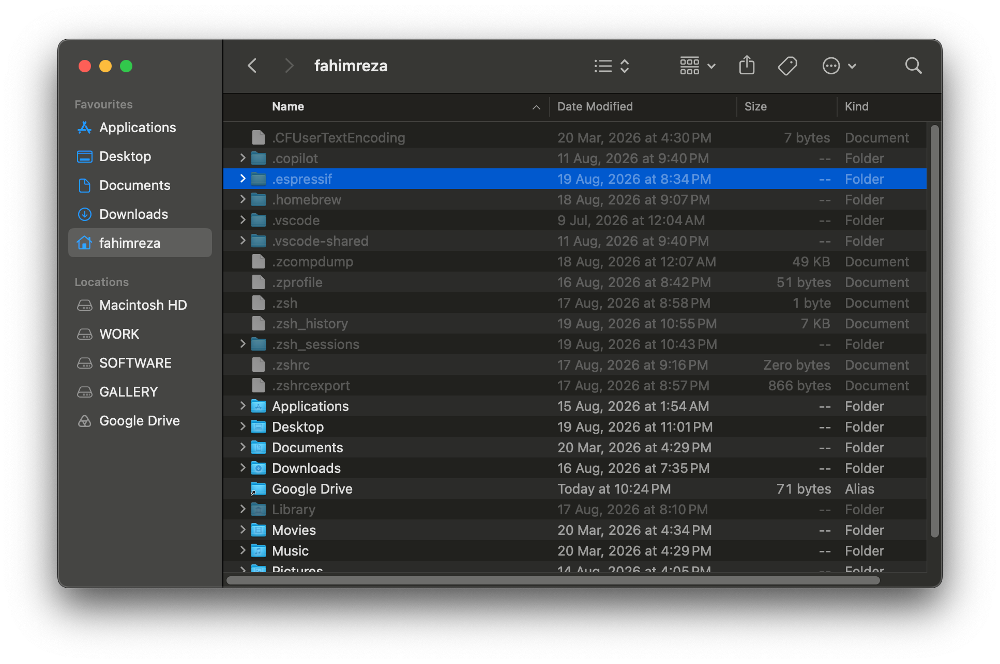
    <figcaption>Figure: Espressif Directory</figcaption>
</figure>

<figure align="center">
    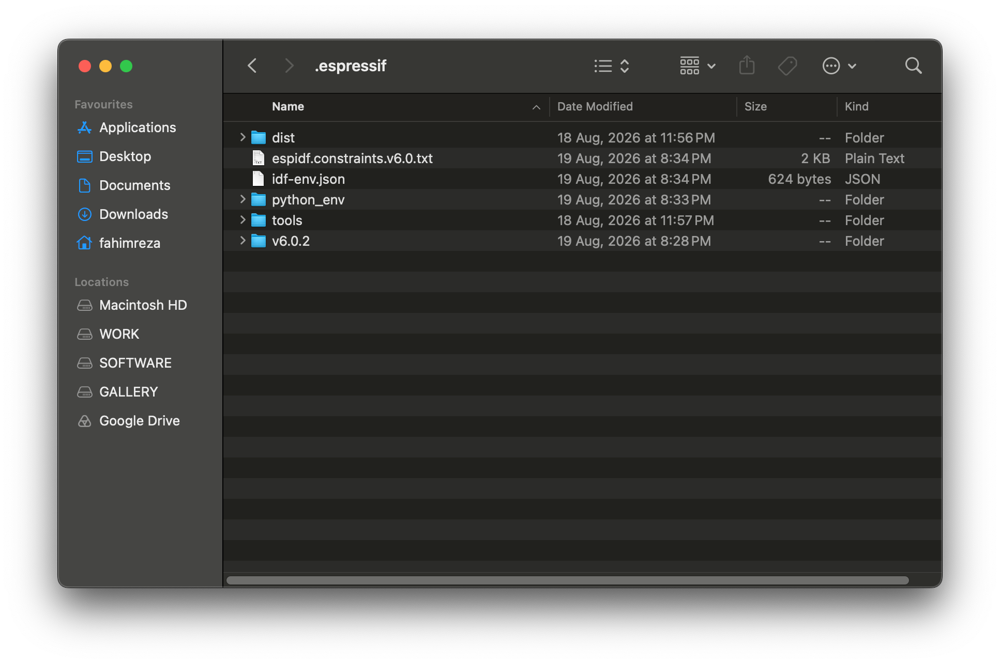
    <figcaption>Figure: Espressif v6.0.2 Folder</figcaption>
</figure>

<figure align="center">
    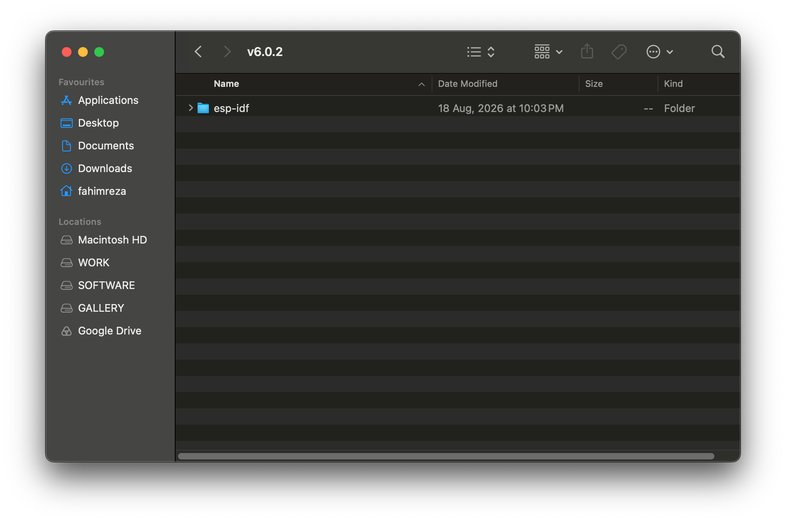
    <figcaption>Figure: ESP-IDF Directory</figcaption>
</figure>

<figure align="center">
    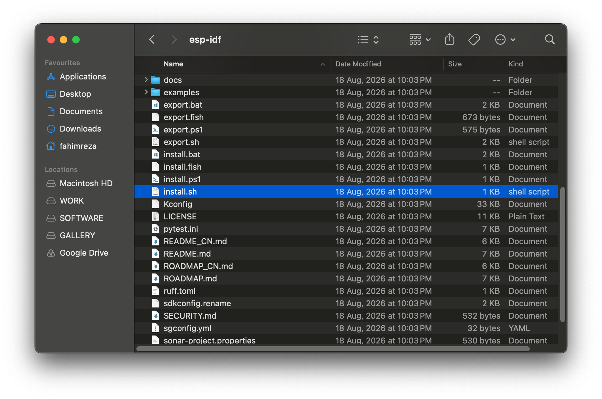
    <figcaption>Figure: install.sh Script File</figcaption>
</figure>

<figure align="center">
    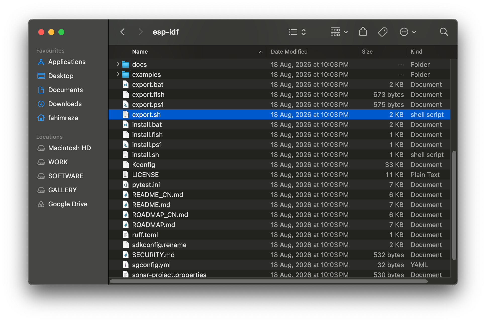
    <figcaption>Figure: export.sh Script File</figcaption>
</figure>

ESP-IDF এই `install.sh`, `export.sh` ফাইল দুইটি ব্যবহার করে macOS-এর জন্য প্রয়োজনীয় সফটওয়্যার এর সমন্বয়ে একটি Environment তৈরি করে, যেখানে ESP-কে প্রোগ্রাম করার জন্য প্রয়োজনীয় কমান্ড `run` করা যায়। 


### ৩.৭.১ install.sh রান করা
`install.sh` ফাইলটি রান করতে macOS এর Terminal খুলুন (Spotlight থেকে `Cmd + Space` চেপে "Terminal.app" লিখে সার্চ করুন) এবং Change Directory (cd) কমান্ড ব্যবহার করে esp-idf ডিরেক্টরিতে প্রবেশ করুন। 

<figure align="center">
    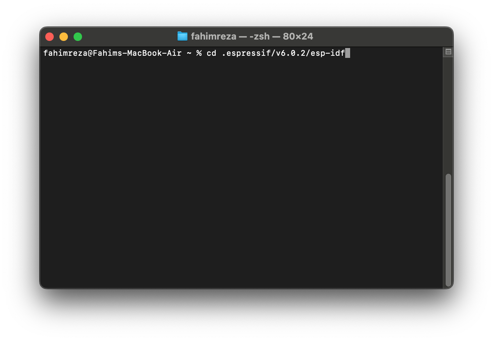
    <figcaption>Figure: Navigating to ESP-IDF Directory</figcaption>
</figure>

<figure align="center">
    
    <figcaption>Figure: Inside ESP-IDF Directory</figcaption>
</figure>

ফাইলটি রান করলে ESP-IDF কম্পাইল করার জন্য প্রয়োজনীয় সব টুল (`কম্পাইলার`, `Python প্যাকেজ`, ইত্যাদি) স্বয়ংক্রিয়ভাবে ডাউনলোড ও ইনস্টল হতে শুরু করে। এ সময় লক্ষ্য করলে টার্মিনালে দেখতে পাবেন কোন কোন টুল ইনস্টল হচ্ছে (যেমন `xtensa-esp-elf-gdb`, `riscv32-esp-elf-gdb`, `cmake`, `ninja`, `ccache`, `dfu-util` ইত্যাদি):

<figure align="center">
    
    <figcaption>Figure: Running install.sh</figcaption>
</figure>

<figure align="center">
    
    <figcaption>Figure: Installing ESP-IDF Tools</figcaption>
</figure>

> নোট: এই পুরো প্রক্রিয়ায় বেশ কিছুটা সময় লাগতে পারে (ইন্টারনেট স্পিডের উপর নির্ভর করে), কারণ বেশ বড় সাইজের কিছু ফাইল (যেমন টুলচেইন) ডাউনলোড হবে। ধৈর্য ধরে অপেক্ষা করুন।

<figure align="center">
    
    <figcaption>Figure: Installing Python Packages</figcaption>
</figure>

সবকিছু সফলভাবে ইনস্টল হয়ে গেলে, `All done! You can now run: . ./export.sh`-মেসেজ দেখতে পাবেন।

এখন আমরা ESP-IDF এনভায়রনমেন্ট অ্যাক্টিভেট করতে `source export.sh` ফাইলটি চালু করবো। 

<figure align="center">
    
    <figcaption>Figure: Running export.sh</figcaption>
</figure>

<figure align="center">
    
    <figcaption>Figure: ESP-IDF Environment Activated</figcaption>
</figure>

ESP-IDF এনভায়রনমেন্ট সফলভাবে তৈরি হলে, `Done! You can now compile ESP-IDF projects.` মেসেজ দেখতে পাবেন।


### ৩.৭.২ VS Code-এ প্রজেক্ট ফোল্ডার ওপেন করা
Launchpad বা Spotlight (`Cmd + Space` চেপে "Visual Studio Code.app" লিখে) থেকে VS Code চালু করুন। 

<figure align="center">
    
    <figcaption>Figure: Searching VS Code via Spotlight</figcaption>
</figure>

<figure align="center">
    
    <figcaption>Figure: Opening VS Code</figcaption>
</figure>

প্রথমবার Window টি এভাবে খালি অবস্থায় দেখতে পাবেন:

<figure align="center">
    
    <figcaption>Figure: VSCode Welcome Screen</figcaption>
</figure>

আমাদের সকল প্রোগ্রামগুলো একজায়গায় গুছিয়ে রাখতে রাখতে, Desktop-এ ESP-Programs নামে একটি Project Folder তৈরি করে রাখুন। এখন File > Open Folder (অথবা Welcome স্ক্রিনের Open Folder লিংকে) ক্লিক করে ESP-Programs ফোল্ডারটি সিলেক্ট করুন:

<figure align="center">
    
    <figcaption>Figure: Select Project Folder</figcaption>
</figure>

ফোল্ডারটি ওপেন হলে VS Code-এর Explorer-এ ESP-PROGRAMS নামে দেখতে পাবেন:

<figure align="center">
    
    <figcaption>Figure: Explorer Project Folder</figcaption>
</figure>

### ৩.৭.৩ VS Code Integrated Terminal ওপেন করা
আমরা এখন থেকে আলাদা কোনো ``Terminal.app`` না খুলে, সরাসরি VS Code-এর নিজস্ব Integrated Terminal ব্যবহার করব। এ জন্য VSCode এর উপরের মেনু থেকে Terminal > New Terminal সিলেক্ট করুন (অথবা শর্টকাট Ctrl+Shift+`):

<figure align="center">
    
    <figcaption>Figure: VSCode Terminal</figcaption>
</figure>

একটা টার্মিনাল প্যানেল খুলে যাবে। খেয়াল করুন, ডিফল্টভাবে এটা zsh দিয়ে ওপেন হয়। 

`Optional:` কাজের সুবিধার্থে, প্রয়োজনে Welcome Screen টি close করে নিতে পারেন।

<figure align="center">
    
    <figcaption>Figure: VSCode Terminal No Welcome Screen</figcaption>
</figure>

### ৩.৮ ESP-IDF এনভায়রনমেন্ট অ্যাক্টিভেট করা
এখানে মনে একটি প্রশ্ন আসতে পারে — টুলস ইনস্টল করা হয়েছে, তাহলে আবার "অ্যাক্টিভেট" করার দরকার কী?

আসলে EIM যে টুলগুলো (Python, কম্পাইলার, idf.py স্ক্রিপ্ট ইত্যাদি) ইনস্টল করেছে, সেগুলো সাধারণ কোনো প্রোগ্রামের মতো সরাসরি Operating System-এর PATH-এ যোগ হয়নি — বরং একটা নির্দিষ্ট, আলাদা লোকেশনে (.espressif ফোল্ডারের ভেতরে) রাখা হয়েছে, যাতে অন্য কোনো সফটওয়্যারের সাথে conflict না হয়। ফলে যদি আপনি এখনই একটা নতুন টার্মিনাল খুলে idf.py লেখেন, অপারেটিং সিস্টেম সেই কমান্ডটি চিনবে না — কারণ টার্মিনালটা জানেই না এই টুলগুলো কোথায় আছে।

"অ্যাক্টিভেট করা" মানে হলো — এই নির্দিষ্ট টার্মিনাল সেশনের জন্য সাময়িকভাবে PATH এবং অন্যান্য প্রয়োজনীয় Environment Variable সেট করে দেওয়া, যাতে টার্মিনালটা জানতে পারে ঠিক কোথায় গিয়ে idf.py, Python, কম্পাইলার ইত্যাদি খুঁজে পেতে হবে। এই কাজটিই করে export.sh স্ক্রিপ্ট। এই সেটিংস শুধু ওই একটা টার্মিনাল সেশনের জন্যই প্রযোজ্য — টার্মিনাল বন্ধ করে আবার নতুন করে খুললে আবার export.sh চালাতে হবে।

ESP-IDF এনভায়রনমেন্ট অ্যাক্টিভেট করতে, EIM যেখানে ESP-IDF ইনস্টল করেছে, সেই ডিরেক্টরিতে প্রবেশ করুন:

```
cd .espressif/v6.0.2/esp-idf
```

<figure align="center">
    
    <figcaption>Figure: Navigating to ESP-IDF Directory</figcaption>
</figure>

<figure align="center">
    
    <figcaption>Figure: Inside ESP-IDF Directory</figcaption>
</figure>

এখন `export.sh` স্ক্রিপ্টটি রান করুন: 

```
source export.sh
```

<figure align="center">
    
    <figcaption>Figure: Running source export.sh</figcaption>
</figure>

বা সংক্ষেপে যে কোন ডিরেক্টরিতে থাকা অবস্থায় single line command হিসাবে নিচের কমান্ডটি `run` করতে পারেন: 

```
source ~/.espressif/v6.0.2/esp-idf/export.sh
```

<figure align="center">
    
    <figcaption>Figure: Export Single Line Command</figcaption>
</figure>

এই `export.sh` স্ক্রিপ্টটি রান হওয়ার পর একে একে বেশ কিছু চেক সম্পন্ন হবে (Python dependencies, ESP-IDF environment, shell identification, outdated tools) এবং সবশেষে "Done! You can now compile ESP-IDF projects." মেসেজ দেখতে পাবেন:

<figure align="center">
    
    <figcaption>Figure: Establishing ESP-IDF Environment</figcaption>
</figure>

> নোট: এই `export.sh` স্ক্রিপ্টটি প্রতিবার নতুন টার্মিনাল খোলার সময় আবার রান করতে হবে (এনভায়রনমেন্ট ভ্যারিয়েবলগুলো শুধু ওই নির্দিষ্ট টার্মিনাল সেশনের জন্যই সেট হয়)। বারবার এই দুটো কমান্ড টাইপ করা এড়াতে চাইলে, আমরা পরবর্তী একটা অধ্যায়ে একটা সহজ শর্টকাট তৈরি করার উপায় দেখব।

### ৩.৮.১ ইনস্টলেশন চেক করা
এখন আমরা একটি Command লিখে চেক করে দেখতে পারি যে, সবকিছু ঠিকঠাক কাজ করছে কি না? 

```
idf.py --version
```

<figure align="center">
    
    <figcaption>Figure: Checking IDF Version</figcaption>
</figure>

সবকিছু ঠিক থাকলে, ESP-IDF রিপ্লাই হিসাবে আপনাকে **Installed Version Name** রিটার্ন করবে: 

```
ESP-IDF v6.0.2
```

<figure align="center">
    
    <figcaption>Figure: IDF Version Reply</figcaption>
</figure>

অভিনন্দন! আপনার ESP-IDF এনভায়রনমেন্ট এখন VS Code-এর ভেতরেই সম্পূর্ণভাবে কাজ করছে — কোনো আলাদা Terminal window ছাড়াই।

--- 

## ৩.৯ New Project তৈরি এবং বিল্ড করা
এতক্ষণে `VS Code` এবং `ESP-IDF` ফ্রেমওয়ার্ক — সবকিছু ইনস্টল করা হলো। এখন আমরা একটি সাধারণ কম্পিউটার প্রোগ্রাম (হ্যালো ওয়ার্ল্ড) `create` এবং `run` করে দেখবো যে সবকিছু ঠিকঠাক কাজ করছে কিনা। যেকোনো প্রোগ্রামিং ভাষা শেখার ক্ষেত্রে এটি একটি common প্রোগ্রাম। 

1. সর্বপ্রথম নিশ্চিত হয়ে নিন যে, VSCode EXPLORER এ আমাদের Project Folder ওপেন রয়েছে। এবার **EXPLORER** এর ফাঁকা জায়গায় কম্পিউটার-মাউসের Right Button ক্লিক করে Copy Path অপশনে ক্লিক করুন।

<figure align="center">
    
    <figcaption>Figure: Copy Project Path</figcaption>
</figure>

2. এখন VSCode Terminal এর Current Working Directory পরিবর্তন করে Project Folder করতে `cd` লিখে কপি করা `project path` টি **paste** করুন: 

```
cd /Users/fahimreza/Desktop/ESP-Programs
```

<figure align="center">
    
    <figcaption>Figure: Move to Project Directory</figcaption>
</figure>

<figure align="center">
    
    <figcaption>Figure: Inside Project Directory</figcaption>
</figure>


3. নতুন একটি ESP IDF Project তৈরি করতে, `idf.py create-project <project-name>` কমান্ডটি run করুন: 

```
idf.py create-project 01-Hello-World 
```

<figure align="center">
    
    <figcaption>Figure: Create New Project</figcaption>
</figure>

<figure align="center">
    
    <figcaption>Figure: Created New Project</figcaption>
</figure>

4. VSCode Explorer এ ওপেন থাকা Project Folder এর পাশে থাকা Arrow বাটনগুলোতে ক্লিক করার মাধ্যমে `01-Hello-World.c` ফাইলটি ওপেন করুন। 

<figure align="center">
    
    <figcaption>Figure: Project Folder</figcaption>
</figure>

<figure align="center">
    
    <figcaption>Figure: Project Main Folder</figcaption>
</figure>

<figure align="center">
    
    <figcaption>Figure: Main C File</figcaption>
</figure>

Main C File এ pre-written (boilerplate) কিছু কোড দেখতে পাবেন। 

5. `app_main` ফাংশনের মধ্যে `printf("Hello World!\n");` লিখুন এবং কীবোর্ড থেকে Ctrl+S চেপে ফাইলটি Save করুন।

```
#include <stdio.h>

void app_main(void)
{
    printf("Hello World!\n");
}
```

<figure align="center">
    
    <figcaption>Figure: Main C File Updated</figcaption>
</figure>

6. Project Folder এ browse করুন। 

```
cd 01-Hello-World
```

<figure align="center">
    
    <figcaption>Figure: Move to Project Folder</figcaption>
</figure>

<figure align="center">
    
    <figcaption>Figure: Inside Project Folder</figcaption>
</figure>

7. নিচের কমান্ডটি run করার মাধ্যমে target-chip সিলেক্ট করুন। 

```
idf.py set-target esp32
```

<figure align="center">
    
    <figcaption>Figure: Set Target Chip ESP-32</figcaption>
</figure>

<figure align="center">
    
    <figcaption>Figure: Running Cmake in Directory</figcaption>
</figure>

<figure align="center">
    
    <figcaption>Figure: Build Files Written</figcaption>
</figure>

> নোট: লক্ষ্য করলে দেখবেন `idf.py set-target esp32` কমান্ড execute করার সাথে সাথেই Project Folder এর মধ্যে build নামে একটি নতুন folder তৈরি হয়েছে।

8. এখন পর্যন্ত কোন বুটলোডার ফাইল তৈরি হয়নি, মানে bootloader ফোল্ডারটি empty অবস্থায় পাবেন। 

<figure align="center">
    
    <figcaption>Figure: Build Folder</figcaption>
</figure>

<figure align="center">
    
    <figcaption>Figure: Bootloader Folder Empty</figcaption>
</figure>

প্রোজেক্ট build করতে নিচের কমান্ডটি লিখুন: 

```
idf.py build
```

<figure align="center">
    
    <figcaption>Figure: Project Build Command</figcaption>
</figure>

<figure align="center">
    
    <figcaption>Figure: Partition Table</figcaption>
</figure>

<figure align="center">
    
    <figcaption>Figure: Created ESP32 Image</figcaption>
</figure>

<figure align="center">
    
    <figcaption>Figure: Project Build Completed</figcaption>
</figure>

<figure align="center">
    
    <figcaption>Figure: Bootloader Files Generated</figcaption>
</figure>

আমাদের ESP Image তৈরি হয়েছে। এখন যদি আপনি পুনরায় bootloader ফোল্ডারটিতে browse করেন, তাহলে সেখানে bootloader.bin নামে একটি ফাইল দেখতে পাবেন। 

<figure align="center">
    
    <figcaption>Figure: Project Bin File</figcaption>
</figure>

অর্থাৎ আমাদের Project File বিল্ড হয়ে binary ফাইল তৈরি হয়েছে। মূলত Program Execution এর জন্য এই 01-Hello-World.bin ফাইলটি ESP Chip এর মধ্যে Flash করা হয়। 

---

## ৩.১০ ESP32-তে প্রোগ্রাম আপলোড করা 
আপনার কাছে থাকা ESP32 Microcontroller-এ প্রোগ্রাম আপলোড করতে, নিচের ধাপগুলো অনুসরণ করুন: 
1. প্রোগ্রাম আপলোড করতে সর্বপ্রথম ESP32 Dev Kit V1 কে USB Cable এর সাহায্যে কম্পিউটারের সাথে connect করতে হবে। 

2. ESP বোর্ডে থাকা USB-to-Serial চিপ কম্পিউটারের সাথে যোগাযোগের জন্য একটি ডিভাইস ফাইল (device file) তৈরি করে। (এটা Windows-এর COM Port-এর সমতুল্য, তবে macOS-এ একে `/dev/cu.*` নামে চেনা যায়।) বোর্ডটি কম্পিউটারে কোন ডিভাইস ফাইল হিসেবে দেখা যাচ্ছে, তা Terminal থেকে খুব সহজেই চেক করা যায়। এ জন্য Terminal খুলুন (Spotlight থেকে `Cmd + Space` চেপে "Terminal.app" লিখে সার্চ করুন) এবং নিচের কমান্ডটি `run` করুন।

```
ls /dev/cu.*
```

<figure align="center">
    
    <figcaption>Figure: Checking Serial Devices</figcaption>
</figure>

<figure align="center">
    
    <figcaption>Figure: List of Serial Devices</figcaption>
</figure>

ESP বোর্ডে USB to Serial Communication এর জন্য সাধারণত **CP2102** অথবা **CH340** চিপ ব্যবহার করা হয়। 

আপনার বোর্ডে কোন চিপ ব্যবহার করা হয়েছে তা বোর্ডের ছোট IC-গুলোর গায়ে লেখা নাম পড়ে নিতে পারেন। 

3. ESP32 Dev Kit V1-এ Hello-World প্রোজেক্টটি binary file flash করার জন্য নিচের কমান্ডটি run করুন। 

```
idf.py -p /dev/cu.usbserial-0001 flash 
```

<figure align="center">
    
    <figcaption>Figure: Flash Chip via USB-Serial</figcaption>
</figure>

<figure align="center">
    
    <figcaption>Figure: Bootloader Executing Flash</figcaption>
</figure>

<figure align="center">
    
    <figcaption>Figure: Connected to ESP32 on USB-Serial</figcaption>
</figure>

Screen-এ `Connecting...` মেসেজ দৃশ্যমান হওয়ার সাথে সাথেই `Boot` বাটনটি প্রেস করে ধরে রাখুন এবং `Writing at 0x00010000...` মেসেজ দৃশ্যমান হলে `Button Release` করুন। 

<figure align="center">
    
    <figcaption>Figure: Writing Bootloader Bin File</figcaption>
</figure>

4. মনে আছে? প্রোগ্রামে আমরা printf("Hello World!\n"); লিখেছিলাম। সুতরাং আমরা যদি এখন ESP32-এর সিরিয়াল পোর্টের কানেক্ট হতে পারি, তাহলে Hello World! লেখা দেখতে পাবো। 

ESP32 Dev Kit V1 এর সিরিয়াল-ডেটা read করতে, নিচের কমান্ডটি run করুন। 

```
idf.py -p /dev/cu.usbserial-0001 monitor 
```

<figure align="center">
    
    <figcaption>Figure: Monitor via USB-Serial</figcaption>
</figure>

<figure align="center">
    
    <figcaption>Figure: Executing Action Monitor</figcaption>
</figure>

<figure align="center">
    
    <figcaption>Figure: Data on Serial Monitor</figcaption>
</figure>

ফাইনালি আমরা successfully আমাদের ESP32 Dev Kit V1 ব্যবহার করে Hello World প্রিন্ট করতে পেরেছি। 

যদিও আমি বোঝার সুবিধার্থে ভেঙে ভেঙে কমান্ড দিয়েছি, তবে আপনি ইচ্ছা করলে সরাসরি নিচের মত করে single line command লিখতে পারেন, এতে করে Program Upload হয়ে সরাসরি Terminal-এ Serial Data প্রিন্ট হওয়া শুরু হবে।  

```
idf.py -p /dev/cu.usbserial-0001 flash monitor 
```

5. Serial Data প্রিন্ট করার কমান্ড execute করার সাথে সাথেই Terminal-এ নতুন কমান্ড নেওয়া বন্ধ হয়ে যাবে। VSCode Terminal টি stop করতে কীবোর্ড থেকে Ctrl+] প্রেস করুন। 

<figure align="center">
    
    <figcaption>Figure: Stop Terminal</figcaption>
</figure>

সুতরাং আমরা এখন পর্যন্ত ESP-IDF ব্যবহার করে Project `Create`, `Build`, `Flash`, এবং `Monitor` করা শিখেছি। 

> **নোট:** অধ্যায়-৩ তুলনামূলকভাবে একটু কঠিন মনে হতে পারে। তবে এটি যেহেতু শুধুমাত্র একবারই করতে হয়, তাই আমার পরামর্শ থাকবে হতাশ না হয়ে বরং একটু মনোযোগ দিয়ে বারবার এই অংশ practice করার। এটি হলো ESP শেখার ভিত্তি, আর ভিত্তি যত শক্ত হবে - পরবর্তী শেখাগুলো ততই সহজ হবে। 

---

## ৩.১১ সাধারণ সমস্যা ও সমাধান
| সমস্যা | সম্ভাব্য কারণ ও সমাধান |
|---|---|
|`export.sh` ফাইল `run` করলে **ERROR** আসছে |সম্ভবত `.espressif/v6.0.2/esp-idf` এই লোকেশন থেকে `install.sh` ফাইলটি `run` করা হয়নি! (প্রথমবার EIM ইনস্টলেশনের পর একবার `install.sh` ফাইলটি `run` করা বাধ্যতামূলক) |
| `idf.py --version` চালালে **"idf.py is not recognized"** জাতীয় এরর দেখাচ্ছে | এর মানে ESP-IDF এনভায়রনমেন্ট অ্যাক্টিভেট হয়নি। ঠিক esp-idf ফোল্ডারে (`cd ~/.espressif/v6.0.2/esp-idf`) আছেন কিনা এবং তারপর `export.sh` চালিয়েছেন কিনা যাচাই করুন। মনে রাখবেন, প্রতিটা নতুন টার্মিনালে আবার এই দুই ধাপ করতে হয়। |
| `install.sh` চলাকালীন ডাউনলোড খুব ধীর বা আটকে গেছে মনে হচ্ছে | ইন্টারনেট কানেকশন চেক করুন। টুলচেইনের কিছু ফাইল বেশ বড় সাইজের, তাই ধীরগতির কানেকশনে স্বাভাবিকের চেয়ে বেশি সময় লাগতে পারে — ধৈর্য ধরে অপেক্ষা করুন। |
| বোর্ড USB দিয়ে কানেক্ট করার পর `ls /dev/cu.*`-এ কোনো নতুন ডিভাইস দেখাচ্ছে না | USB ক্যাবল বদলে দেখুন (অনেক ক্যাবল শুধু চার্জিং সাপোর্ট করে, ডেটা ট্রান্সফার না)। |
| `idf.py flash` চালালে **"Could not open port"** বা **"Failed to connect"** এরর | সঠিক ডিভাইস নাম (যেমন `/dev/cu.usbserial-0001`) ব্যবহার করছেন কিনা `ls /dev/cu.*`-এ আবার চেক করুন। এছাড়া অন্য কোনো প্রোগ্রাম (যেমন Arduino IDE-এর Serial Monitor) যদি একই সময়ে সেই ডিভাইস ব্যবহার করে থাকে, সেটা বন্ধ করুন — একই সিরিয়াল ডিভাইস একসাথে দুটো প্রোগ্রাম ব্যবহার করতে পারে না। |
| Flash করার সময় বোর্ড সাড়া দিচ্ছে না, বারবার "Connecting..." দেখাচ্ছে | কিছু ESP32 Dev Kit V1 বোর্ডে ম্যানুয়ালি bootloader mode-এ যেতে হয় — **Boot** বাটন চেপে ধরে রাখুন, "Writing at 0x00010000..." মেসেজ দেখা গেলে ছেড়ে দিন (৩.১০ সেকশনে বিস্তারিত আছে)। |

---

