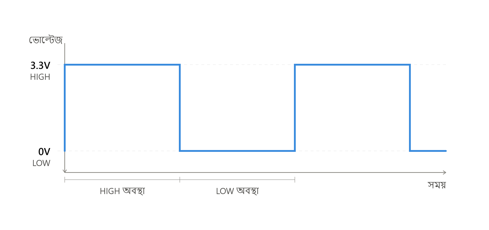
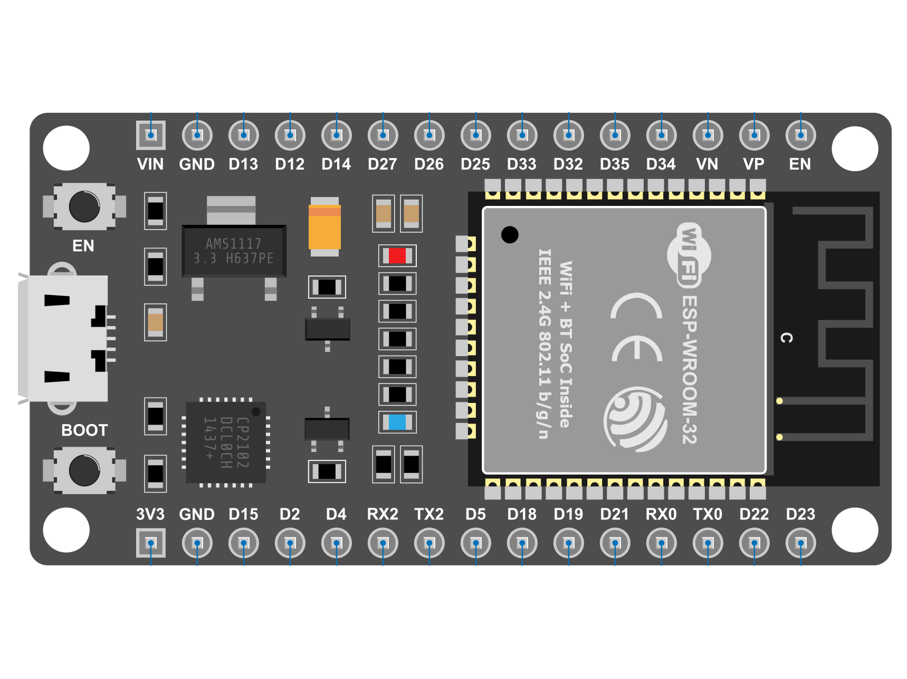

# অধ্যায় ৪: ডিজিটাল আউটপুট ও ইনপুট প্রোগ্রামিং (GPIO Programming) 

<figure align="center">
    
    <figcaption>Figure: ESP32 Dev Kit V1</figcaption>
</figure>

## ৪.১ GPIO কী এবং কেন প্রয়োজন

GPIO (General Purpose Input/Output) হলো মাইক্রোকন্ট্রোলারের এমন একটি পিন, যা প্রয়োজন অনুযায়ী ইনপুট অথবা আউটপুট হিসেবে ব্যবহার করা যায়। ESP32 Dev Kit V1-এ একাধিক GPIO পিন রয়েছে, যেগুলো ব্যবহার করে LED, রিলে, বাজার, বাটন, সেন্সর ইত্যাদি নিয়ন্ত্রণ (অন / অফ) করা যায়।

একটি GPIO পিন যখন **আউটপুট মোডে** থাকে, তখন আমরা নিজেরাই সেই পিন থেকে সিগন্যাল পাঠাতে পারি — যেমন কোনো LED জ্বালানো বা নেভানো, রিলে চালু-বন্ধ করা ইত্যাদি। এই অধ্যায়ে আমরা প্রথমে আউটপুট নিয়ে কাজ করব, পরবর্তী অংশে ইনপুট নিয়ে বিস্তারিত আলোচনা করব।

## ৪.২ ডিজিটাল আউটপুট এবং লজিক লেভেল

মাইক্রোকন্ট্রোলার শুধু দুটি অবস্থা বুঝতে পারে এবং পাঠাতে পারে —

- **HIGH (1)** — সাধারণত 3.3V ভোল্টেজ
- **LOW (0)** — সাধারণত 0V (গ্রাউন্ড)

<figure align="center">
    
</figure>

আউটপুট মোডে একটি GPIO পিনের অবস্থা সম্পূর্ণভাবে আমাদের নিয়ন্ত্রণে থাকে — অর্থাৎ প্রোগ্রামের মাধ্যমে যেকোনো সময় পিনটিকে HIGH বা LOW করা যায়। যেহেতু পিনের অবস্থা আমরা নিজেরাই নির্ধারণ করি, তাই আউটপুট মোডে ইনপুট মোডের মতো পুল-আপ বা পুল-ডাউন রেজিস্টরের প্রয়োজন হয় না।

## ৪.৩ অনবোর্ড LED জ্বালানো ও নেভানো

ESP32 Dev Kit V1 বোর্ডে **GPIO2** পিনের সাথে একটি অনবোর্ড LED যুক্ত থাকে, যা আউটপুট শেখার জন্য বেশ উপযোগী। কারণ এর জন্য কোনো অতিরিক্ত ওয়্যারিং বা ব্রেডবোর্ডের প্রয়োজন নেই।

### প্রজেক্ট তৈরি

VS Code Integrated Terminal-এ `ESP-Programs` ফোল্ডারের ভেতর নতুন একটি প্রজেক্ট তৈরি করব:

```
idf.py create-project 02-Digital-Output
```

### কোড লেখা (main/02-Digital-Output.c)

```c
#include <stdio.h>
#include <unistd.h>
#include <driver/gpio.h>

#define LED_PIN GPIO_NUM_2

void app_main(void)
{
    gpio_reset_pin(LED_PIN);

    gpio_config_t gpio_out_config = {
        .intr_type = GPIO_INTR_DISABLE,
        .mode = GPIO_MODE_OUTPUT,
        .pin_bit_mask = (1UL << LED_PIN),
        .pull_down_en = GPIO_PULLDOWN_DISABLE,
        .pull_up_en = GPIO_PULLUP_DISABLE
    };

    gpio_config(&gpio_out_config);

    while (1)
    {
        gpio_set_level(LED_PIN, 1);
        sleep(1);

        gpio_set_level(LED_PIN, 0);
        sleep(1);
    }
}
```

### কোড ব্যাখ্যা

- **`gpio_reset_pin(LED_PIN)`** — পিনটিকে ডিফল্ট অবস্থায় রিসেট করে, যাতে আগের কোনো কনফিগারেশনের সাথে সম্পর্কযুক্ত না থাকে। যেকোন GPIO নতুন কনফিগারেশনের আগে এটি অনুসরণ করা উচিৎ।
- **`gpio_config_t`** — একটি স্ট্রাকচার, যার মাধ্যমে একটি বা একাধিক GPIO পিনের মোড, পুল-আপ/পুল-ডাউন, এবং ইন্টারাপ্ট সেটিংস একসাথে কনফিগার করা যায়।
- **`pin_bit_mask`** — কোন পিন কনফিগার করা হবে তা বিট-মাস্ক আকারে উল্লেখ করা হয়। এখানে `(1UL << LED_PIN)` দিয়ে GPIO2-এর জন্য নির্দিষ্ট বিটটি সেট করা হয়েছে।
- **`mode = GPIO_MODE_OUTPUT`** — পিনটিকে আউটপুট মোডে সেট করা হয়েছে, কারণ এখান থেকে আমরা সিগন্যাল পাঠাব।
- **`pull_down_en` ও `pull_up_en` উভয়ই DISABLE** — আউটপুট মোডে পুল-আপ/পুল-ডাউন রেজিস্টরের প্রয়োজন নেই, কারণ পিনের অবস্থা আমরা নিজেরাই নিয়ন্ত্রণ করছি।
- **`gpio_set_level(LED_PIN, 1)`** — পিনটিকে HIGH করে, ফলে LED জ্বলে ওঠে।
- **`gpio_set_level(LED_PIN, 0)`** — পিনটিকে LOW করে, ফলে LED নিভে যায়।
- **`sleep(1)`** — `unistd.h` হেডারের একটি ফাংশন, যা ১ সেকেন্ডের বিরতি দেয়। 

### বিল্ড, ফ্ল্যাশ এবং মনিটর

```
idf.py build
idf.py flash monitor
```

কোড আপলোড হওয়ার পর বোর্ডের অনবোর্ড LED প্রতি ১ সেকেন্ড পরপর জ্বলা-নেভা করবে।

<figure align="center">
    
    <figcaption>Figure: Blinking LED Project Output</figcaption>
</figure>

> **লক্ষণীয়:** কিছু ESP32 Dev Kit ক্লোন বোর্ডে অনবোর্ড LED GPIO2-এর পরিবর্তে অন্য পিনে (যেমন GPIO5) যুক্ত থাকতে পারে। LED না জ্বললে বোর্ডের সিল্কস্ক্রিন বা ডকুমেন্টেশন যাচাই করে নেওয়া ভালো।

---


